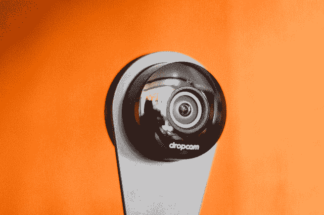

# 三年后，Dropcam Pros 得到更新，可以处理 1080 p 

> 原文：<https://web.archive.org/web/https://techcrunch.com/2016/07/14/three-years-later-dropcam-pros-get-updated-to-handle-1080p/>

# 三年后，Dropcam Pros 得到更新，可以处理 1080p

如果你拥有一台 drop cam Pro(drop cam 在被 Nest 买下之前出货的最后一款机型):惊喜！它现在可以进行 1080p 录制。

之前上限为 720p，Nest 长期以来一直承诺 Dropcam Pro 将支持 1080p。见鬼，连 Dropcam Pro 的盒子都说支持 1080p！

当 Nest 最终推出 1080p Nest Cam 时，许多人认为长期承诺的更新永远不会到来。

但果不其然:在 Dropcam Pro 首次亮相近三年后，Nest 告诉我，他们刚刚向应用商店推出了新版本的 Nest 应用，并为 Dropcam Pro 用户打开了 1080p 播放。