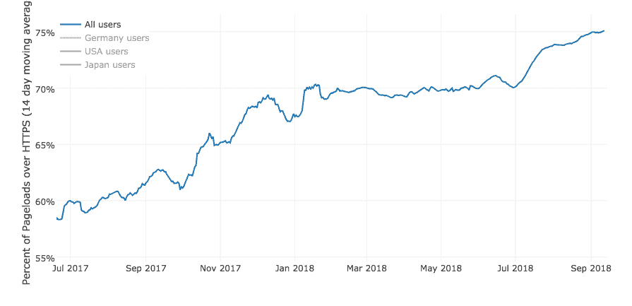

# 三年后，Let's Encrypt 已经发行了超过 3.8 亿张 HTTPS 证书 

> 原文：<https://web.archive.org/web/https://techcrunch.com/2018/09/14/three-years-later-lets-encrypt-now-secures-75-of-the-web/>

# 三年后，Let's Encrypt 已经发行了超过 3 . 8 亿张 HTTPS 证书

*Bon 纪念日，*让我们加密吧！

免费使用的非营利组织[于 2014 年由电子前沿基金会(Electronic Frontier Foundation)部分创立，并得到 Akamai、谷歌、脸书、Mozilla 等公司的支持。三年前的星期五，它颁发了第一张证书。](https://web.archive.org/web/20230207092419/https://techcrunch.com/2016/04/12/lets-encrypt-free-https-certification-push-exits-beta/)

从那以后，数字爆炸了。迄今为止，已在 1.29 亿个独特的域名上颁发了超过 3.8 亿份证书。这也使它成为迄今为止世界上最大的证书发行商。

根据公开的火狐数据，现在，75%的火狐流量来自 HTTPS[——部分归功于“让我们加密”。这是一个巨大的增长，从它成立之初，只有 38%的网站页面通过 HTTPS 加密连接提供服务。](https://web.archive.org/web/20230207092419/https://letsencrypt.org/stats/#percent-pageloads)

“如此速度和规模的变化令人难以置信，”一位发言人告诉 TechCrunch。“让我们加密并不是这一变化的唯一原因，但我们肯定是它的催化剂。”

HTTPS 保证了网络管道的安全。每当你的浏览器亮起绿灯或挂锁闪烁时，这是一个 TLS 证书，加密你的计算机和网站之间的连接，确保没有人可以拦截和窃取你的数据或修改网站。

但多年来，证书市场是破碎的，昂贵的，难以驾驭的。为了“加密网络”，EFF 和其他公司联合起来，为大众提供免费的 TLS 证书。

这意味着博客作者、[单页网站](https://web.archive.org/web/20230207092419/https://www.troyhunt.com/heres-why-your-static-website-needs-https/)和初创公司等都可以免费获得一个易于安装的证书——甚至像 [TechCrunch 这样的新闻网站也依赖于让我们加密](https://web.archive.org/web/20230207092419/https://www.ssllabs.com/ssltest/analyze.html?d=techcrunch.com)来实现安全连接。安全专家和加密倡导者 Scott Helme 和 Troy Hunt [上个月发现](https://web.archive.org/web/20230207092419/https://whynohttps.com/)访问量排名前 100 万的网站中超过一半都在 HTTPS。

随着它的成长，证书发行人已经得到了主要参与者的信任，包括苹果、谷歌、微软、甲骨文等等。

一个完全加密的网络还有很长的路要走。但是，随着每天颁发近一百万个加密证书，它看起来比以往任何时候都更加触手可及。