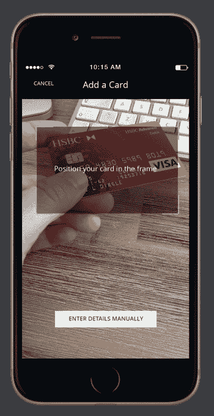
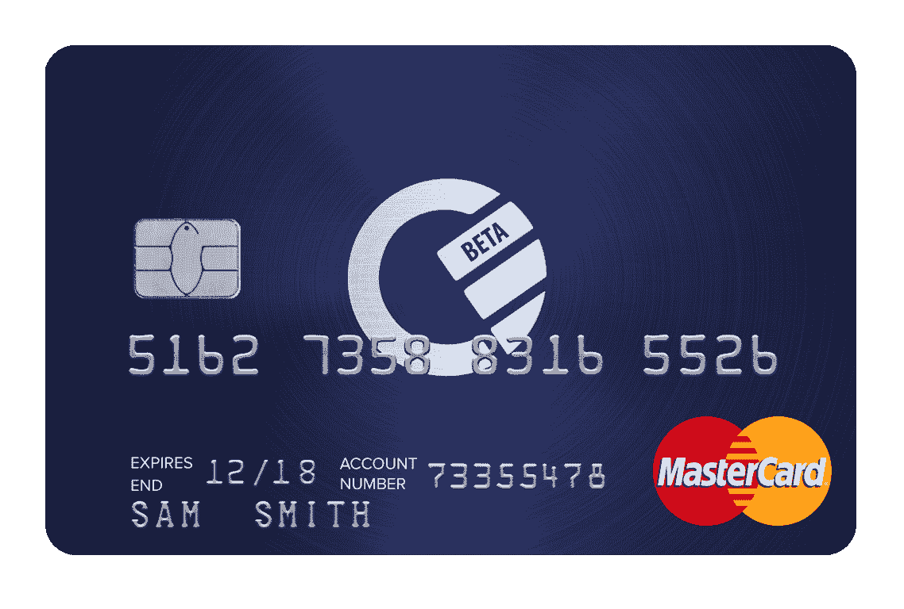
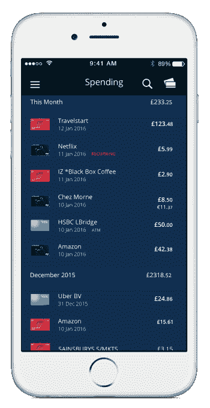

# 总部位于伦敦的 Curve De-capture 将您所有的银行卡合二为一，更广泛的金融科技融合玩法 

> 原文：<https://web.archive.org/web/https://techcrunch.com/2016/02/17/throwng-a-fintech-curveball/>

由著名金融科技投资者支持的总部位于伦敦的秘密创业公司[Curve](https://web.archive.org/web/20221209130237/https://beta.techcrunch.com/2015/12/10/below-the-curve/)，今天终于揭开了它的神秘面纱，推出了它的 iOS 应用程序和万事达卡支持的 Curve 卡。

与美国的[硬币](https://web.archive.org/web/20221209130237/https://beta.techcrunch.com/2015/04/17/coin-the-one-credit-card-to-rule-them-all-is-finally-shipping/)类似，其主要特点是能够将无限数量的银行卡整合到一张实体支付卡中。将你所有的借记卡和信用卡加载到应用程序后，你只需选择你希望曲线卡作为任何支付渠道的卡。美国运通的用户获得了额外的好处，使美国运通在更多地方被接受——实际上是在万事达卡被接受的任何地方。

 Curve 的“一卡多用”方法带来了许多其他直接好处。这些功能包括在一个地方查看和标记您的所有交易，无论这些交易来自哪张卡，以及在国外消费时大幅降低外汇兑换。

就后者而言，这家初创公司收取万事达卡批发价加 1%的费用，不收取额外的交易费。考虑到 Taavet Hinrikus 是 Curve 的投资者，这一点尤其值得注意，他是 money transfer startup 的联合创始人，并报告了“独角兽”TransferWise。

然而，事情变得有趣的是这家初创公司的长期雄心(我敢说，正是这种雄心吸引了像 Hinrikus 这样的投资者)。这是因为 Curve 真正在构建的是我要称之为的东西，因为没有更好的词，一个金融科技融合平台，构建在你的手机之上。

该公司的创始人押注的前提是，每当出现混乱时——在这种情况下，随着技术和监管的变化，大量新的金融科技公司正在分拆银行业的各个部门——这将不可避免地导致分裂。最终随之而来的是*收敛*。

从“将所有卡放在一张卡片上”和对你的支出的综合视图开始，再加上更便宜的外汇，Curve 希望让这“最终”变得更直接。所有这些都不需要彻底改变消费者或商业行为——例如，Apple Pay 就不能这么说——因此，首先建立移动服务，但与传统支付卡接口。

“尽管这种拆分为消费者和企业带来了更高的效率和更好的成本基础，但它也延续并加剧了支撑金融格局的分裂，”Curve 联合创始人兼首席执行官 Shachar Bialick 解释道。“作为一名用户，我非常清楚拥有和管理多种不同的卡、账户和服务的要求，以便保持财务自主并节省资金”。

这可能包括一个个人*和*商业账户——Curve 最初针对的是企业家和自由职业者——一个美国运通卡、Virgin Money 或 Nectar 卡，用于他们各自的奖励计划，类似于 TransferWise 用于向国外汇款，肉豆蔻用于投资，薄荷用于管理你的支出。你越是精通财务，利用各种各样正在发生的事情，就越难管理和跟踪你的钱。Bialick 和他的团队正致力于减少这种认知超载。

“看看其他行业，很明显，哪里引进了技术，哪里就会出现融合，”他说。“智能手机就是一个很好的例子——将生产力工具、社交工具等集于一身。可以有把握地认为，在未来，我们目前经历的这种财务碎片化将通过一个单一的平台/界面连接所有这些服务来解决。”

在这个阶段，Bialick 差不多会说 Curve 将成为那个平台，而不是把他的初创公司正在做的工作称为修补。他表示，无论如何，它几乎肯定会是移动的，因此 Curve 以其 iOS 应用程序为中心，而平台是后端和支付接口或前端不可知的。

换句话说，Curve 被设计成可以插入任何支付系统(今天这是卡，但可能是银行账户或 PayPal 等在线支付提供商)，未来可以用 NFC 兼容的智能手机或可穿戴设备取代或补充 Curve 卡本身——或任何未来的支付接口。

“这将把用户放回中心，用他们独特的‘所有钱’把他们联系起来，”Bialick 说，他是这家初创公司的核心人物。“我们相信智能手机有潜力为该平台提供基础设施”。

https://www.youtube.com/watch?v=PW0mGjEANZI

(注:Curve 的试运行将包括最初限量发行 10，000 张 Curve 卡，介绍价格为 35 英镑。)