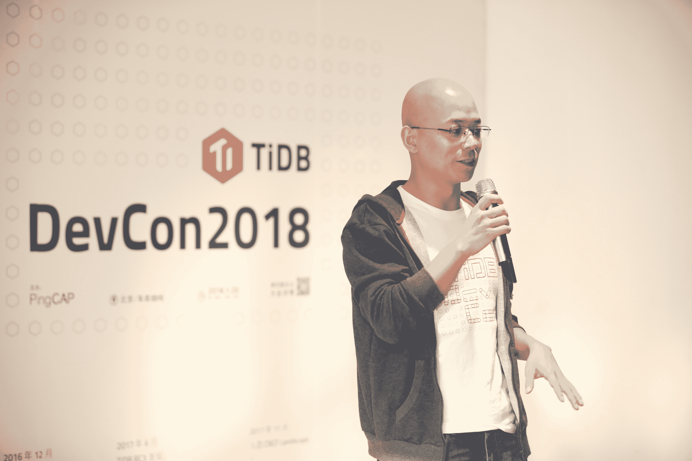

# TiDB 开发商 PingCAP 在筹集了 5000 万美元的 C 轮 TechCrunch 融资后，希望在北美扩张

> 原文：<https://web.archive.org/web/https://techcrunch.com/2018/09/11/tidb-developer-pingcap-wants-to-expand-in-north-america-after-raising-50m-series-c/>

# TiDB 开发商 PingCAP 在筹集了 5000 万美元的 C 轮融资后，希望在北美扩张

PingCAP 联合创始人兼首席执行官 Max Liu

兼容 MySQL 的分布式数据库 TiDB 背后的公司 PingCAP 今天表示，在筹集了 5000 万美元的 c 轮融资后，它计划开展全球业务。该轮融资由中国风险投资公司复星和晨兴风险投资公司牵头，包括中国增长资本、云起合伙人和 Matrix Partners 在内的回归投资者参与。

总部位于北京的该公司表示，它还将利用新的资本来打造更多跨云产品。PingCAP 专注于北美市场，因为这是最成熟的云市场，该公司美国战略和运营总经理许海波在一封电子邮件中说。

PingCAP 于 2015 年由 Dylan Cui、Edward Huang 和 Max Liu 创立，迄今已筹集约 7200 万美元，其中包括【2017 年 6 月宣布的 1500 万美元 B 轮。TiDB 是一个开源的混合事务和分析数据库，面向需要处理大量数据并计划快速扩展，但仍希望能够使用同一数据库的公司。它的许多用户来自金融、电子商务、游戏和旅游行业，目前包括摩拜单车、北京银行、Hulu、联想和 Ele.me。

在其他分布式数据库方面，TiDB 经常被拿来和 CockroachDB、FoundationDB 做比较。Xu 表示，TiDB 与 CockroachDB 的主要区别之一是，除了在线事务处理之外，它还能够大规模处理混合事务和分析处理工作负载。它也兼容 MySQL，而 CockroachDB 兼容 PostgreSQL。他补充说，FoundationDB 更类似于 TiKV，后者是由 PingCAP 开发的键值存储层，最近成为了云原生计算基金会项目，因为 FoundationDB 不像 TiDB 那样是具有 SQL 接口的关系数据库。

在一份新闻声明中，晨兴创投董事总经理刘强东表示:“数据库行业一直是一个竞争激烈的领域，PingCAP 已经成为中国许多大型互联网公司和金融服务企业的首选解决方案，从而在这个拥挤的领域占据了突出的位置。因此，我们很高兴与 PingCAP 一起成长，并继续共同构建 TiDB 生态系统。”