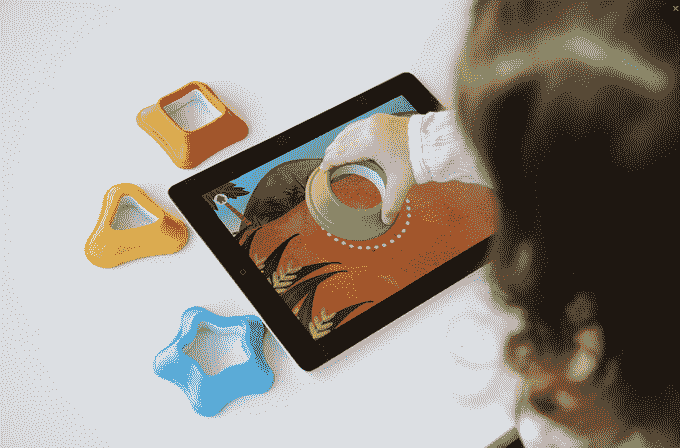

# Tiggly 是一款面向婴幼儿的 iPad 学习玩具，它引发了 TechCrunch 的首轮融资

> 原文：<https://web.archive.org/web/https://techcrunch.com/2014/09/22/tiggly-an-ipad-learning-toy-for-babies-and-toddlers-raises-series-a/>

为 iPad 最年轻的用户——婴儿设计的教育应用。(哦，还有初学走路的孩子)——已经筹集了一轮首轮融资，由总部位于德国的早期游戏和学习公司 Habermaass GmbH 和玩具品牌 [HABA](https://web.archive.org/web/20221007042226/http://www.habausa.com/) 的所有者牵头，该品牌目前正在进入美国教育技术市场。尽管这家初创公司不会透露这轮融资的规模，但它之前在 2013 年 5 月至 2014 年 1 月期间筹集了 100 万美元的种子资金，这笔额外的资金现在使其融资总额达到了 500 万美元。所以你可以算算。

作为一名家长，我从个人经历中了解到移动应用对越来越年轻的用户的吸引力。尽管在我女儿很小的时候，我努力限制科技的使用(没有[带 iPad 支架的婴儿椅](https://web.archive.org/web/20221007042226/http://www.cbsnews.com/news/baby-bouncy-seat-with-ipad-attachment-sparks-outrage-online/)在我家里！)，在她一岁之前，我确实让她在 iPad 上“用手指画画”，并在她长大后，推出了一些专注于教育的幼儿应用程序。

泰格利就是其中之一。

这款应用是一个售价 29.95 美元的套件的一部分，该套件包括四个颜色鲜艳的几何形状(正方形、圆形、三角形和星形)，当它们被放置在屏幕上的适当位置时，就会变成可爱的角色，比如丛林动物，或者可以在各种其他游戏中用作邮票或绘图工具。这些游戏旨在鼓励语言发展、创造力、空间思维和运动技能。或许，它们就像是一代人版的木块。

自 2013 年 10 月推出以来，Tiggly 的应用程序已被播放超过 40 万次，其“Tiggly Shapes”现已在五大洲的 20 多个国家推出，并有 8 种语言版本。该公司表示，到目前为止，反馈是积极的，并引用了 50 次评论后对 Amazon.com 的 4.5 分评级。(该公司拒绝透露用户数量、销售额或收入的细节。)

创始人菲尔·乔治乌解释说，Tiggly 的产品引起了那些为孩子寻找“更健康”平板电脑体验的客户的共鸣。

他告诉 TechCrunch:“这笔资金将帮助我们扩大产品线，并为喜爱应用程序的学龄前儿童和幼儿园儿童提供更多学习机会。”“我们决定向 Habermaass 筹集资金，因为他们在制造儿童喜爱的学习玩具方面有着 75 年的历史。拥有像 Habermaass 这样的战略合作伙伴将极大地增强我们的分销网络，并让我们获得行业知识和人脉，这将有助于我们快速扩张。”

乔治乌指出，该公司对传统风险投资公司感兴趣，但选择哈伯马斯是因为他们在玩具和学习市场的经验。Habermaass GmbH 公司总部位于德国巴德罗达赫，年生产€3.65 亿英镑，旗下品牌包括 HABA、韦弗里兹和 Jako-O。其玩具和游戏注重高教育价值和高品质设计，但 HABA 品牌与 Tiggly 最相关，因为它是 0 至 6 岁儿童的玩具制造商。

额外的资金将帮助这家小型创业公司将其团队从 6 人增加到 12 人，主要是扩大其应用程序和设计团队。

“特别是，我们正在大力投资建设一个有趣的世界，让孩子们在快乐中学习，”这位创始人说。他补充说，长期目标是为 18 个月至 6 岁的儿童提供教育产品，包括涵盖算术和识字等其他领域的扩展课程。

“我们相信有许多重要的幼儿发展里程碑，最好通过我们正在开拓的引人入胜的游戏来实现，这笔资金将帮助我们快速将这些产品推向市场，”乔治乌说。