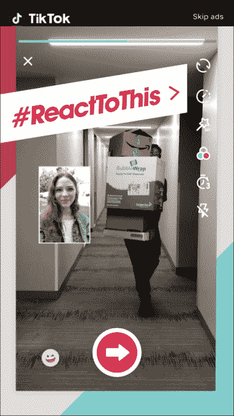

# 抖音在其新合并的应用程序 中加入了视频反应

> 原文：<https://web.archive.org/web/https://techcrunch.com/2018/09/03/tiktok-reactions/>

# 抖音在其新合并的应用程序中增加了视频反应

在简短视频应用 Musical.ly 和抖音合并大约一个月后，该应用引入了一个新的社交功能，允许用户发布他们对所观看视频的反应。

取代文本评论，这些反应将采取视频的形式，本质上是叠加在现有剪辑之上。任何在 YouTube 上呆过一段时间的人都应该熟悉反应视频的概念，但抖音以一种看起来非常无缝的方式融入了这个概念。

要发布反应，用户只需在给定视频的分享菜单中选择反应选项。该应用程序将在剪辑播放时记录您的音频和视频。您还可以决定您希望您的反应视频出现在屏幕上的什么位置。

如果你听不出抖音的名字，那可能是因为这款应用[8 月初才在美国](https://web.archive.org/web/20230326031744/https://techcrunch.com/2018/08/02/musically-tiktok/)推出，但它在中国已经上市几年了。

回到 2017 年，抖音背后的中国公司字节跳动以及新闻聚合网站今日头条[以大约 10 亿美元的价格收购了 Musical.ly】。它最终合并了这两个应用程序，以结合它们的受众和功能；Musical.ly 的用户被转移到他们现有的视频和设置上。](https://web.archive.org/web/20230326031744/https://techcrunch.com/2017/11/09/chinas-toutiao-is-buying-musical-ly-in-a-deal-worth-800m-1b/)

该公司表示，在未来一两天内，谷歌 Play 和 T2 苹果应用商店的更新应用程序中将会提供反馈。