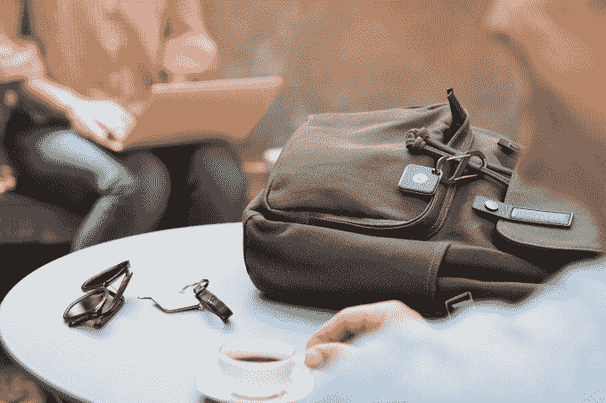
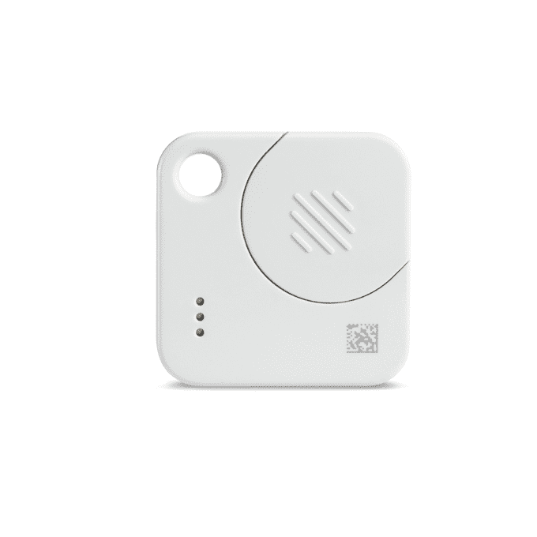
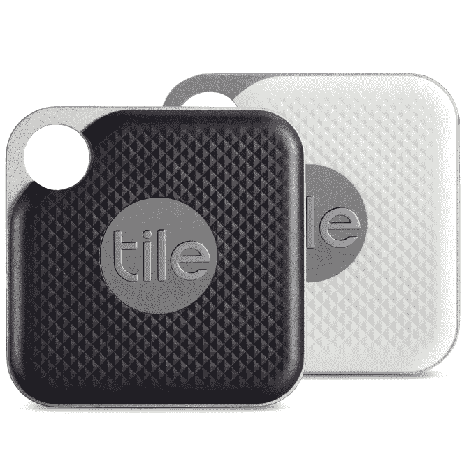

# Tile 的新失物追踪器提供可更换电池，订阅服务 

> 原文：<https://web.archive.org/web/https://techcrunch.com/2018/10/02/tiles-new-lost-item-trackers-offer-replaceable-batteries-subscription-service/>

就在一周前，失物招领处宣布了新的首席执行官，并增加了康卡斯特的投资。但该公司还没有完成变革。如今，Tile 正在推出新设备，以解决消费者对其追踪器最常见的抱怨——缺乏用户可更换的电池。现在，Tile 的旗舰产品 Tile Mate 和 Tile Pro 将由硬币电池供电——当电池电量开始下降时，Tile 可以通过一个新的订阅计划自动发送给你。

“大多数对我们的评价都与我们没有可更换的电池这一事实有关，”Tile 首席执行官 CJ Prober 解释道，他最近从联合创始人 Mike Farley 手中接过了的职位，Mike Farley 离开了他在公司的日常工作。“用户必须出去买新的磁贴，重新贴上，然后重新激活，”他说。“这是成为瓷砖客户的一个相当大的障碍。”

用户可更换的电池也与 Tile 最初的设想大相径庭，该设想认为，不必安装电池就能使其设备比 T4 的竞争对手 T5 更薄。

无论如何，这并不是说这些新瓷砖很大。

新款 Tile Mate 的尺寸为 34.7 毫米 x 34.7 毫米 x 6.2 毫米，重量为 7.5 克，而之前的尺寸为 34 x 34 x 4.65 毫米和 6.1 克。

新的 Tile Pro 的范围是 Mate 的两倍，今天的尺寸为41.6 毫米 x 41.6mm 毫米 x 6.5 毫米，重量为 12.8 克。旧版本为 37.5 x 37.5 x 5.9 毫米，重量为 11 克。

换句话说，这些仍然是非常小的加密狗——完全适合钥匙链、包、钱包等等。

然而，Tile 的另一款设备 Tile Slim 旨在滑入你的钱包，今天不会升级。据我们所知，目前它将继续使用不可更换的电池。

要从新的 Mate 或 Pro 上取下电池，你可以用拇指推开设备背面的小门。用回形针，你可以取出旧电池，然后放入新电池。

虽然电池是新产品的最大变化，但这些设备也比以前更响亮，范围更广。Mate 的范围现在是 150 英尺，Pro 可以达到 300 英尺。

该公司表示，新的 Tile Mate 和 Pro 也比旧型号更响亮。

随着更新，Tile 也转向新的订阅产品。该公司此前推出了一个名为[的再销售计划](https://web.archive.org/web/20221025222150/https://www.thetileapp.com/en-us/retile)，当旧设备的电池没电时，该计划会为新设备提供大幅折扣。Prober 说，这不会马上结束。相反，随着旧设备停止工作，客户将逐渐转向新设备。

除了回收瓷砖之外，消费者还将获得各种功能和电池。每月 2.99 美元(或每年 29.99 美元)，Tile Premium 用户将获得延长的 3 年保修，通过短信，电池更换，无限共享(家庭一起跟踪设备的理想选择)，位置历史和“智能提醒”功能的按需客户支持，推出测试版。

位置历史功能将在磁贴 ping 服务器时为您提供地图和过去 30 天内磁贴最后已知位置的列表(移动时会更频繁)，而智能提醒将帮助您不要忘记物品。

在发布时，如果您在(预先配置的)家庭地址留下了什么东西，智能提醒会通知您，例如，如果您出门时没有带钱包、运动包、工作牌或其他您跟踪的东西。随着时间的推移，该计划也将支持其他地址。

“我们肯定在考虑多个地点，”Prober 说。

*上图:Tile Pro，现在黑白。漂亮的白色和金色相间的 T2 T3 不见了。*

Tile Premium 将与任何 Tile 设备以及 [partners](https://web.archive.org/web/20221025222150/https://www.thetileapp.com/en-us/smart-location-platform) 产品中的嵌入式解决方案配合使用，例如支持 Tile 的 [Bose 耳机](https://web.archive.org/web/20221025222150/https://techcrunch.com/2018/01/08/lost-item-finder-tile-will-work-with-bose-headphones-and-other-new-partners/)。它首先在 iOS 上推出，随后是 Android。

转向订阅的目的是利用瓷砖创造的巨大市场。迄今为止，已售出 1500 万块瓷砖。这些连接每天可以定位 400 万件商品，成功率为 90%，这要归功于社区查找功能，该功能使 Tile 可以通过 Tile 所有者的众包网络在蓝牙范围之外工作。

升级后的瓷砖现已上市。Mate 25 美元，Pro 35 美元。

这些产品在 Tile.com 销售，并通过主要零售商销售，包括亚马逊、百思买、塔吉特、at、威瑞森(TechCrunch 的母公司)等。

**更正，2018 年 10 月 2 日，美国东部时间上午 10:00:Tile 之前提供的与新设备响度增加相关的数据不准确，他们在发布后通知 TechCrunch。鉴于在 Tile 的各种新闻材料和与我们的通信中发现的差异，我们从该报告中提取了这些数字。新瓷砖的声音明显更大，但在进一步测试之前，我们将拒绝引用瓷砖的说法。*