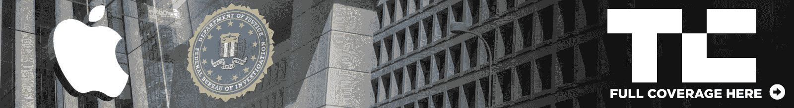

# 蒂姆·库克(Tim Cook ): iPhone 的后门程序相当于“软件癌症”

> 原文：<https://web.archive.org/web/https://techcrunch.com/2016/02/24/tim-cook-a-backdoor-into-the-iphone-would-be-the-software-equivalent-of-cancer/>

苹果首席执行官蒂姆·库克发起了最激烈的争论，解释为什么苹果反对联邦调查局下令打开圣贝纳迪诺恐怖分子赛义德·法鲁克使用的 iPhone。

库克已经在两个场合详细解释了苹果的立场(在[一封给客户的信](https://web.archive.org/web/20221210054037/https://beta.techcrunch.com/2016/02/17/tim-cook-apple-wont-create-backdoor-to-unlock-san-bernardino-attackers-iphone/)和[一封给员工的内部通知](https://web.archive.org/web/20221210054037/https://beta.techcrunch.com/2016/02/22/in-employee-email-apple-ceo-tim-cook-calls-for-commission-on-interaction-of-technology-and-intelligence-gathering/)被公开)，许多技术人士也表示了支持。然而，在[联邦调查局局长詹姆斯·科米](https://web.archive.org/web/20221210054037/https://beta.techcrunch.com/2016/02/21/fbi-director-denies-wanting-to-create-a-backdoor-into-the-iphone/) [否认](https://web.archive.org/web/20221210054037/https://beta.techcrunch.com/2016/02/21/fbi-director-denies-wanting-to-create-a-backdoor-into-the-iphone/)最终目标是一个后门之后，[一项皮尤民调显示](https://web.archive.org/web/20221210054037/https://beta.techcrunch.com/2016/02/23/most-americans-support-justice-department-over-apple-finds-pew/)大多数美国人认为苹果应该遵守命令。尽管出现了这样的结果，但库克继续清楚地表明了公司对此事的立场。

[在接受美国广播公司大卫·缪尔](https://web.archive.org/web/20221210054037/http://abcnews.go.com/WNT/video/exclusive-apple-ceo-tim-cook-sits-david-muir-37174976)的独家采访时，库克描述了他的担忧，即允许对 iPhone 的后门访问——他将其描述为“相当于癌症的软件”——将为未来树立一个危险的先例，危及全球数亿苹果客户的隐私和“公共安全”。

“我们不同情恐怖分子，”库克说。“在我看来，当他们决定做可怕的事情时，他们就放弃了自己的权利……我们不是在保护他们的隐私，我们是在保护其他人的权利……和公共安全。

“[创建软件来访问锁定在 iPhone 上的数据]暴露了其他所有人。开发这个软件，它是如此强大，它有能力解锁其他 iPhones。这就是问题所在。”

库克表示，他已经收到了数千封支持苹果立场的电子邮件，其中“最大的一类”声音来自“为我们的自由而战”的美国男女军人。库克说，这说明了创造一把钥匙的潜力，这把钥匙可能会被用来侵犯公共安全，因为它可能会暴露人们保存在手机上的亲密和私人信息——如银行信息、关系和孩子的位置。

## 万能钥匙不安全

包括[微软创始人比尔盖茨](https://web.archive.org/web/20221210054037/https://beta.techcrunch.com/2016/02/22/bill-gates-says-apple-should-unlock-the-iphone/)和[总统候选人唐纳德川普](https://web.archive.org/web/20221210054037/https://beta.techcrunch.com/2016/02/19/donald-trump-weighs-in/)在内的公众人物已经站出来辩称，国家安全和恐怖主义是苹果同意开放有问题的 iPhone 的正当理由，但库克强调，这一举动的未来影响让他和苹果感到恐惧。

“一把打开 1 亿把锁的万能钥匙，即使在你信任的人手中，也可能被盗，”苹果首席执行官解释道。“你可以想象那块上的目标。我不是说政府会滥用它，但世界上有很多坏人。数百万人的个人信息已经被黑客窃取。”

苹果此前曾表示，它已经向联邦调查局提供了它掌握的所有信息，库克重申了这一点，并补充说，该公司正在尽最大努力增加这一堆信息——而不是打开手机。关于 iPhone 上可能包含的其他数据，苹果首席执行官指出，联邦调查局可以向电信运营商和其他人获取有关通过蜂窝网络拨打电话和发送信息的信息。可以说，数据球不仅仅属于苹果。

库克还花时间表达了他对联邦调查局处理该问题的方式的担忧，包括当局改变设备的密码，从而锁定设备上的数据。

他声称苹果第一次听说这项命令是通过媒体报道，他指出这项命令可能会为美国其他州申请类似的“后门”打开大门，这不仅会增加不良运营商访问此类软件的风险，而且会使上述个人设备上的数据有效地为法院和法官所用。

除此之外，他补充说，没有理由不能向其他电话公司提出类似的请求——他认为这种情况对人们来说是灾难性的。

这场辩论目前正在公开进行，虽然库克承认“让人们听到声音”有积极的一面，但他对目前的情况感到遗憾。他说，他认为任何关于此事的裁决都应该来自国会，在那里“美国人民[可以]有发言权。”库克乐观地认为，他概述的潜在违规行为将得到华盛顿的支持，但他打算与奥巴马总统讨论这一情况，并发誓如果有必要，将把这个问题一直推到最高法院。

## “我们倡导公民自由”

“我(作为苹果首席执行官)面临过很多挑战，但从未感受到政府机构——这就在那里，”库克反思道。“我们是倡导公民自由的人，这太讽刺了。”

尽管这场辩论面临挑战并以公开的方式进行，但库克强调了他的公司对美国的深切感谢，并重申“我相信我们在这种复杂的情况下做出了正确的选择”。“有些事很难，有些事是对的，有些事两者兼而有之。这是其中之一，”他补充道。

最终，库克的回应是呼吁对这个非常敏感的隐私问题进行政策讨论，而不是膝跳，压力，在公众聚光灯下的谈话(就像现在发生的一样)。虽然库克哀叹这是对话的状态，但他抑制不住的乐观情绪宣布，他们将代表他们的客户坚持不懈。

虽然这种情况有无数的复杂性，但毫无疑问，如果苹果被迫遵守，它将对其品牌资产造成相当大的损害。人们会对未来如何使用手机三思而行，这可能会影响 iPhone 作为工具的价值主张，从而影响苹果的长期利润。

然而，库克反复强调(至少公开强调)从客户的角度而不是从苹果的角度来看待这个问题，这证明了该公司对客户的独特关注，并可能有助于向那些只以非黑即白的方式看待这个问题的人解释为什么这家智能手机制造商正在采取它正在采取的方法。即使是现在，苹果也一直在为顾客着想。

