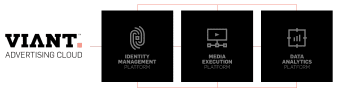

# 时代公司收购 Viant，拥有 Myspace 和一个庞大的广告技术网络 

> 原文：<https://web.archive.org/web/https://techcrunch.com/2016/02/11/time-inc-acquires-viant-owner-of-myspace-and-a-vast-ad-tech-network/>

看起来，Myspace 又一次成为了大型媒体的资产。今天，[时代公司](https://web.archive.org/web/20221207155420/http://www.timeinc.com/)在其季度收益报告中宣布，它已经[收购了 Viant](https://web.archive.org/web/20221207155420/http://viantinc.com/time-inc-to-acquire-viant/) ，这是一家盈利的公司，建立了一个大型广告技术业务，但也拥有其他资产，包括曾经炙手可热的社交网站 Myspace。交易条款尚未披露。作为其中的一部分，时代公司将成为 Viant 的大股东，创建 Viant 的 Vanderhook 家族保留少数股份(比例未披露)。

Viant 的一位发言人告诉我们，时代公司打算保留 Viant 的全部，并将其作为一个独立的业务来运营。除了 MySpace 和广告云产品之外，该公司还包括 [Vindico](https://web.archive.org/web/20221207155420/http://vindico.com/) 、Specific Media 和 [Xumo](https://web.archive.org/web/20221207155420/http://www.xumo.com/) 。“一切照旧，”他说。

《时代》计划将 Viant 的业务与自己的业务合并，创建一个大数据、广告定位的发电站。具体来说，《时代》表示，它将“将其优质内容、订户数据和广告库存与 Viant 的第一方数据和编程能力合并，为这两个平台的客户带来实质性价值。”

这些优质内容每月吸引超过 60 个网站的 1.5 亿访客。《时代》旗下大牌 consuer 品牌包括《人物》、《体育画报》、《InStyle》、《时代》、《真正简单》、《南方生活》、《娱乐周刊》等。

现在，这也将包括 Myspace。

“MySpace 是 Viant 以人为本的广告平台的内在组成部分，”一位发言人告诉我。

为什么要收购 Viant？出版商希望增加他们在广告技术方面的活动，以弥补在出版和更基本的广告服务等更传统的业务领域的损失。

时代公司——尽管是标志性的——也不例外。今天，该公司[报告](https://web.archive.org/web/20221207155420/https://invest.timeinc.com/invest/financials/financial-press-releases/press-release-details/2016/Time-Inc-Grew-Video-Mobile-and-Programmatic-Revenues-Strongly-in-Q4-and-2015/default.aspx)本季度和全年收入大幅下降，本季度净收入下降，全年净亏损 8.81 亿美元。

“这次收购改变了我们的游戏规则，”时代公司董事长兼首席执行官乔·瑞普在一份声明中说。“营销人员正在选择拥有数据驱动能力或优质内容的媒体合作伙伴；我们将能够在一个平台上同时提供这两种服务，并与那些只提供其中一种服务的公司区别开来。换句话说，我们将能够在所有类型的设备上向最佳受众发送广告信息，同时具备衡量投资回报率的能力。"

另一方面，Viant 首席执行官蒂姆·范德胡克如是说，Viant 是一家盈利的公司，过去十年一直如此。该公司的投资者也相对较少:它在 2006 年从 Enterprise Partners 和 Shepherd Ventures 筹集了 1000 万美元，但在那之后进行的一轮私募股权投资已经全部偿还给了这些支持者。Vanderhook 告诉我们，当 Viant 决定收购时代公司时，它正在筹集资金。

他说:“我们一直在进行一轮融资。“我们同时关注私募股权和战略投资者，因为我们希望投入更多资金来发展业务。在最后一分钟，我们决定与时代公司合作，因为战略带来了好处。I t 是优质内容资产与我们广告技术的结合，为谷歌和脸书带来了一个令人信服的替代方案。”

Viant 声称，其广告网络覆盖 12 亿人，其广告云于 2014 年推出，被(Viant 自己)描述为“最大的注册用户数据库之一，在云中提供一套全面的按需广告应用程序。”

其独特的卖点是，其广告数据不像许多服务那样基于 cookies，而是基于注册的命名用户。Vanderhook 说:“我们正在从 cookies 向基于人的数据、注册用户和能够更准确地定位数据的方向转变。“我们希望筹集资金，机会是显而易见的:我们拥有营销人员寻找的数据，并且我们拥有对这些数据执行的编程能力。”

时代公司表示，Viant 资产将使其产品覆盖三个领域:

*   第一方数据——用时代公司的用户数据库支持 Viant 庞大的注册数据库，创建了一个可与行业领导者脸书和谷歌相媲美的第一方数据集。
*   程序化技术——Viant 的广告云平台为时代公司带来了程序化广告技术，包括基于人的数据管理、定位和高级分析。
*   优质内容——Time Inc .是制作高质量内容的领导者，每月向 1.5 亿消费者提供内容，涵盖世界上最知名的品牌，包括《时代》、《体育画报》、《财富》和《人物》。

Viant [于 2015 年从互动媒体控股公司](https://web.archive.org/web/20221207155420/http://venturebeat.com/2015/01/14/myspaces-owner-looking-to-tap-its-user-base-launches-first-advertising-cloud/)更名而来。在此之前，它被称为特定媒体。2011 年，据报道，T2 以 3500 万美元的价格从新闻集团手中收购了 MySpace。(新闻集团以 5.8 亿美元收购了 MySpace，随后该公司陷入困境。)

“我们是最大胆的公司，”首席执行官兼联合创始人蒂姆·范德胡克曾在一次采访中说，“在没有人收购 MySpace 的时候收购了它。”

他说，与此同时，自从被 Viant 收购以来，MySpace 业务的增长并没有放缓。

“MySpace 在发布后做得非常好。我们已经将一些重点从单纯的流量驱动转移到推动更多的参与，我们在这方面做得非常成功。但如何吸引新用户或带回老用户是一个持续的平衡。大多数人在那里都有账户。”他说，网站的平均月访问量在 2000 万到 5000 万之间。