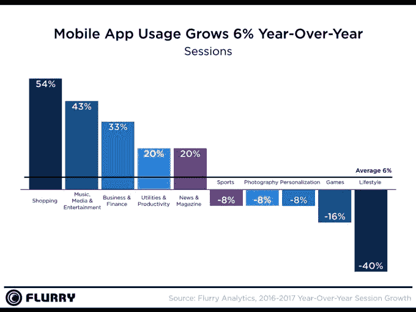

# 去年花在应用上的时间仅增长 6%，低于 2016 年的 11% 

> 原文：<https://web.archive.org/web/https://techcrunch.com/2018/01/16/time-spent-in-apps-grew-just-6-last-year-down-from-11-in-2017/>

根据 App Annie 最近的估计，应用程序经济正在持续增长，今年来自应用程序商店的全球收入预计将超过 1100 亿美元。然而，另一份报告发现，人们使用应用程序的时间开始停滞。在 [Flurry 的“2017 年移动状态”](https://web.archive.org/web/20221207044157/http://flurrymobile.tumblr.com/post/169545749110/state-of-mobile-2017-mobile-stagnates)年度总结中，该公司报告称，从 2016 年到 2017 年，整体应用程序会话活动仅增长了 6%。

这低于 2016 年底报告的 11%的增长率，代表用户平均每天在智能手机上花费超过 5 个小时。

会话活动增长的下降意味着用户正在达到一个点，他们不能放弃更多的时间来使用应用程序。相反，他们将活动从旧应用转移到新应用。他们也在各种各样的应用上花费时间。

在过去一年的应用程序使用增长方面，有一些明显的赢家和输家。

毫不奇怪，今年是电子商务蓬勃发展的一年。Flurry 发现，从 2016 年到 2017 年，购物应用的使用量增长了 54%，现在消费者可以放心地在移动设备上进行购买。应用程序与 Apple Pay 和 Samsung Pay 的集成也有所帮助。

我们看到了这种趋势，尤其是在假日购物季期间，例如，[移动购物将首次超过桌面购物](https://web.archive.org/web/20221207044157/https://beta.techcrunch.com/2017/11/02/mobile-holiday-shopping-visits-in-u-s-will-surpass-desktop-for-first-time/)，而[黑色星期五 50.3 亿美元的在线销售额中有 20 亿美元发生在移动购物上](https://web.archive.org/web/20221207044157/https://beta.techcrunch.com/2017/11/24/black-friday-deals-net-640m-in-sales-so-far-mobile-60-of-all-traffic/)。

2017 年的另一个大赢家是媒体、音乐和娱乐类别，随着消费者增加移动媒体消费，应用程序使用量同比增长 43%。

Sensor Tower 最近的一份年终报告也证明了这一点，该报告发现，[网飞的应用程序在 2017 年](https://web.archive.org/web/20221207044157/https://beta.techcrunch.com/2018/01/12/netflix-was-2017s-top-non-game-app-by-revenue/)创造了所有非游戏应用程序中最多的收入——Pandora 在被网飞击败之前[已经赢得了四分之一的份额。](https://web.archive.org/web/20221207044157/https://beta.techcrunch.com/2017/11/02/pandora-made-80m-in-u-s-app-store-revenue-in-q3-booting-netflix-from-the-top-grossing-spot/)

2017 年下降的应用类别包括生活方式和令人惊讶的游戏。

需要明确的是，我们在这里谈论的是应用会话增长的下降，而不是应用使用的下降。这是一个指向与应用程序的使用和受欢迎程度相关的更大趋势的指标，但还不应该让开发者和出版商担心。毕竟，正如 Flurry 指出的，今天的游戏玩家在手机游戏上花费的时间和金钱比以往任何时候都多。

生活类应用增速下滑幅度最大，同比下降 40%。Flurry 认为，这表明应用类别作为一个整体可能难以培养日常使用习惯。

为了生成这份报告，Flurry 在 2017 年跟踪了全球 26 亿台设备中的 100 多万个应用程序。它将应用使用定义为用户打开应用并记录会话。

完整的报告还深入研究了移动应用的其他领域，包括外形采用和顶级移动制造商。在这里，它发现平板手机仍然被大量使用，占活跃设备的 55%。

[gallery ids="1587195，1587194"]

与此同时，安卓制造商占 2017 年所有活跃设备的三分之二，但苹果以 34%的活跃设备占据了单个市场份额。

**披露:通过 2014 年被雅虎收购，Flurry 与 TechCrunch 共享一家母公司。TC 母公司 AOL 于 2017 年与雅虎合并成立 Oath。威瑞森拥有誓言。*