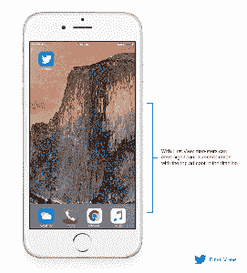

# 时间就是一切:Twitter 在你的时间表顶部发布首次观看广告和视频

> 原文：<https://web.archive.org/web/https://techcrunch.com/2016/02/09/timing-is-everything-twitter-unveils-first-view-ads-videos-at-the-top-of-your-timeline/>

在过去的几天里，Twitter 一直处于聚光灯下，因为据称即将到来的([长期以来的](https://web.archive.org/web/20230324044802/https://techcrunch.com/2014/09/01/twitters-timeline-could-get-more-algorithmic/))计划改变你的时间线中推文的顺序。尽管其首席执行官已经证实[本周没有这样的计划](https://web.archive.org/web/20230324044802/https://twitter.com/jack/status/696081566032723968?ref_src=twsrc%5Etfw)，但 Twitter *正在*其广告业务中添加一款新产品，这确实强调了一个事实，即在 Twitter 上，时机的确很重要。

今天，Twitter 推出了一个名为 [First View](https://web.archive.org/web/20230324044802/https://blog.twitter.com/2016/introducing-first-view) 的新视频广告单元。选择第一浏览位置的广告商基本上会跳到 Twitter 广告网络的队列前面，在 24 小时内，当一个人第一次打开 Twitter 时，就会获得第一个广告位置。

在发布时，First View 将只有视频——推动 Twitter 扩大其丰富媒体服务的动力。一位发言人表示，Twitter 正在考虑未来扩展到其他类型的推文。

右边是一个例子:

这一消息出现在 Twitter 的关键时刻。

该公司将于 2 月 10 日星期三宣布第四季度和全年收益。就在昨天，它的股票首次跌至每股 15 美元以下，这表明一些投资者仍然质疑该公司是否能够证明其用户群正在增加而不是停滞不前，以及其基于广告的商业模式正在随之增长。

增加更多的优质广告单元是该公司增加每用户收入的一种方式，这也有助于抵消为更多观众提供更简单广告的利润率下降。

First View 广告(推广的推文)将首先在美国推出，并选择美国管理的客户端，跨 Twitter 的移动和桌面应用程序以及 Twitter.com，并计划在不久的将来在全球推出。发言人说，目前不支持移动网络和第三方应用程序。

(如果你想知道，发言人没有回答我的一个问题，即验证过的账户是否会看到 First View 广告。您可能还记得，[一些经过验证的账户](https://web.archive.org/web/20230324044802/http://www.techmeme.com/160125/p27#a160125p27)用户已经有一段时间没有收到广告了。)

无论是来自 Deepak Rao 的关于 First View 的[博客帖子，还是发言人，都没有透露 First View 相对于其他推广的推文广告单元的定价。](https://web.archive.org/web/20230324044802/https://blog.twitter.com/2016/introducing-first-view)

但是，First View 让广告客户获得了令人垂涎的提要顶部位置——消除了一些人不会在 Twitter 上滚动太多的担忧——以及它专注于优质视频的事实，都表明 Twitter 有兴趣围绕其创收主线开发更多高价层级。最近推出的其他支持这一战略的广告单元包括“[对话](https://web.archive.org/web/20230324044802/https://techcrunch.com/2016/01/05/twittersconversational-ad-unit-encourages-users-to-participate-with-customizable-hashtags/)广告单元和 Twitter 的[放大](https://web.archive.org/web/20230324044802/https://techcrunch.com/2015/10/08/twitter-expands-amplify/#.zewlyd:1FEE)视频节目的扩展。

那么谁会是使用新的第一视角单元的典型广告客户呢？事实上，它是以视频为中心的，所以当你听说娱乐业是目标市场时，你不会感到惊讶:

“在电影营销中，口碑比以往任何时候都更重要。而且没有比 Twitter 更好的口碑社交平台了。 Twitter 的第一个观点是一个很好的机会来广泛分发我们为迈克和戴夫需要婚礼日期的预告片，同时产生嗡嗡声和社会对话。20 世纪福克斯公司的营销总裁马克·温斯托克在一份声明中说:“我们能够用精彩的视频吸引广大的电影观众，这种方式不仅可以获得浏览量，还能创造社会动力。”。