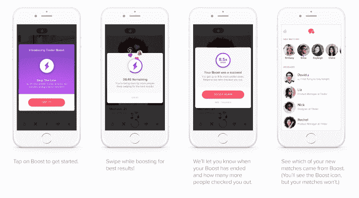

# Tinder Boost 让你一步到位

> 原文：<https://web.archive.org/web/https://techcrunch.com/2016/09/27/tinder-boost-lets-you-pay-your-way-to-the-front-of-the-line/>

Tinder 推出了一项新的高级功能，名为 Tinder Boost。该功能将允许用户付费，让他们的个人资料首先在同一地区的应用程序上向其他用户显示 30 分钟。

根据[的公告](https://web.archive.org/web/20230322160427/http://blog.gotinder.com/skip-the-line-with-tinder-boost/)，这一切都是为了节省用户的时间，并确保在他们实际使用应用程序的时间内，Tinder 的体验是最大化的。

来自[博客](https://web.archive.org/web/20230322160427/http://blog.gotinder.com/):

> 你要去见一些人，去一些地方。事实上，Tinder 的设计就考虑到了这一点，为你提供一个简单、有趣的介绍给附近的新朋友，这样你就可以走出去，在现实世界中遇见他们。尽管如此，有时候一天的时间还是不够，你需要的是朝着正确的方向前进。Tinder Boost 正是给了你这一点:成为你所在领域 30 分钟顶级人物之一的方法。增加匹配的机会——在提升的同时，您可以获得 10 倍以上的个人资料视图。

Tinder 经常在全球上线之前先在澳大利亚测试新产品，Tinder Boost 也不例外。澳大利亚的 Tinder 用户将很快获得 Tinder Boost，而其他市场则需要等到 Tinder 推出最终产品。

这让我想到了定价。就像 Tinder 在澳大利亚测试产品本身一样，该公司很可能也会测试定价。也就是说，你可以预期这种特殊的功能在价格方面会有错误，因为它只有在相对稀缺的情况下才有用。

如果 5 英里范围内的每个人都能够在周五晚上购买快速兴奋剂，那么在某人的 Tinder feed 中“第一个”出现就开始失去其有效性，最终失去其吸引力。

Tinder Plus 用户每周将获得一次免费提升，并有能力购买更多。没有 Tinder Plus 的用户也可以在不加入高级层的情况下购买增强。要使用该功能，您必须处于 Tinder 刷卡模式。

从[超级喜欢](https://web.archive.org/web/20230322160427/https://techcrunch.com/2015/10/01/tinders-super-like-rolls-out-globally/)中得到启示，这是一个高级功能，让你可以给某人发送一个特别的喜欢，而不是普通的喜欢，我们可以预计这些提升既可以单独出售，也可以打包出售。

也就是说，Tinder 还没有透露确切的价格。

肖恩·拉德在一份电子邮件声明中说:“有了 Tinder Boost，用户只需点击一个按钮，就可以成为他们所在地区最热门的个人资料之一，从而最大限度地利用他们的时间和匹配潜力。”“我们的平台上每天有 14 亿次刷卡，有时我们的用户希望确保他们被刷到最前面。我们认为我们在澳大利亚的用户会喜欢这个功能，并希望很快在全球发布。”

[gallery ids="1393428，1393429，1393430，1393431，1393432"]

Tinder 并不是第一个提供让你站在约会前沿的产品的公司。

Tinder 母公司 Match Group 旗下的品牌 Match 也提供了一个[付费提升功能](https://web.archive.org/web/20230322160427/https://uk.match.com/faq/#!home/how-long-does-a-boost-last)，将用户的个人资料放在热门单曲标签中，并位于搜索结果的顶部。Bumble 是一款类似 Tinder 的应用，但女性是主导者，它也推出了一项节省时间的功能，作为其[高级层](https://web.archive.org/web/20230322160427/https://techcrunch.com/2016/08/15/bumble-is-finally-monetizing-with-paid-features-to-better-help-you-find-a-match/)的一部分，让你在你的 feed 顶部看到已经喜欢你的人。

然而，像 Match 的 Boost 一样，Tinder 将从 Boost 功能中获得更多收入，因为它是在 Tinder Plus(除了每周免费的 Boost)上销售的，并且不对免费用户免费提供。

Tinder Boost 现已在澳大利亚推出，我们将确保在全球推出时通知您。