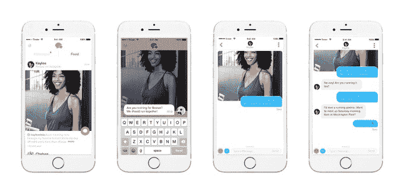
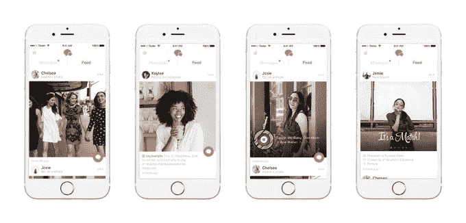

# Tinder 正在测试你的比赛的实时更新，包括来自 Instagram 和 Spotify  的帖子

> 原文：<https://web.archive.org/web/https://techcrunch.com/2017/12/12/tinder-is-testing-a-feed-of-real-time-updates-from-your-matches-including-posts-from-instagram-and-spotify/>

Tinder [宣布](https://web.archive.org/web/20230306220502/http://blog.gotinder.com/introducing-feed/)今天开始测试一项名为“Feed”的新功能，旨在帮助用户了解更多关于他们的比赛。该订阅源将作为一个标签出现在“信息”屏幕上，将包括来自那些你已经匹配的人的实时更新，包括最近添加的 Tinder 照片，加上 Instagram 帖子和你在 Spotify 上的顶级艺术家和颂歌。这是 Tinder 用户已经可以看到的数据，他们的匹配将这些外部账户连接到他们的个人资料。

这个想法是以一种新的格式呈现这些信息。

该公司在声明中解释说，Feed 是为了让用户超越比赛，以便建立“真正的”联系。

至少从理论上来说，这种提要可以帮助点燃比赛之间的对话。毕竟，当你不得不与一个完全陌生的人开始聊天时，使用约会应用程序最困难的部分是在你对他们知之甚少的情况下找到可以聊的东西。

即使粗略浏览了一下 Tinder 的个人资料，你可能也不会马上知道他们对什么感兴趣，或者他们在空闲时间做什么。但是他们的音乐品味和社交媒体帖子可以给你一个更好的想法。

这里的想法是，如果你看到一些有趣的东西出现在 Feed 上，你就可以开始聊天了。

Tinder 表示，你可以通过双击分享的内容，然后直接回复来开始这些由 Feed 发起的聊天。用户还可以通过应用程序的设置或编辑你的个人资料来控制提要中显示的内容。

事实上，这一概念与用户通过竞争对手约会应用 Hinge 上分享的帖子和照片进行联系的方式并不完全不同。在 Hinge 上，每个单独的文本条目或共享的照片都可以得到回复，这使你可以不回复个人资料本身，而是回复你在该个人资料上读到或看到的特定内容。Tinder 的实现将此改为持续更新的提要。

该功能还可以让那些不确定在个人资料中包含何种信息的用户，或者遗漏了一些值得注意的信息(如最喜欢的乐队或经常性的爱好)的用户更容易使用，这些信息将在他们的社交媒体和音乐帖子中显示。

但并不是每个人都会喜欢这种新的形式，因为它可能为人们的生活提供了一个太显眼的窗口，为网络跟踪提供了机会。这也可能鼓励人们更加消极地在应用程序中——或者更确切地说，在现实生活中——真正了解另一半，这是约会应用程序应该鼓励的。用户可以只看他们的更新，同时花更多的时间在 Tinder 的应用上，提高它的底线。

另一方面，Feed 的存在可能会鼓励更活跃的用户表现出某种自恋的行为——知道他们发布的 Instagram 照片会被潜在约会的新观众看到，可能会影响用户分享的照片类型，降低其真实性。(但这是社交媒体的一个普遍问题，而不仅仅是一个棘手的问题。)

Tinder 表示，目前正在澳大利亚、新西兰和加拿大测试 Feed 格式。它没有说是否或何时会推广到更广泛的用户群。