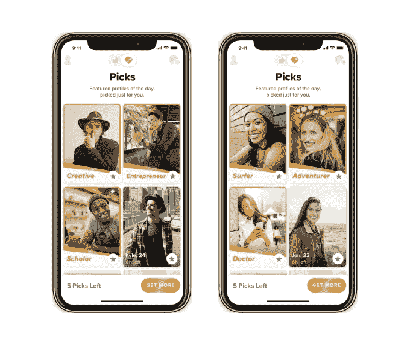
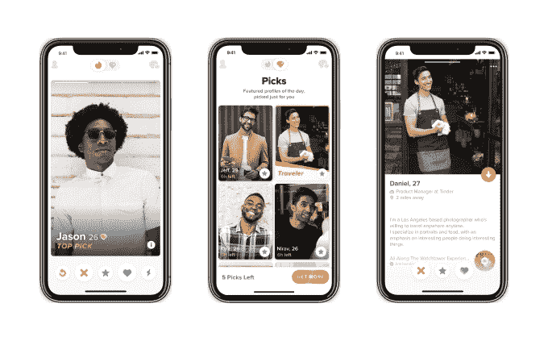

# Tinder 在全球推出其策划的“最佳精选”功能

> 原文：<https://web.archive.org/web/https://techcrunch.com/2018/09/11/tinder-launches-its-curated-top-picks-feature-worldwide/>

今年夏天早些时候，Tinder [开始测试一个新功能](https://web.archive.org/web/20230225042435/https://techcrunch.com/2018/06/22/tinder/),它会列出你的最佳潜在匹配，称为“最佳选择”Tinder 表示，这项功能只对 Tinder Gold 上的付费用户开放，现在已经在全球范围内开放。

继在德国、巴西、法国、加拿大、土耳其、墨西哥、瑞典、俄罗斯和荷兰以及英国进行初步测试之后，Top Picks 也于上周悄然在美国和英国推出。然而，Tinder 一直等到全球推出时才宣布它的到来。

Top Picks 背后的想法似乎有点受约会应用 [Coffee Meets Bagel](https://web.archive.org/web/20230225042435/https://coffeemeetsbagel.com/) 的启发，该应用同样专注于比赛的监管，以减少用户继续浏览无限量档案的冲动。人类[不擅长太多的选择](https://web.archive.org/web/20230225042435/https://en.wikipedia.org/wiki/The_Paradox_of_Choice)——过多的选择实际上会导致焦虑，并且——在约会应用的情况下——无法做出决定，因为用户知道总有另一个潜在的匹配就在眼前，或者有人争论过。

Tinder 对此的解决方案是 Top Picks，这是一个更有限的潜在匹配集，它认为用户会喜欢这些匹配集，基于用户档案中的信息，如教育程度、工作类型、爱好和兴趣。然后，Tinder 利用这些数据将用户分组，比如“美食家”、“创意”或“冒险家”等等。

这些信息与用户之前的刷卡行为相结合，以确定当天的首选，在应用程序的主屏幕上可以切换到哪个区域(通过菱形图标)。

Tinder 表示，虽然最佳选择每天都会更新，但用户可以选择按菜单购买更多 10、20 或 30 包的最佳选择。(是的，我们所说的“包”指的是用户群——Tinder 把人们变成了你可以购买的应用内商品。*耶*。太好了。).

这项功能只提供给 Tinder Gold 用户，这意味着它的价格各不相同。Tinder 向老用户收取更高的黄金访问费用，并在向你显示其定价时考虑了其他因素，如地区、订阅时间和最近的应用内促销。

Top Picks 等付费功能帮助推动了 Tinder 的增长和收入。

在其订阅服务 Tinder Gold 推出后，这款应用迅速成为应用商店中最卖座的应用。从那以后，它就一直占据着头把交椅——根据最近一份 App Store 最大应用的报告，它甚至成为了有史以来票房排名第五的应用。

付费用户也在飙升。Tinder 母公司 Match Group 报告称，Tinder 在第二季度增加了 299，000 名付费会员，在过去一年中共增加了 170 万名会员，迄今为止增加了 300 多万名会员。

Tinder 的首席产品官 Brian Norgard 在一份声明中说:“鉴于它的早期成功，我们很高兴最终能与全球用户分享最佳选择。”“数据表明，测试市场的用户已经喜欢上了这一功能，我们很高兴通过这一全球推广，每天为所有用户提供一个最佳选择。该功能每天更新，以简单、有趣和有用的方式突出我们用户的多样性、才华和激情。”

Top Picks 的推出与此同时，一部关于 Tinder 对约会文化的巨大影响的新纪录片*在 HBO 首播。*

 *这部电影对通过 Tinder、等应用进行在线约会的[采取了相当严厉的观点，强调了它的一些最糟糕的属性——比如男人命令女人去他们家，他们做得天衣无缝；那些总是认为外面有更好的人的瘾君子；女性收到的主动提供的性照片；以及真实人际关系价值的整体下降，这是由于约会应用程序的大量“目录”提供了丰富的选择。](https://web.archive.org/web/20230225042435/https://www.washingtonpost.com/news/soloish/wp/2018/09/10/how-tough-is-the-dating-app-scene-hbos-documentary-swiped-paints-a-bleak-portrait/?utm_term=.d4961e02892a)

最佳选择不一定能解决这些问题。在最好的情况下，它至少可以帮助用户缩小他们的关注范围，并开始理解当你心中有一定的标准时，实际上并没有*无止境的约会选择。在最坏的情况下，它可能会鼓励用户更多地将人视为一种商品，因为他们点击支付仅仅几便士来购买更多的精选“包”*

该功能将于周一晚上在全球 iOS 和 Android 上推出。*