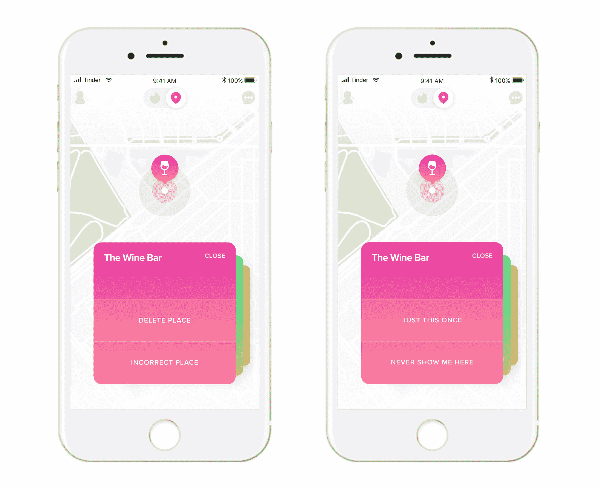
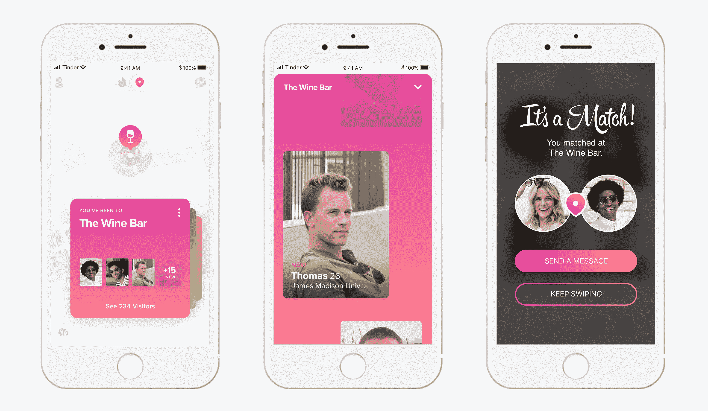
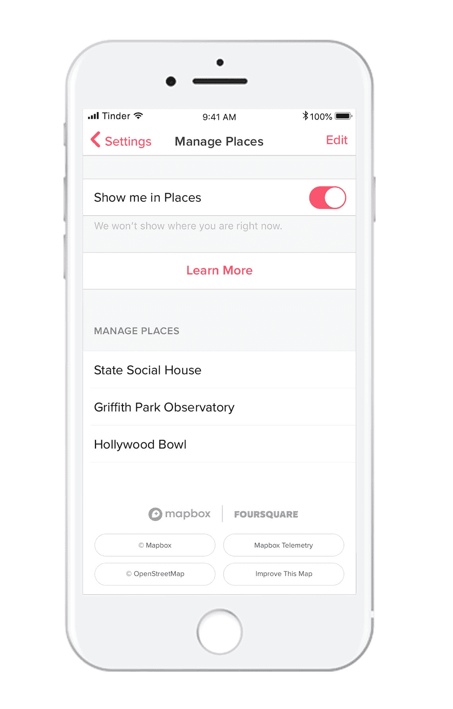
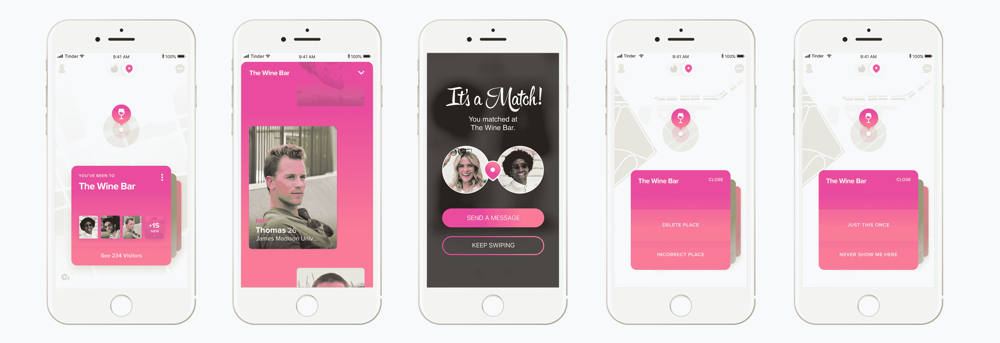

# Tinder pilots Places 是一项追踪你的位置以便更好匹配的功能

> 原文：<https://web.archive.org/web/http://techcrunch.com/2018/05/23/tinder-places-tracks-your-location-to-help-you-find-matches/>

Tinder 现在将帮助你找到那些你在日常生活中可能会遇到的人。正如[早些时候承诺的](https://web.archive.org/web/20230311131116/https://techcrunch.com/2018/02/07/tinder-is-launching-a-new-location-based-feature-set-this-year/)，该公司今天宣布推出一个新的基于位置的功能，将你的潜在约会对象名单缩小到那些下班后去你同一家酒吧喝酒的人，或者那些去你最喜欢的咖啡店喝咖啡的人，或者那些在你同一家健身房锻炼的人。

是的，没错——现实生活中你再也不用说“你好”了——你可以先配，*再*说话。

这就是结局，朋友们。就连“遇见可爱”这个故事，现在也成了一款交友 app 产品。

这个被称为 Tinder Places 的功能是[之前在 beta 测试中发现的](https://web.archive.org/web/20230311131116/https://www.theverge.com/2018/5/14/17351562/tinder-location-sharing-places-update-test)。

从今天开始，Tinder Places 正式宣布在三个城市进行公开测试:澳大利亚的悉尼和布里斯班以及智利的圣地亚哥。(在此之前，它已经在这些市场进行了私下测试。)该公司表示，计划是从公开试验中收集用户反馈，并在向全球所有用户推出之前对产品进行调整。

然而，与陌生人分享你的位置的想法[有点令人毛骨悚然](https://web.archive.org/web/20230311131116/https://techcrunch.com/2018/05/14/tinders-upcoming-location-based-feature-seems-a-bit-creepy/)——尤其是考虑到 Tinder 用户并不总是尊重的。但 Tinder 认为，它向你展示了你在现实生活中可能会遇到的人，这一事实实际上会促使最初的聊天更加礼貌。

“我确实认为——这是我的一个个人假设——如果你和一个你认识的和你去同一个地方的人配对，我认为这将为谈话设定一个非常不同的基调，而不是一个在约会平台上作为在线配对或多或少匿名的人，”领导该产品开发的 Tinder 定位产品总监萨曼莎·史蒂文斯说。

她说，这里更大的想法是向用户展示与你已经有共同点的潜在匹配，正如你去的地方所反映的那样。

“你去的地方很大程度上说明了你是谁，你重视什么，你的爱好，你的兴趣，”她继续说道。“因此，我们认为，能够在 Tinder 上找到与你有相同想法的人，可以创造更真实的匹配和更好的对话。”

也就是说，并不是每个人都希望交友网站上的陌生人知道在哪里可以找到他们。

但史蒂文斯解释说，Places 内置了许多安全措施，让用户感觉更舒适，并限制该功能被用于跟踪的能力。

“作为设计这个功能的女性，我亲自确保我使用它会感到安全，”她说。

首先，该功能是选择加入，而不是选择退出。

它利用 [Mapbox](https://web.archive.org/web/20230311131116/https://www.mapbox.com/) 和 [Foursquare 的 Pilgrim SDK](https://web.archive.org/web/20230311131116/https://enterprise.foursquare.com/products/pilgrim) 来识别和分类你去的地方，它只分享那些 Foursquare 认为“社交”的地方(Foursquare 能够“唤醒”Tinder 的应用程序进行后台定位，以防你想知道这是如何工作的)。Tinder 表示，它不会记录像你的房子、你工作的办公楼、银行、医生办公室和其他过于私人或与匹配无关的场所。所有这些都出现在 Tinder 应用程序界面的一个独立部分。

此外，你去过的地方不会被实时记录到应用程序中。相反，Tinder 会等到至少 30 分钟后某个地方才会出现，甚至更久。它将某人出现在特定地点之前的时间随机化，以限制其他人推断人们日常活动的能力。

此外，当添加新地点时，参与地点的用户将收到提醒，然后可以选择关闭该地点，这样它就不会立即显示。

你也可以告诉 Tinder 在某个地方首次出现后，不要再显示它。所以，举例来说，如果你不想在你浑身热汗淋漓的时候去健身房见人，你可以禁止那个地方出现。

史蒂文斯说，你与一个地方的关联也会在 28 天后从应用程序中删除，这不仅是为了保护隐私，也是因为它有助于保持数据新鲜。(毕竟，仅仅因为一年前你去了那个 hip 酒吧，并不意味着你就是一个去 hip 酒吧的人。)

当然，一个专门的跟踪者可以记下你最喜欢去的地方，并试图在现实世界中找到你，但这需要额外的努力来写下事情，并试图确定你的模式。开始建立一些联系并不是不可能的，但这需要对手头的任务投入。

尽管有这些保护措施，但还不清楚现实世界对用户的好处是否足以让他们选择加入这一额外的数据收集。虽然可以说有与你相遇的人匹配的用例，但仅仅去同一家咖啡店并不一定是潜在关系的指标。这可以归结为许多其他因素——最重要的是，包括不可预测的化学反应——这是 Tinder 和其他任何约会应用都无法确定的——以及一系列共同的价值观。充其量，这个“地点数据”是一个破冰船。

但是对于 Tinder 来说，其用户的位置数据更有价值。

该公司没有计划删除你在镇上游览的记录。例如，你不能按一个按钮来清除你的数据。如果你想让它消失，你需要完全删除你的 Tinder 用户帐户，我们理解。

该公司表示，用户在测试期间没有要求这种功能。相反，他们已经完全选择了这个功能，似乎对他们的个人数据或其用途没有什么疑虑。

“就选择加入率而言——我们会看到这在更大的人群中如何表现——但我们大约是 99%，”Tinder 首席执行官埃利·塞德曼说，他在 1 月份从 Match Groups 的 OKCupid 的首席位置上超越了 T2，成为 Tinder 的领导者。“我不知道我们是否会看到这种情况在广大人群中持续下去，但我认为我们可以预计这是 90%以上的选择率。”

这似乎与在[脸书-剑桥分析公司丑闻之后，用户对个人数据收集的态度](https://web.archive.org/web/20230311131116/https://techcrunch.com/tag/cambridge-analytica/)的转变[相矛盾，](https://web.archive.org/web/20230311131116/https://www.nytimes.com/2018/03/28/technology/social-media-privacy.html)导致世界上最大的社交网络重新思考其做法，并可能面临监管。其后果导致用户变得更加愤世嫉俗，并且[对要求他们分享数据的社交应用](https://web.archive.org/web/20230311131116/https://www.axios.com/exclusive-poll-facebook-favorability-plunges-1522057235-b1fa31db-e646-4413-a273-95d3387da4f2.html)保持警惕——就 Tinder 而言，坦白地说，它是关于浪漫和性的——人们会认为用户会对“选择加入”多加考虑。

不过，塞德曼认为用户没什么好担心的。他解释说，这是因为 Tinder 的主要业务不是广告，而是其优质服务的订阅。

“我们不会利用(个人数据)来推销广告，”这位高管表示。“如果你想一想我们的会员和我们之间的交易——比如，你用数据交换了什么？在一个地方，你可以看到孩子们的照片，对吗？很明显，很多广告。在另一个地方，你与生活中最重要的部分联系在一起。所以我认为这是非常不同的事情，”塞德曼说。

当然，这无疑是对 Tinder 潜力的一种不切实际的看法。

有人可能会说，“孩子的照片”——指的是你的家人、朋友和他们的家人，以及你通过社交网络建立的更广泛的联系——对你的浪漫关系至少同样重要，如果不是更有价值的话。(尤其是如果你只是用 Tinder 来勾搭的话)。

Tinder 声称其应用内广告没有使用位置数据来锁定用户，但这并不意味着该选项永远不会出现。拥有大量用户位置数据可能是一种优势，也是改善其算法的一种方式，甚至有可能帮助它扩展到现实世界的事件中——史蒂文斯没有排除这一点，他说如果这是大量用户的要求，Tinder 可能会考虑。

与此同时，一个更好的匹配算法将是 Tinder 的一个重要竞争优势，它今天也在抵御其他新来者，不仅仅是桌面网络时代的约会网站。例如，它[卷入](https://web.archive.org/web/20230311131116/https://techcrunch.com/2018/03/16/tinder-owner-match-is-suing-bumble-over-patents/)与顶级竞争对手邦布尔的来回[诉讼](https://web.archive.org/web/20230311131116/https://techcrunch.com/2018/03/28/bumble-is-suing-match-group-for-400m-for-fraudulently-obtaining-trade-secrets/)，甚至它自己也采用了邦布尔的[“女性优先”特色。](https://web.archive.org/web/20230311131116/https://techcrunch.com/2018/02/14/tinder-to-adopt-bumbles-ladies-first-feature-in-a-future-update/)鉴于整个行业已经窃取了 Tinder 流行的匹配机制，这似乎很公平。

塞德曼认为，新的定位功能不会那么容易被复制。

“这是第一次，在人们匹配之前的体验中，我们从根本上改变了用户界面。当然，这感觉非常像火绒，”他说。“这里有大量的工作，团队已经为此工作了几个季度。这是一种天生就适合规模化的产品。我们正在宇宙周围画一个更小的圆，”塞德曼补充道。"你需要 Tinder 的规模水平才能让这项工作成功."

Tinder 官方声称在全球拥有“数千万”用户，估计这一数字超过 5000 万。

该公司尚未提供基于位置的约会何时在全球推广的时间表。

*图片来源:插图:布莱斯·德宾；截图:Tinder 夫妇:李必立·哈维/盖蒂图片社*