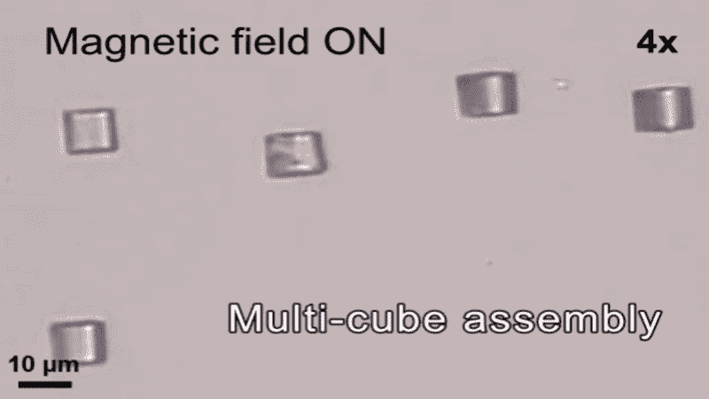

# 这些微小的模块化“微型机器人”可以改变形状来捕捉单细胞 

> 原文：<https://web.archive.org/web/https://techcrunch.com/2017/08/04/tiny-modular-microbots-can-change-shape-to-capture-single-cells/>

# 这些微小的模块化“微型机器人”可以改变形状来捕捉单细胞

在北卡罗来纳州立大学和杜克大学的一段视频中，五个微小的立方体在显微镜下自由漂浮。突然两对扣在一起，然后五对组合成一个整体。一旦合在一起，它们就绕着铰链弯曲，像吃豆人的大颚一样合在一起。立方体接近一个小的圆形物体——单个酵母细胞——利用开合运动推动自己前进。它们突然合上，困住了单细胞，然后打开，让它漂走。

研究人员将聚合物立方体称为“微型机器人折纸”，这种微小的模块化物体可以重新配置成无数种形状。每个立方体都有一面覆盖着金属涂层，允许研究人员使用显微镜周围的一系列电磁体来操纵它们的形状和运动。  这些设备被设计成模仿自然界中蛋白质链折叠的方式——就像那些物体一样，微型机器人的形状决定了它们如何折叠。

在短期内，微型机器人可能会被证明是有用的研究工具。通过与显微镜下的物体相互作用，这些模块可以让人们深入了解不熟悉的材料。“目前，这是一种在微观层面上研究材料的工具，”该论文的合著者 Orlin Velev 告诉 TechCrunch。“拿一块大材料进行各种机械测试非常容易。但是一次捏一个囊泡要困难得多。”

这项研究与麻省理工学院等[学校正在开发的其他小型折纸机器人有一些共同的特征，将它应用于更小的微米尺度。像那些项目一样，这些微型机器人也可能有一些潜在的有用的医疗应用。医生可以用它们在小范围内操纵物体或分离单细胞进行测试。](https://web.archive.org/web/20230217141426/https://techcrunch.com/2016/05/12/meatbot/)

研究人员还认为，它们还可以用于制造生物医学设备，如人造肌肉，在细胞水平上执行必要的运动。