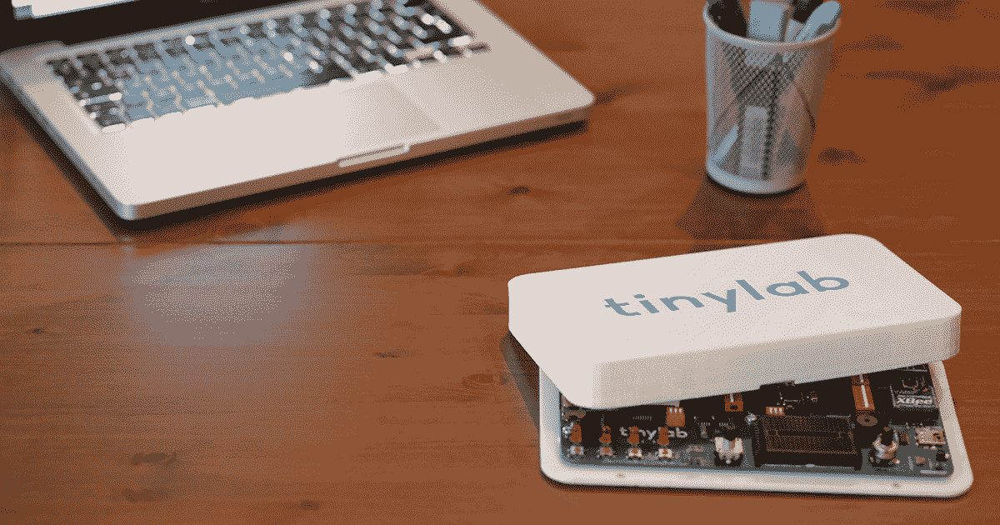

# TinyLab 是一个盒子里的原型系统

> 原文：<https://web.archive.org/web/https://techcrunch.com/2016/01/12/tinylab-is-a-prototyping-system-in-a-box/>

# TinyLab 是一个盒子里的原型系统

还有什么比“博斯普鲁斯机电一体化”这样的名字更酷的呢一个小盒子怎么样，它可以让你连接几乎任何东西，包括无线连接和旋转输入。该板可以从 Windows 或 Linux 编程，被称为 [TinyLab](https://web.archive.org/web/20230323173335/https://www.indiegogo.com/projects/tinylab-prototype-easier-than-ever--2#/) ，是一个鼓捣者的梦想，拥有 20 多个 I/O 和存储选项以及 Arduino 支持。

“Tinylab 是专为懒人准备的。如果你不喜欢弄乱电缆、屏蔽和焊接，Tinylab 适合你。只是编码！它完全兼容 Arduino 平台，默认库可以使用它。它有显示器、按钮、继电器、传感器等流行的东西，还有物联网生态系统中流行的模块插座，”创始人 Ahmet Sait Borlak 说。该系统还包括 XBee 和蓝牙无线支持。

一套早起鸟套装售价 59 美元，将于 5 月份上市。

该团队由一些熟练的硬件黑客和制造商组成。他们甚至在伊斯坦堡建立了一个叫做 [Makerhane 的地方，在那里他们创建了一个商店、一个创客空间和工作室。当他们意识到构建一个可以反复使用的标准板比将一个 Arduino 连接到一堆 IO 连接器更有趣时，他们创建了 TinyLab。](https://web.archive.org/web/20230323173335/http://makerhane.com/)

“Arduino 是我们的英雄，我们主要围绕它进行设计，我们意识到我们通常使用一些通用组件。每一次，我们都需要制造相同的电路来显示、发送或感知某些东西，”Borlak 说。“使用试验板是一种折磨，而使用可堆叠护盾通常达不到这个目的。你需要三个以上的屏蔽，但由于引脚重叠，你不能将更多的屏蔽堆叠在一起。所以我们认为 Tinylab 可以作为止痛药。所以我们设计它，使用它，热爱它。所以我们决定分享给其他人。此外，它非常适合教育。因为它与麻省理工学院的 Scratch 兼容，我们认为它可以在学校实验室进行。”

这是一个有趣的小项目，相当古怪。就像之前的 Udoo 一样，这个系统不需要太多的焊接，也不需要太多的屏蔽和连接器。它使原型制作变得更容易，而且，我们敢说，更有趣。

【YouTube = https://www . YouTube . com/watch？list = pl 3g 701 eoaflko 9 dkizjulqbbyhgle 9 EJ & v = s 64 ees 4 iokm]