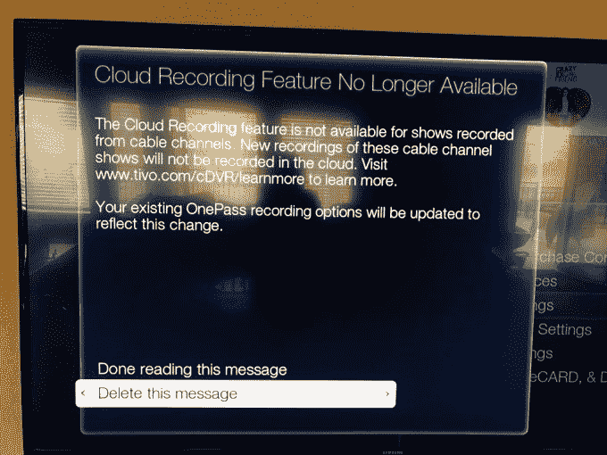

# TiVo 测试云 DVR 

> 原文：<https://web.archive.org/web/https://techcrunch.com/2016/12/06/tivo-tests-a-cloud-dvr/>

最近几周，媒体播放器和 DVR 制造商 TiVo 正在测试一种“云 DVR”类型的功能。如果这项功能能够投入商业生产，对这家硬件制造商来说将是一个值得注意的新发现，它的产品更专注于与传统 DVR 竞争，将 TiVo 独特的用户体验与在线服务的流媒体功能以及搜索和跟踪内容的工具相结合，无论内容来自哪里。

根据行业观察家戴夫·扎茨的说法，[云 DVR 功能](https://web.archive.org/web/20221207161456/http://zatznotfunny.com/2016-11/tivo-mavrik-cloud-dvr/)最初是在新的未发布的硬件中发现的，被称为 [TiVo Mavrik](https://web.archive.org/web/20221207161456/http://zatznotfunny.com/2016-11/tivo-mavrik/) 。然而，[他在本周](https://web.archive.org/web/20221207161456/http://zatznotfunny.com/2016-12/tivo-cloud-dvr/)报道称，TiVo Bolt DVR 的所有者也短暂地看到了一个提及“云录制”功能的通知。(见下文)

云录制不是 TiVo Bolt 今天附带的东西，所以这个弹出窗口似乎暗示了某种测试正在进行中。

虽然 TiVo 没有对这一发现发表评论，但我们已经从知情人士处证实，正如这次泄露所表明的那样，TiVo 正在用云记录进行小规模测试。据我们所知，该公司只是在考虑将云(而不是本地录制)用于无线信号，而不是有线电视。

TiVo 尚未明确决定该功能是否将作为现有 OTA DVRs(如 Bolt)的升级推出，或者是否将作为新产品的主要功能推出，专门用于录制到云上。

使用云来保存录像具有优势，因为这意味着客户在保存录像时不会受到硬件的限制。取而代之的是，云 DVR 可以让 TiVo 出售附属于特定设备的多层服务。这些录音也可以通过 TiVo 的应用程序，在设备网络上，甚至在手机等其他平台上获得。

在这个掐线时代，云硬盘录像机正成为许多服务的流行附加产品，所以 TiVo 至少会考虑这个选项是有道理的。例如，PlayStation Vue 的流媒体电视服务长期以来一直提供云 DVR，Dish 的 Sling TV [刚刚推出了自己的测试版。](https://web.archive.org/web/20221207161456/https://beta.techcrunch.com/2016/11/28/sling-tv-takes-on-rivals-with-launch-of-a-cloud-dvr/)与此同时，[更新的 arrival DirecTV Now](https://web.archive.org/web/20221207161456/https://beta.techcrunch.com/2016/12/02/hands-on-with-directv-now-atts-new-streaming-service-for-cord-cutters/) 还没有云 DVR，但计划明年推出这项功能。

虽然 TiVo 不是流媒体服务，但显然，它也在类似的领域发挥作用。随着[去年](https://web.archive.org/web/20221207161456/https://beta.techcrunch.com/2015/09/29/tivo-unveils-bolt-a-modern-4k-ready-dvr-designed-for-the-streaming-era/)Bolt 的推出，它更直接地针对那些观看电视以及来自网飞、亚马逊等顶级服务内容的人。

*图片鸣谢: [ZatzNotFunny](https://web.archive.org/web/20221207161456/http://zatznotfunny.com/2016-12/tivo-cloud-dvr/)*