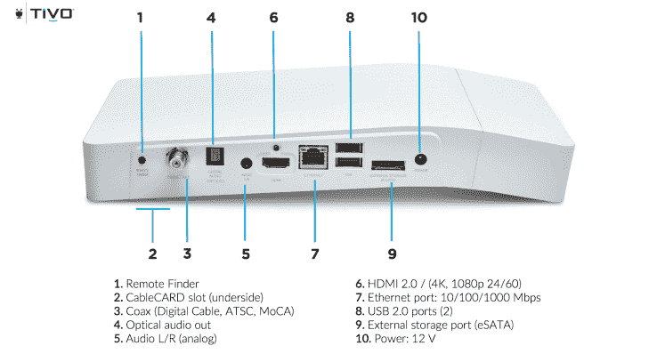
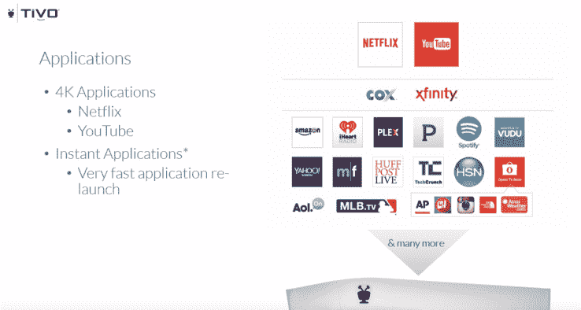
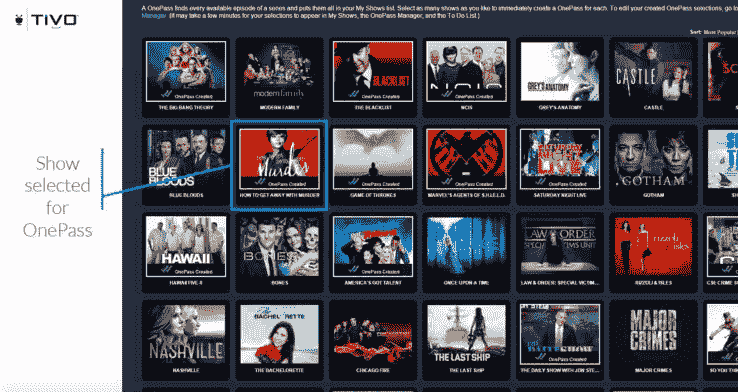
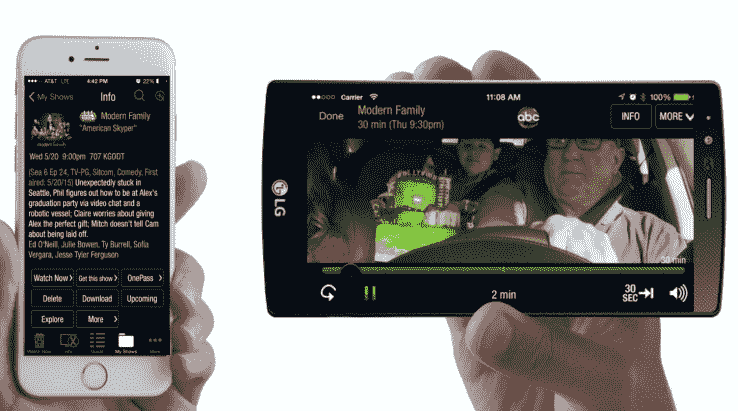
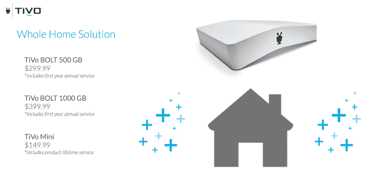
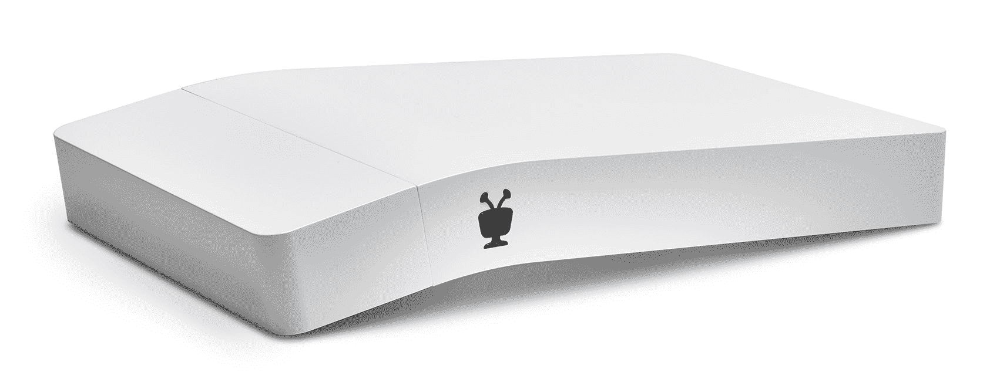

# TiVo 推出 BOLT，这是一款为流媒体时代设计的现代 DVR

> 原文：<https://web.archive.org/web/https://techcrunch.com/2015/09/29/tivo-unveils-bolt-a-modern-4k-ready-dvr-designed-for-the-streaming-era/>

DVR 制造商 TiVo 今天宣布，随着 TiVo BOLT 的到来，它的系列 6 播放器阵容又增加了一个新成员。

BOLT 是一款设计独特的全白色播放器，提供 4K 支持以及改进的用户界面，引入了一些新功能，如跳过录制内容的商业广告，以及在收听音调校正音频时将播放速度加快 30%。

该播放器还包括 TiVo 的流行功能，如 OnePass 订阅、OneSearch 和对[最近推出的门户网站 TiVo Online](https://web.archive.org/web/20230324220228/http://www.engadget.com/2015/06/09/tivo-online/) 的支持。

## 基础

*   有线电视+ OTA 支持
*   CPU 内核/DMIPS: 2/11，000
*   DDR 内存:3 GB
*   HDMI 输出:4K/HDMI 2.0/HDCP 2.2
*   4K 解码:是–HEVC/VP9
*   硬盘:500 GB 或 1 TB
*   转码/#流:片上/1-2
*   有线网络:千兆以太网
*   Wi-Fi: 802.11ac/n 2×2
*   当代艺术馆:MOCA 2.0
*   调谐器数量:4
*   控制输入:IP/RF4CE/蓝牙(未来)
*   11.4 英寸宽 x 7.3 英寸深 x 1.8 英寸高
*   1.9 磅。

**优点:**

*   现代设计，占地面积更小
*   4K/超高清平台
*   升级软件
*   更好的性能
*   新功能包括“快速模式”和“跳过模式”
*   家庭内和家庭外流媒体(2016 年家庭外)

**缺点:**

*   起价 299.99 美元，比苹果电视(149 美元以上)、Fire TV(99.99 美元)、Roku 3(99.99 美元)等流媒体播放器都贵
*   仍然需要月费或年费(14.99 美元/月或 149 美元/年)，但第一年免除
*   对于新用户来说，繁忙的用户界面和杂乱的遥控器相当于一个更高的学习曲线
*   发布时不支持 Hulu
*   对移动设备流媒体的限制

## 设计

BOLT 最引人注目的地方，乍一看，是更新的硬件设计。与 TiVo 过去提供的标准黑匣子不同，新播放器是白色的，有一个有点奇怪的曲线，最初需要一些时间来适应。硬件按钮也不见了，取而代之的是集成灯，它让播放器感觉比与之竞争的有线电视公司的 DVR 更现代。

这种设计本身不仅仅是一种审美选择——该公司表示，将播放器的一部分抬高的柔和曲线也有助于散热。鉴于硬件的内部升级，这很有用，其中包括比旧的 Roamio 型号快 3.5 倍的 CPU 和 3 倍的内存。

这些升级不仅使 TiVo BOLT 的性能更好，而且还有助于新增加的对 4K 视频的支持以及播放器现在内置的代码转换功能——这是对 Roamio-S 的另一项改进。新的 BOLT 将取代 TiVo 的入门级 DVR。像 Roamio-S 一样，TiVo BOLT 也将配备 500 GB 的硬盘，尽管也将提供 1 TB 的驱动器选项。

然而，其他 Roamio 型号，包括 Plus(6 调谐器，1 TB Roamio 型号)和 Pro(6 调谐器，3 TB 型号)不会立即消失。Plus 将在市场上保留一段时间，并将“最终”被 BOLT 取代。但 Pro 由于其更大的容量，还没有相应的 BOLT，将暂时继续存在。

当然，虽然 TiVo 不会证实这一点，但 Pro 似乎也将在未来逐步淘汰，因为产品阵容有点分散可能会引起消费者的困惑。

## 五金器具

BOLT 设备本身比早期的 Roamio 型号更小，比 Roamio 小 33 %,比 Roamio Plus 和 Pro 小 65%。它包括对 over-the-top 流媒体服务、天线无线录制和有线电视录制的支持。这使得它对于断线钳和有线电视用户来说都是一个不错的选择，假设他们想购买像 TiVo 这样的一体化设备。

在设备的背面(和底部)有各种输入，包括 CableCARD 插槽、同轴端口、光学音频输出、音频 L/R(模拟)端口、HDMI 2.0 插槽(4K、1080p、24/60)、以太网、2 个 USB 2.0 端口、外部存储端口(eSATA)和电源适配器端口。

在内部，TiVo 坚持使用旋转磁盘驱动器，以降低成本。

## 遥远的

TiVo 遥控器也有了一点升级。虽然它仍然感觉像有线电视公司的 DVR 自带的遥控器一样有很多按钮，但它现在有一个白色的设计和新功能按钮，如“SkipMode”，一个通过按绿色“D”按钮激活的商业跳过功能，以及“QuickMode”，一个通过按“Play”按钮然后按“Select”按钮进行加速播放的功能。

一个方便的功能是“丢失的遥控器”寻找功能，让你按下 TiVo 本身背面的一个按钮，以便通过音频声音来定位丢失的遥控器。遥控器提供了射频技术，无需直接指向 TiVo 单元就能工作。

该遥控器不像 Apple TV 和亚马逊的 Fire TV 那样支持语音，但 BOLT 本身带有蓝牙功能，尚未打开。这暗示着未来的远程硬件升级可能会引入语音选项。

## 软件/用户界面

与此同时，TiVo BOLT 软件也进行了更新。对于那些熟悉 TiVo 的外观和感觉的人来说，这与其说是一次彻底的升级，不如说是一次迭代。例如，某些屏幕导航元素使用了一些不同的颜色，更扁平的图标补充了新设备更现代的设计，频道标志现在出现在指南中。

BOLT 软件更值得注意的是它对 4K 的支持，包括网飞和 YouTube 应用程序，更快的应用程序启动时间，以及新的 QuickMode 和 SkipMode 功能。

此外，由于更强大的硬件，TiVo BOLT 上的应用程序可以比以前更快地启动和恢复。例如，Roamio 上的应用程序启动时有时需要 10 到 15 秒，但现在在 BOLT 上需要 5 到 7 秒。另外，BOLT 是唯一一个在内存中暂停应用程序以允许更快恢复的 TiVo 播放器。

TiVo 继续专注于其更大的战略，即允许观众找到、订阅和观看各种来源的内容，无论是 DVR 录像，亚马逊和网飞等流媒体服务上的节目，还是 YouTube 上的视频。(不幸的是，在 TiVo 等待该公司从 Flash 过渡到 HTML5 时，Hulu 没有出现在应用程序集合中。)

博尔特还提供 TiVo 的“OnePass”技术，让你可以立即订阅节目，不管这些剧集在哪里。它甚至通过“OnePass QuickSelect”功能改善了新用户的体验，新用户可以通过他们的欢迎电子邮件指向一个热门节目页面，他们只需点击即可订阅。

## 突出的功能:快速模式和跳过模式

如上所述，BOLT 的另一个重要特性是 QuickMode 和 SkipMode。前者实际上是三年前由一位 TiVo 工程师提出的，但从未投入生产。从本质上来说，这是一个最好的选择，用于加速您试图获取信息的新闻或体育等内容，但不一定要寻求传统的，向后倾斜的电视观看体验。

相反，QuickMode 可以让你的观看速度提高 30 %,并带有音调校正的音频。

[gallery ids="1217035，1217034，1217033，1217032"]

另一方面，使用 SkipMode，TiVo 实际上是以一种方式标记内容，允许用户按一下按钮就可以移到节目的下一部分，而不必观看商业广告。该功能在 20 个受欢迎的频道上直播，但目前仅用于黄金时段节目(下午 4 点到午夜，包括重播和深夜脱口秀)。)使用 SkipMode 不会干扰使用其他回放功能(如快进或快退)的选项。

SkipMode 将是 BOLT 独有的功能，但 QuickMode 将在今年晚些时候作为软件更新推广到其他 Roamio 型号。

BOLT 的集成内容流——这意味着它向电脑、手机和平板电脑传输内容的能力——在发布时受到限制。最初，用户只能在家中观看一个流，直到 2015 年 11 月增加对两个流的支持。网络流媒体和室内下载在发布时也可以使用，但室外下载和流媒体要到 2016 年才会推出(后者将只提供一个流媒体，明年上半年推出)。

## 更新的移动应用

TiVo BOLT 升级的最后一部分是更新的移动应用程序。这款新应用于 11 月初首次在 iOS 上推出，随后将在 Android 上推出，它专注于为用户提供更加个性化的体验。与在网飞上配置用户配置文件不同，定制是基于每台设备的，现在除了流派和扩展的收藏列表之外，用户还可以跟踪自己的爱好和兴趣。

首先，用户将通过类似 Flipboard 的入职流程从一系列爱好和兴趣中进行选择。这个过程然后根据这些选择创建定制的 YouTube 频道。例如，如果你真的喜欢“露营”或“动物”，你可以把这些部分添加到你的“看什么”部分。

如果用户不喜欢这类内容，他们现在还可以隐藏预先配置的订阅源(如“体育”或“儿童”)。

该应用程序引入了扩展的社交分享功能，超越了脸书和 Twitter，包括电子邮件和其他方法。当朋友点击一个共享链接时，他们将进入 TiVo 门户网站，在那里他们可以选择录制节目(如果他们是 TiVo 用户)或被定向到内容本身(例如，电视频道自己网站上的剧集列表)。

## 新定价:第一年没有订阅费

或许 TiVo BOLT 最大的变化是该公司含蓄地承认，随着更多电视观众切断绳索，转向低成本流媒体服务作为他们的电视和电影娱乐来源，其当前的商业模式可能会成为一个问题。

虽然 TiVo 一直致力于拓展有线电视用户的体验，但这些用户的数量正在减少。对于那些希望通过签约更便宜的服务来节省成本的人来说，TiVo 基于订阅的模式可能难以接受，比如网飞或 Hulu 每月 10 美元以下的服务。

通过 BOLT，TiVo 并没有放弃订阅，而是在某种程度上推迟了订阅——该公司可能希望此举能够吸引新用户，以便他们在时机到来时愿意付费。

500 GB 版本的 BOLT 价格为 299.99 美元，1000 GB 版本的价格为 399.99 美元。这比 199.99 美元的 Roamio 要贵，Roamio 需要每月 14.99 美元的订阅费，但这是因为第一年的服务是捆绑在一起的。一年后，客户可以选择支付月费或购买 149.99 美元的年费。

当然，TiVo 不会完全承认电视市场的转变对其业务有潜在的不利影响，但新产品和定价确实表明该公司明白，仅仅为有线电视观众升级 DVR 是不够的。它必须找到一种方式来吸引那些想要多平台观看和无线 DVR 功能的人。

TiVo 产品营销副总裁 Jim Denney 承认:“我们与有线电视提供商有大量业务往来，因此我们不鼓励人们放弃有线电视订阅，但事实是，市场甚至比几年前更具活力。”。

“BOLT 应该对[断线钳]有强大的吸引力……你可以获得完整的 DVR、所有 OTA DVR 功能和所有 OTT 应用，完善你的内容体验，”他说。“我们是为那些已经决定不看付费电视的人打造的，但这是一个灵活的平台——它可以满足两种突发情况。”

TiVo BOLT 将于明天在亚马逊和百思买上销售，并将于周日进入零售渠道。订单将从周一开始执行。