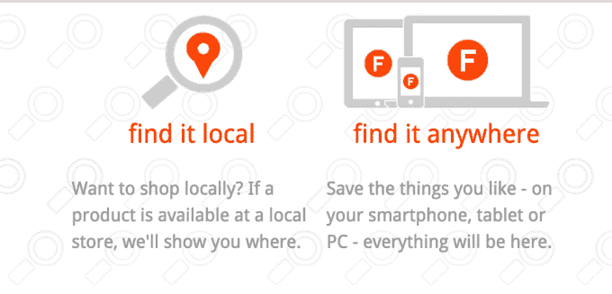

# 脸书收购并关闭购物网站 TheFind，通过广告促进商业发展

> 原文：<https://web.archive.org/web/https://techcrunch.com/2015/03/13/to-boost-commerce-in-ads-facebook-buys-and-shuts-down-shopping-site-thefind/>

# 脸书收购并关闭购物网站 TheFind，通过广告促进商业发展

脸书今天宣布，它已经收购了个性化购物搜索引擎 Find，以帮助改善其商业广告。该基金会自 2005 年成立以来，已经从光速和红点筹集了 2600 万美元[，但现在将被关闭。一些，但不是全部，团队成员将加入脸书。](https://web.archive.org/web/20220815153308/https://www.crunchbase.com/organization/thefind)

TheFind 的产品允许人们在搜索其庞大的产品数据库时获得定制的产品推荐。用户可以输入类似“黑色毛衣”这样的通用术语，然后比较由 Find 汇总的众多零售商的黑色毛衣价格。如果他们立即想要，他们也可以在当地找到购买他们选择的产品的地方。

就在上个月，脸书推出了一个[特别广告单元](https://web.archive.org/web/20220815153308/https://beta.techcrunch.com/2015/02/17/facebook-product-ads/#fTw4kd:NC8B)，旨在突出商家试图出售的特定产品。这一发现不仅可以帮助脸书更好地匹配公司和用户，还可以确保广告中显示的产品是他们可能购买的东西。

过去几年，脸书越来越多地向寻求购买应用安装广告的大品牌广告商和开发商示好。但随着新产品广告和这次收购，它似乎打算从直销商、电子商务公司和时尚品牌身上榨取更多的现金。

脸书告诉我:

> “我们很兴奋地欢迎这个发现来到脸书。TheFind 的天才团队已经建立了一个成功的搜索引擎，将人们与产品联系起来。我们相信，通过共同努力，我们可以让脸书的广告体验对消费者来说更有意义、更好。我们的业务是将人们与他们关心的话题、公司、品牌以及越来越多的产品联系起来，我们期待着与 Find 一起实现这一目标。”

该发现写道:

> 我们要加入脸书了！
> 
> 在过去的九年里，我们努力为您带来简单、高效和有趣的购物体验——在网上搜索所有商店，找到您想要购买的商品。
> 
> 我们现在开始了我们的下一个篇章，与脸书联合起来，为消费者做更多的事情。脸书的资源和平台让我们有机会将我们在产品采购方面的专业知识扩展到超过 10 亿使用该平台的人。
> 
> 我们团队的主要成员正在加入公司，并将努力整合我们的技术，让你每天在脸书看到的广告更好，更贴近你。
> 
> 不幸的是，这意味着我们将在未来几周内关闭我们的搜索引擎。
> 
> 感谢您的忠诚，感谢您让我们所有人的旅程充满乐趣！