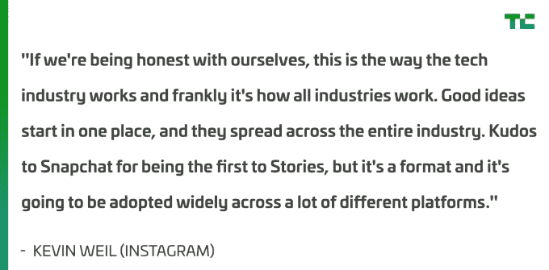

# Instagram 对抄袭 Snapchat 的评论:“这就是科技行业的运作方式”

> 原文：<https://web.archive.org/web/https://techcrunch.com/2017/05/16/to-clone-or-not-to-clone/>

"坦白地说，我认为如果我们说'哦，看那边那个好主意，它实际上满足了人们分享更多生活时刻的需求，那我们就太傻了？因为有一个人做到了，我们甚至不能接近这个想法。"

这是 Instagram 的产品副总裁凯文·韦尔(Kevin Weil)关于克隆 Snapchat 的观点。他负责将 Snap 首席执行官埃文·斯皮格尔的愿景带给更多的观众，为主流媒体重新打造他的功能，然后将 Instagram 推进一步。

但他并没有对复制 Snap 的成功表现出内疚、自责或不情愿，而是把它视为一个必然的结论——进步的必然进程，你要么排队，要么被甩在后面。

今天在 [TechCrunch Disrupt NY，](https://web.archive.org/web/20230219143738/https://techcrunch.com/2017/05/16/instagrams-kevin-weil-says-instagram-stories-are-just-one-part-of-the-product/)的舞台上，我问他是否同意他自己的首席执行官凯文·斯特罗姆，他去年告诉我[“他们应该得到所有的荣誉”](https://web.archive.org/web/20230219143738/https://techcrunch.com/2016/08/02/silicon-copy/)关于 Snapchat 发明的故事。他的回答是:

本质上，目标是让 Instagram 对其用户更有用，推动其使人们更接近的使命。重复是达到目的的正当手段。“关键是你要解决的问题，”韦尔说。

您可以在这里观看整个面板。我们在 4:08 开始与 Snap 讨论竞争。

事实是，我们每天使用的大多数应用程序都是基于以前产品的构建模块。如果社交应用没有相互复制，那么将只有一个带有提要的应用、一个带有标签的应用、一个带有图像过滤器的应用、一个带有用户简档的应用或一个带有即时消息的应用。

韦尔打了个比方，“皮克斯是第一个制作电脑动画电影的人，但我认为我们都更好，因为像梦工厂这样的公司也带来了很棒的电影。”

比为什么 Instagram 会复制 Snapchat Stories(为其用户提供价值)或者它是否适合 Instagram 的业务(Stories 之间的广告可以为 Instagram 赚很多钱)更复杂的问题是，这种复制是否值得——甚至是可持续的。

当被问及是否可以用这个尺度来评判战略时，韦尔退缩了。“我不认为这有什么荣誉。我想这不是一个词，我会归因于它。”

Instagram 的蝴蝶冠过滤器(左)对比 Snapchat 的[花冠](https://web.archive.org/web/20230219143738/http://www.lifeofkaisey.com/2016/04/snapchat-flower-crown-lens.html)过滤器(右)

有一种观点认为 Instagram 有责任为其用户服务，科技的竞争环境使得 Instagram 的复制成为必要。Instagram Stories 每天有 2 亿用户，所以它显然让一些人开心，这可能就足够了。

韦尔总结道:“我们显然在建设人们关心的东西，这才是最重要的。”。“这是一个大行业，整个行业将会有多个成功的参与者，所以对我们来说，这不是一个人倒下的问题。它是关于“我们正在建造正确的东西来增加人们生活的价值吗？”"

硅谷以创新为荣，但实际上把大部分时间花在了快速增量迭代上。如果像脸书这样的科技巨头能够比初创公司更快地实现自己的想法，那可能就是“科技产业的运作方式”尽管如果科技巨头的克隆让新的创业公司面临更大的风险，他们可能得不到资金，有一天，可能没有人可以复制。