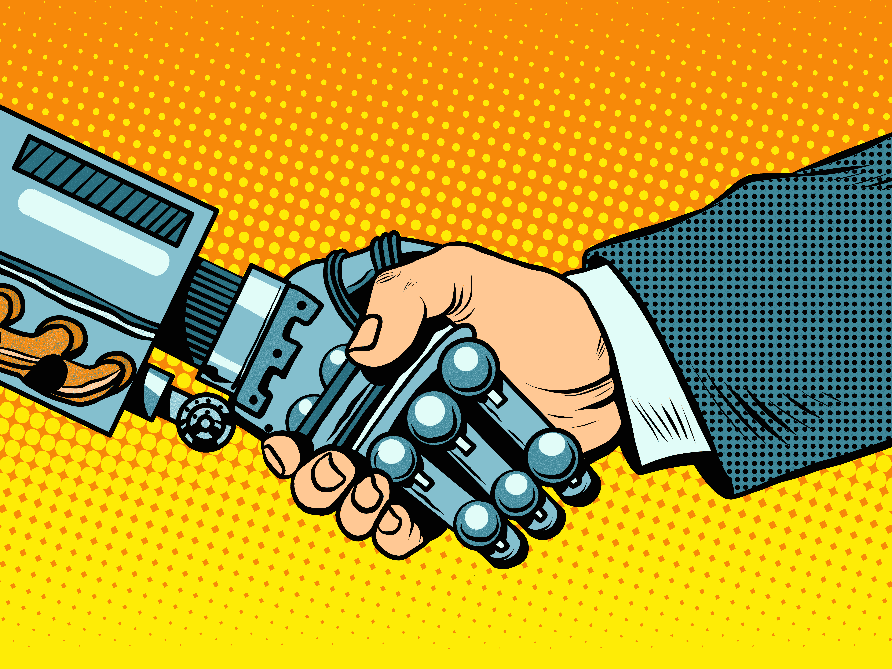
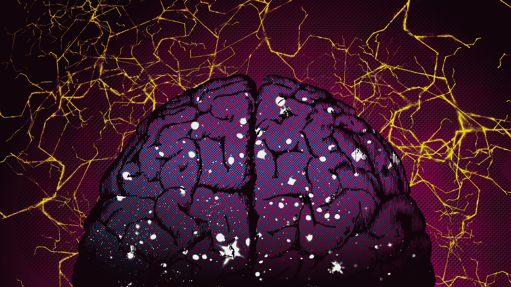

# 为了控制人工智能，我们需要更多地了解人类

> 原文：<https://web.archive.org/web/https://techcrunch.com/2017/09/13/to-control-ai-we-need-to-understand-more-about-humans/>

阿娇哈德菲尔德撰稿人

More posts by this contributor

从弗兰肯斯坦到我，机器人，几个世纪以来，我们一直对创造可能发展自主和自由意志的生物感到好奇和恐惧。

现在，我们正站在越来越强大的人工智能时代的尖端，开发确保我们的创造总是做我们希望他们做的事情的方法的紧迫性正在增加。

对于人工智能领域的一些人来说，像马克[扎克伯格](https://web.archive.org/web/20221208133545/http://fortune.com/2017/07/25/mark-zuckerberg-elon-musk-artificial-intelligence/)，人工智能一直在变得更好，如果出现问题，技术将会解决它们。但对其他人来说，像埃隆[马斯克](https://web.archive.org/web/20221208133545/https://www.theguardian.com/technology/2017/jul/17/elon-musk-regulation-ai-combat-existential-threat-tesla-spacex-ceo)，是时候开始弄清楚如何监管强大的基于机器学习的系统了。

在这一点上，我支持马斯克。不是因为我认为好莱坞喜欢吓唬我们的末日场景即将到来，而是因为扎克伯格认为我们可以解决任何未来问题的信心取决于马斯克的坚持，即我们现在需要“尽可能多地学习”。

我们迫切需要了解的不仅仅是人工智能如何工作，还有人类如何工作。

人类是这个星球上最善于合作的物种。我们在认知和交流方面胜过所有其他动物——这些工具使我们能够分工和共享生活，在这种生活中，我们必须依靠他人做好自己的工作。这就是我们的市场经济和政府系统的全部内容。

但是复杂的认知和语言——人工智能已经开始使用——并不是使人类在合作中如此成功的唯一特征。

人类也是唯一发展出“群体规范性”的物种——这是一个由规则和规范组成的复杂系统，指定了其他人可以接受和不可以接受的行为，并通过惩罚违反规则者的群体努力来加以控制。

许多这些规则可以由监狱和法院的官员来执行，但最简单和最常见的惩罚是集体制定的:批评和排斥——拒绝在公园、[市场](https://web.archive.org/web/20221208133545/http://fortune.com/2016/10/24/wells-fargos-scandal-could-end-up-costing-bank-8-billion/)或[工作场所](https://web.archive.org/web/20221208133545/https://www.nytimes.com/2017/08/07/business/google-women-engineer-fired-memo.html)与违反规范的人玩耍。

说到认可机构行使自由意志的风险，我们真正担心的是它们是否会继续遵守并帮助执行我们的规则。

到目前为止，人工智能社区和资助人工智能安全研究的捐赠者——像 T2·马斯克和几个 T4 基金会这样的投资者——大多求助于伦理学家和哲学家，帮助他们思考如何构建出性能良好的人工智能。像尼克·博斯特罗姆这样的思想家提出了关于人工智能和人工智能研究者应该关心的价值观的重要问题。

但我们复杂的规范性社会秩序与其说是关于道德选择，不如说是关于数十亿人的协调，这些人每天都在就如何行为做出数百万个选择。

这种协调是如何实现的，我们并不真正了解。文化是一套规则，但是是什么让它改变——有时很慢，有时很快——是我们还没有完全理解的。法律是另一套规则，我们可以简单地在理论上改变，但在现实中却不那么容易。

因此，作为我们群体的新成员，人工智能是一个值得怀疑的原因:他们知道和理解什么，他们的动机是什么，他们对我们有多少尊重，他们有多大意愿找到建设性的冲突解决方案？人工智能只有在能够阅读并参与我们精心设计的规范系统的情况下，才能融入该系统。

在人工智能更加普及的未来，人们将定期与机器互动——有时甚至不知道。当一些汽车是自动驾驶的，并相互交谈，但不是我们时，我们驾驶或遵守交通法规的意愿会发生什么？我们会相信机器人会在学校照顾我们的孩子，或者在疗养院照顾我们年迈的父母吗？

社会[心理学家](https://web.archive.org/web/20221208133545/https://www.theguardian.com/science/head-quarters/2017/apr/24/why-are-we-reluctant-to-trust-robots)和[机器人专家](https://web.archive.org/web/20221208133545/http://humanrobotinteraction.org/2017/programme/proceedings/)正在思考这些问题，但是我们需要更多这种类型的研究，更多关注系统的特征，而不仅仅是单个机器或过程的设计。这将需要考虑规范系统设计的人的专业知识。

我们是否准备好让人工智能开始建立自己的规范系统——它们自己的关于机器可以接受和不可以接受的规则——以协调它们自己的交互？我预计这将会发生:像人类一样，人工智能代理将需要有一个预测其他机器将做什么的基础。

我们已经看到人工智能通过[创造他们自己的语言](https://web.archive.org/web/20221208133545/https://www.theatlantic.com/technology/archive/2017/06/artificial-intelligence-develops-its-own-non-human-language/530436/)来提高他们在合作任务中的表现，这让他们的开发者感到惊讶。但是脸书关闭开发了人类无法理解的语言的合作人工智能的能力不一定是一个永远存在的选项。

正如人工智能研究员 Stuart Russell [强调的](https://web.archive.org/web/20221208133545/https://www.ted.com/talks/stuart_russell_how_ai_might_make_us_better_people)，更聪明的机器将会发现，如果它们死了，它们就不能做人类交给它们的任务——因此我们现在必须开始思考如何设计系统，以确保它们继续[重视人类的投入和监督](https://web.archive.org/web/20221208133545/https://www.nytimes.com/2017/08/13/technology/artificial-intelligence-safety-training.html)。

为了建造遵循规则的智能机器，这些规则是由多个相互冲突、有时甚至不成熟的人类群体帮助形成的，我们需要更多地了解是什么让我们每个人每天都愿意这么做。