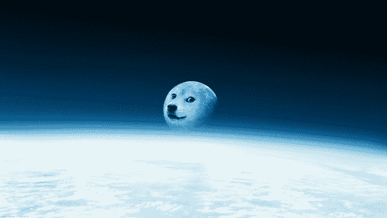

# 去月球！Lunar XPRIZE 团队希望将维基百科送上自制漫游车 

> 原文：<https://web.archive.org/web/https://techcrunch.com/2016/04/21/to-the-moon-lunar-xprize-team-looks-to-send-wikipedia-into-space-aboard-homemade-rover/>

快速:你可以向月球发送 20 千兆字节的数据。会是什么呢？时间到了！

维基百科？真是太巧了——这也是为谷歌的 Lunar XPRIZE 研发国产月球车的团队[兼职科学家](https://web.archive.org/web/20230201185418/http://lunar.xprize.org/teams/part-time-scientists)的决定！他们真的计划[把维基百科带到月球](https://web.archive.org/web/20230201185418/https://meta.wikimedia.org/wiki/Wikipedia_to_the_Moon/About)。

不，这不是一个笑话，[FAQ 快速向读者保证](https://web.archive.org/web/20230201185418/https://meta.wikimedia.org/wiki/Wikipedia_to_the_Moon/FAQ)。PTS 是奥迪赞助的车队,是争夺 3000 万美元奖金的几个车队之一——其中它已经赢得了 75 万美元。这不是在某人的车库里进行的业余项目。

最终的挑战是让月球车安全到达月球表面，让它行驶 500 米并传回一些图像。PTS 设计的火星车看起来像真的一样，该团队甚至有一个发射窗口:2017 年底，乘坐商业火箭。然而，这只能把他们带到轨道上——到达月球必须依靠他们自己的力量。

 然而，凑巧的是，他们的火星车的有效载荷还有 20 GB 剩余。PTS 联系了德国维基媒体(该团队总部设在柏林)，两人决定，这将是刚刚够的空间，以适应一个策划版本的维基百科——整个事情与图像和视频将占用几倍。这将是航海家的[《金唱片》、《T4》和口袋妖怪的一种更新版本。](https://web.archive.org/web/20230201185418/https://en.wikipedia.org/wiki/Voyager_Golden_Record)

监管过程虽然不像将漫游者安全送上月球那样困难，但仍然不简单，这也是该项目需要帮助的部分。

> 需要有一个内容的选择，这揭示了项目背后的真正挑战:我们选择什么？谁来决定？我们如何做到这一点？
> 
> 如果你有机会将所有人类知识的总和带到月球上，你难道不应该努力表现出同样的多样性吗？正是这种多样性使维基百科成为迄今为止世界上最著名的合作项目。

毫无疑问，这将成为一场前所未有的火焰战争的基础。[讨论区](https://web.archive.org/web/20230201185418/https://meta.wikimedia.org/wiki/Wikipedia_to_the_Moon/Discussion)已经像人们建议的那样升温，例如，只使用英语以防止重复，或者包括每种语言的 30 个项目，或者不在乎这种或那种方式，因为外星人无论如何都可以将一个翻译成另一个。

我们真的希望外星人能找到这张光盘吗？与旅行者 1 号不同，旅行者 1 号现在在星际空间中，因此可能会成为路过的外星人感兴趣的对象，认为一个智能体千里迢迢来到这里只是为了在月球上停留似乎有点牵强。

FAQ 比我更好地解释了这个问题:

> 月球挑战主要是关于先锋精神、好奇心和对人类的展望。因此，通过在月球表面留下人类历史快照的象征性行为，我们更多地考虑的是后代而不是外星人……我们非常特殊的维基百科时间胶囊将作为历史文件存在。的确，这将是特别的，因为对未来的历史信息从来没有被这么多人研究过，代表了这么多的文化和对知识的观点。

计划是在 12 月 5 日国际志愿者日之前完成所有这些工作——但是如果你想参加，你需要在接下来的几周内权衡一下。该团队希望在 6 月的 Wikimania Esino Lario 上宣布最终的策略和细节。

去月球！