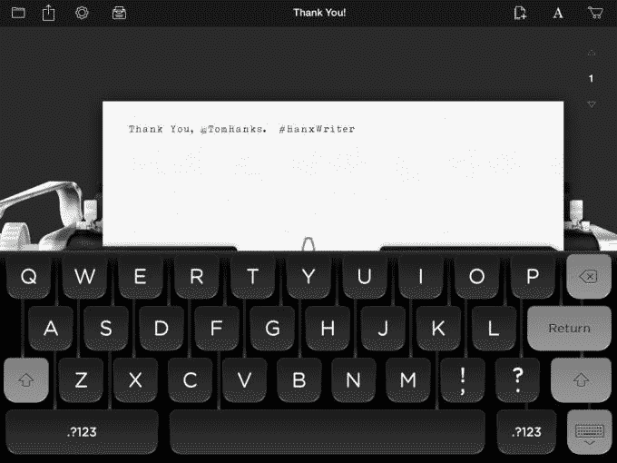
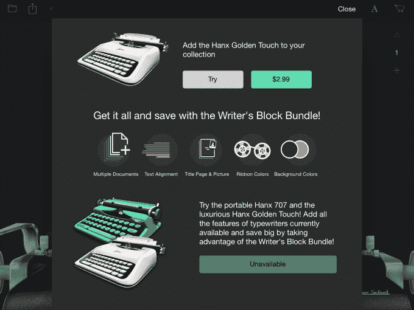
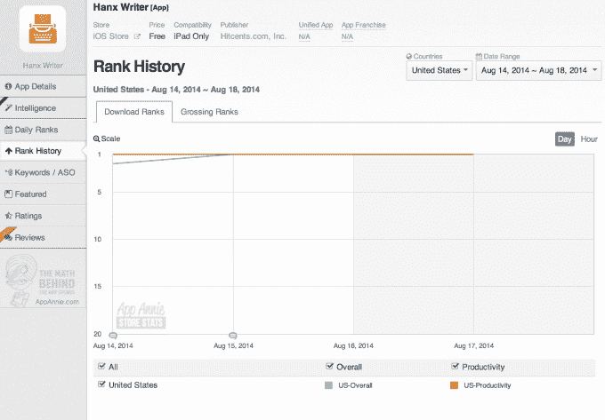
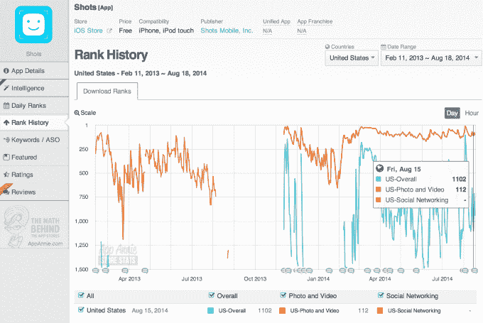

# 汤姆·汉克斯的打字机应用跃居应用商店榜首

> 原文：<https://web.archive.org/web/https://techcrunch.com/2014/08/18/tom-hanks-typewriter-app-shoots-to-the-top-of-the-app-store/>

汤姆·汉克斯的名字似乎不仅仅能卖出一部电影。他最近为 iPad 推出的时髦打字机应用程序 [Hanx Writer](https://web.archive.org/web/20230301154009/https://itunes.apple.com/us/app/hanx-writer/id868326899?mt=8) 现在已经跃居 iTunes 应用程序商店的首位，在生产力部分和整体排名中都名列第一。

上周推出的 Hanx Writer 将你的 iPad 变成一台老式打字机，提供一种*伪*模拟打字体验。现在，当你到达新行的末尾时，按键、硬回车和钟声的声音会伴随着现代化的便利，如无需白带或涂改液即可更正，以及完成后打印、电子邮件或共享文档的选项。

有必要吗？不，不是真的。用起来过瘾，制作精良吗？嗯，是的。

该应用程序提供了一个屏幕键盘或与你的蓝牙键盘配对，这样你就可以假装你没有在塑料 y 键上打字。

虽然是免费的，但用户也可以选择在应用程序中购买额外的打字机型号，包括 Hanx 707 和 Hanx Golden Touch，以补充默认选择 Hanx Prime Select。

一个演员花了一生的时间阅读打印出来的剧本，并通过他个人收藏的许多打字机中的一台进行通信，在他想象的应用程序中可以找到切换机器的选项。

你可能还记得汉克斯去年夏天在《纽约时报》上发表的《打字机颂歌》——也许这是他即将推出的应用的一个聪明的营销策略。在书中，他解释了这些经典机器的吸引力，说道:

> 你在打字机上打出的每样东西听起来都很棒，单词在抖啊抖啊抖的小爆炸中形成。一封感谢信与一部文学杰作产生了同样的共鸣。
> 
> …
> 
> 除了声音，还有打字带来的纯粹身体上的快乐；感觉就像听起来一样好，你手上的肌肉控制着听觉攻击的音量和节奏，这样房间里就回荡着你突触的断奏。
> 
> 您可以选择与您的声音信号相匹配的打字机。

最近，在接受苹果公司 [@AppStore](https://web.archive.org/web/20230301154009/https://twitter.com/appstore) 推特账户(是的，我知道，欢迎来到新媒体)的采访时，汉克斯进一步解释了他创建这款应用的动机，他说，“我想拥有老式手动打字机的感觉——我想要打字的声音，如果没有别的东西的话……因为我发现这就像音乐一样刺激着创作的冲动。“砰，砰，砰，砰，砰，砰，砰，砰，砰，砰，砰，砰，砰，砰，砰，砰，砰，砰，砰，砰，砰，砰，砰，砰，砰，砰，砰，砰，砰，砰，砰，砰，砰，砰，砰，砰，砰，砰，砰，砰，砰，砰，砰，砰，砰，砰，砰，砰，砰，砰，砰，砰，砰，砰，砰，砰，砰，砰，砰，砰，砰，砰，砰，砰，砰，砰，砰，砰，砰，砰，砰，砰，砰，砰，砰，砰，砰，砰，砰，砰，砰，砰，砰，砰，砰，砰，砰，砰，砰

他还在应用程序中详细说明了这三种打字机的区别，并补充说，Prime Select 会让你砰然离去，而 707 更小、更安静，Golden Touch 是豪华型号。

正如在《泰晤士报》的早期文章中，汉克斯也承认，在打字机上做“真正的工作”并不总是实际的，不管是虚拟的还是真实的。他说，这款应用可能不是学期论文或法律简报的最佳选择，但对于笔记、日记或情书——你希望看起来特别的东西——来说是有意义的。

汉克斯与 iOS develop Hitcents 合作，将 Hanx Writer 带入生活，Hitcents 目前生产许多游戏和其他应用程序。自首次亮相和 App Store 攀升以来，该应用程序已收到 1310 条评论，基本上是正面的，目前拥有 4.5 星的评级。

以免你认为这款应用的吸引力仅仅来自名人的支持，以及美国人对汉克斯先生的普遍喜爱，事实可能并非如此。毕竟，看看贾斯汀比伯的自拍应用 Shots ( [以前我的照片](https://web.archive.org/web/20230301154009/https://techcrunch.com/2013/11/12/justin-bieber-shots-of-me/))来做比较:即使是这位歌手的大量粉丝和“自拍”潮流似乎也不能让这款应用成为社交网络的最爱，它从未在任何时间点上登上 App Store 的榜首，包括在它首次亮相和嗡嗡作响的媒体之后。

*汉克斯:*

*比伯:*

*图片鸣谢:@ AppStore TwitterHanx 作家；App Annie*