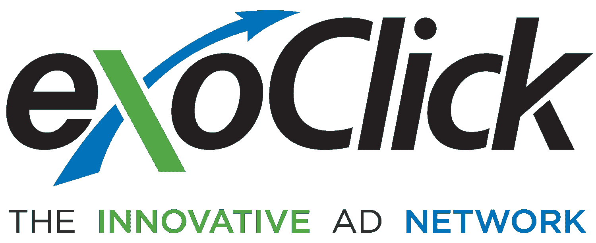
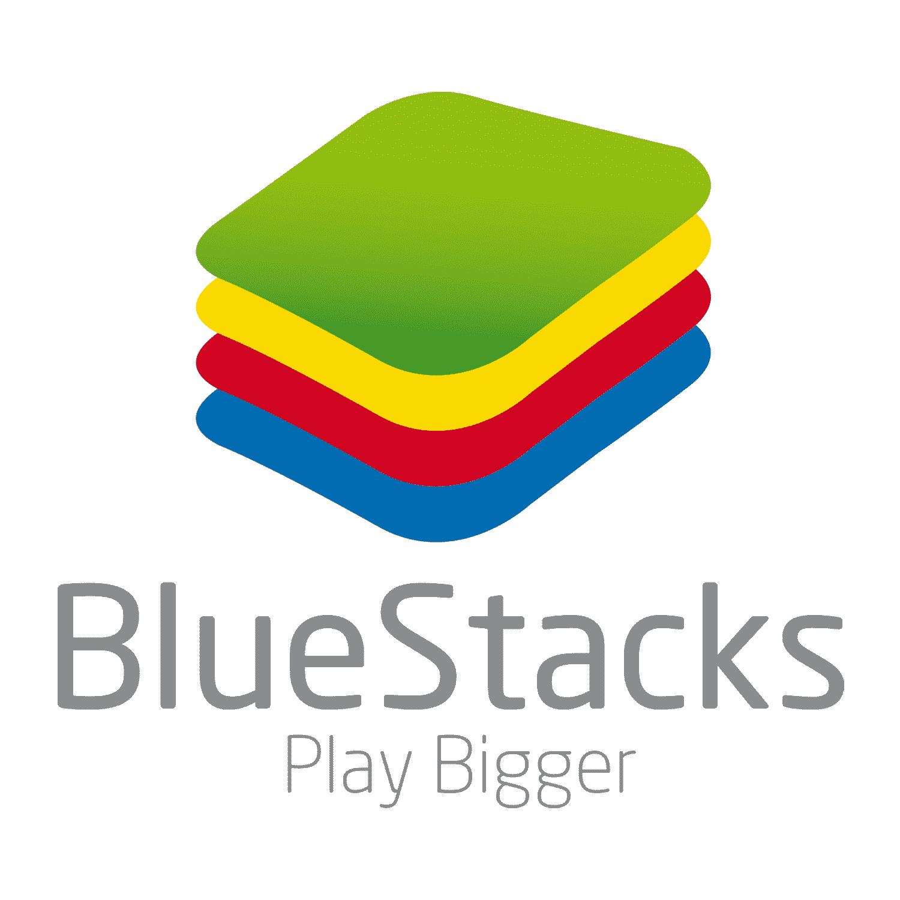
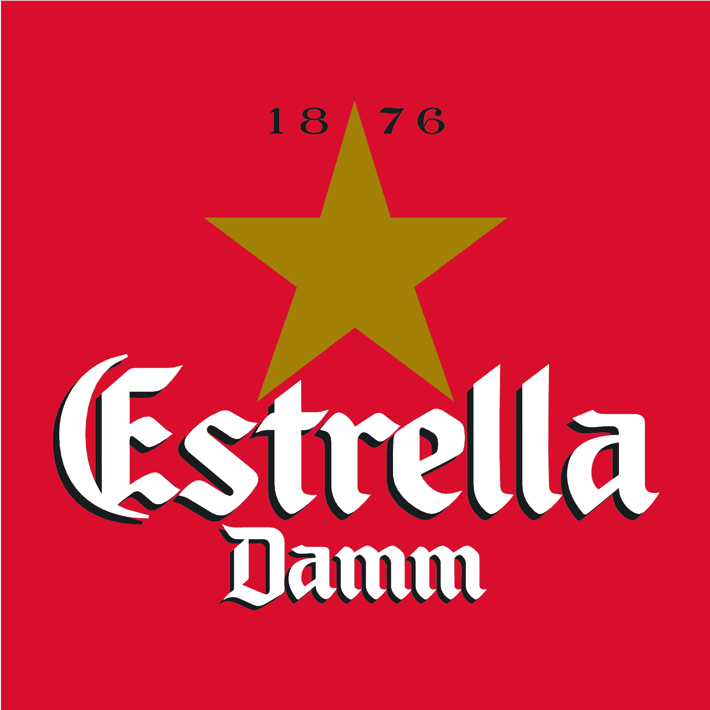

# 明天是巴塞罗那的比赛和开球！

> 原文：<https://web.archive.org/web/https://techcrunch.com/2015/03/02/tomorrow-is-the-barcelona-meet-up-and-pitch-off/>

巴塞罗那的比赛就在明天！万岁。如果你已经买了票，对你有好处。它们是稀有商品。如果你没有，那你就有点不走运了，因为活动门票已经卖完了。记住，你必须有正式的 Eventbrite 票才能加入我们。

如果您没有 Eventbrite 门票，您就没有注册。如果你只是把你的名字添加到最初的谷歌列表中，那就不算数了。抱歉。

如果你没有入围，不要害怕:只要在活动中找到我们，告诉我们一些关于你的创业公司的事情。我们很乐意接受卡片并跟进。

这是参加比赛的选手。他们将有两分钟的时间进行推介，并有四分钟的时间接受 TC 编辑和当地评委的提问。获胜者将在纽约的 TC Disrupt Startup Alley 获得一张桌子，亚军将获得两张活动门票。参赛者是:

[fuel yalty](https://web.archive.org/web/20230130000647/http://www.fueloyal.com/)
Kompyte
[Avegant](https://web.archive.org/web/20230130000647/http://www.avegant.com/)
[Swytch](https://web.archive.org/web/20230130000647/http://www.swytch.com/)
[rendeevoo](https://web.archive.org/web/20230130000647/http://www.rendeevoo.com/)
[Hirestack](https://web.archive.org/web/20230130000647/https://hirestack.com/)
[every layer](https://web.archive.org/web/20230130000647/http://www.everylayer.com/)
[face meeting](https://web.archive.org/web/20230130000647/http://www.facemeeting.com/)
[canguroencasa.com](https://web.archive.org/web/20230130000647/http://canguroencasa.com/)

注:活动已售罄。我们期待着惊人的结果。我希望你早点买票。

日期:2015 年 3 月 3 日星期二
时间:19:00–22:00。20 点开球。
详情:在欧洲中部时间 19:30 至 21:30(最后一轮)期间提供开放酒吧和小吃/小吃。
地点: [Ailaic](https://web.archive.org/web/20230130000647/http://www.ailaic.com/) ，Passatge Utset 14，我们将与东道主荷兰的移动网络赛事合作。
费用:€5.50
**[在这里买票](https://web.archive.org/web/20230130000647/https://www.eventbrite.com/e/techcrunch-pitch-off-event-barcelona-2015-tickets-15691591974?utm_campaign=new_event_email&utm_medium=email&utm_source=eb_email&utm_term=viewmyevent_button)**

感谢荷兰移动网络的好心人，今年的巴塞罗那见面会和开球将会非常精彩。有这样一个有求必应、善解人意的伴侣真是太好了。也就是说，他们正在处理所有的赞助，仍然需要你的帮助。请给我本人发电子邮件到 john@beta.techcrunch.com 的 T2，或者给卡罗琳 dutchmobilenetworking.com 的卡罗琳发电子邮件。

# 赞助商

**金牌赞助商**

[Vserv](https://web.archive.org/web/20230130000647/http://www.vserv.com/)是一个领先的移动营销平台，为营销人员、应用程序开发人员、电信公司和数据合作伙伴提供智能数据导向的结果。凭借其屡获殊荣的市场第一技术，该公司为新兴的十亿移动互联网用户提供引人入胜的移动体验。成立于 2010 年；Vserv 拥有超过 5 亿个唯一用户配置文件，其办事处遍布全球，包括美国、英国、南非、印度、新加坡、泰国、印度尼西亚、马来西亚、菲律宾&越南。

**饮料赞助商**

[exo click](https://web.archive.org/web/20230130000647/https://www.exoclick.com/)是一家自筹资金的初创企业，由首席执行官本杰明·丰泽(Benjamin Fonzé)于 2006 年创办，他现在和他的兄弟阿德里安(首席运营官)一起经营。ExoClick 总部位于西班牙巴塞罗那，是一家创新的全球广告网络，每月通过其专有软件向网络和移动广告客户/出版商平台提供 1250 多亿个地理定位广告。该公司目前被 W3Techs 列为世界第五大广告网络，也是唯一一家三次入选德勤快速 500 强的西班牙公司。ExoClick 还在员工人数在 20-49 人(PYMES)的西班牙 20 大最佳工作场所中排名第 11 位。

 
背靠安德森-霍洛维茨、三星、英特尔等， [BlueStacks](https://web.archive.org/web/20230130000647/http://bluestacks.com/) 是移动营销自动化的领导者。该公司成立于 2011 年，总部位于硅谷，在伦敦、东京和北京设有办事处。BlueStacks 的 App Player 软件支持任何手机应用或游戏在 PC 上运行。预装在联想和华硕电脑上的 App Player 最近在全球下载量突破了 8500 万次。

[
埃斯特拉·达姆](https://web.archive.org/web/20230130000647/http://www.estrelladamm.com/)

[荷兰移动网络事件&地点](https://web.archive.org/web/20230130000647/http://www.dutchmobilenetworking.com/)

3 月 2 日(星期一)的网络活动可容纳 300 名来自电信行业的讲荷兰语的访客，他们可通过受控来宾名单进行访问。大多数 DMNE 访问者都是电信服务、软件和硬件采购的 C 级决策者。除了传统的成功社交活动(3 月 2 日星期一)之外，DMNE 还为游客提供了一个在活动期间可以放松的地方。您也可以在这里与组织协商组织自己的活动。注册访问者也可以从这个位置参加圆桌讨论和演示。来自世界移动通信大会的内容(如趋势更新)可以通过媒体合作伙伴高管人员和荷兰 IT 频道的新闻源、采访和视频更新进行跟踪。

你愿意赞助我们的活动吗？请与卡洛琳·dutchmobilenetworking.com 的卡洛琳联系。到目前为止，她帮助组织了整个活动，并负责食物、饮料和爵士乐。！).我们期待着见到你！