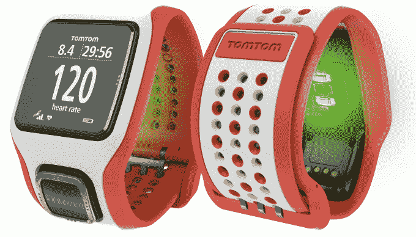

# TomTom Cardio 运动手表将全球定位系统和心率追踪功能整合在一个轻巧的组件中 

> 原文：<https://web.archive.org/web/https://techcrunch.com/2014/04/04/tomtom-cardio-sport-watches-offer-gps-and-heart-rate-tracking-in-one-light-package/>

【YouTube http://www.youtube.com/watch?v=zIO4ag79eec？feature = player _ embedded & w = 640 & h = 360]

TomTom 大约六个月前才推出 GPS 健身手表系列，但它已经在设计上进行了迭代，增加了一个新的功能。新的 [TomTom Cardio 手表](https://web.archive.org/web/20221005154054/http://sports.tomtom.com/en_us/?WT.dl=99&WT.z_ban_loc=Home&WT.z_ban_id=1&WT.z_ban=2&1.WT.ac=SportWatch-Banner)，包括多运动和跑步专用版本，通过位于手表表面下侧的光学传感器提供内置心率监测。

该传感器实际上是由 [Mio 公司制造的，该公司是由 Kickstarter 资助的初创公司](https://web.archive.org/web/20221005154054/https://beta.techcrunch.com/2013/01/29/the-surprisingly-comfortable-mio-alpha-heart-rate-watch-does-away-with-those-pesky-chest-straps/)，它生产基于手腕的心率监测器，取代了运动员多年来一直绑在胸前的又大又笨重且通常不舒服的环绕式监测器。Mio tech 通过皮肤的顶层发出明亮的光，照亮毛细血管，并实际检测血细胞何时随着每次跳动而充血，以高达专用 EKG 机器 99%的准确度检测心率。

TomTom 总裁 Jocelyn Vigreux 在接受 TechCrunch 采访时解释说，TomTom 在设计 Cardio GPS 手表系列时旨在简单和不引人注目，以及方便和准确。除了心率监测器，TomTom 还升级了手表中的 GPS 技术，以便它可以几乎立即接收信号，通过一种双重方法，包括将传感器放在四向硬件按钮控制器后面，那里最有可能获得清晰的天空视图，并感谢软件告诉手表在任何给定时刻卫星可能被发现的位置，以便它可以减少搜索以接收信号。

运动手表的有氧系列有很多令人印象深刻的技术，但在内置定位服务和[光学心率监测器](https://web.archive.org/web/20221005154054/https://beta.techcrunch.com/2014/03/20/samsung-gear-2-will-cost-295-gear-fit-will-be-197-when-they-go-on-sale-in-april/)的智能手表时代，专用的腕戴跑步跟踪器是否有点过时？Vigreux 说，像心脏这样的设备肯定可以与多用途设备共存。

“如果你有一个智能手表，它肯定会更重，肯定会做很多其他事情，”Vigreux 说。“我们已经在多个行业中看到，做同样事情的多用途和单一用途设备可以共存。当你锻炼或做其他(专门的活动)时，像这样的设备作为你必不可少的装备肯定有市场。你洗完澡，再打开另一个[多功能]设备。”

Vigreux 将有氧运动手表比作跑鞋、短裤、运动上衣或任何其他运动员的基本锻炼设备；从理论上讲，你可以穿宽松的纽扣甚至裤子来搭配，但是你会选择更适合这个目的的衣服。Cardio 与智能手表也是如此——它是为积极使用而设计的，而不仅仅是在技术上能够处理活动。

有氧运动的目的基本上是通过内置的振动电机在手腕上提供反馈来摆脱这种方式。它会告诉你何时处于你想要完成的任何训练(脂肪燃烧、有氧运动、热身等)的最佳心率范围。)当你跑得太热或太冷时，它会推你一把。跑步者可以使用 GPS 或内置加速度计跟踪室外或室内的跑步，多运动版本也可以跟踪骑自行车和游泳(包括圈速和行程数)。

Vigreux 告诉我，TomTom 没有通过 API 将数据提供给其他应用程序，这在一定程度上是因为该公司希望保持其跟踪准确运行数据的秘密，但它确实使你可以在事后下载数据，并将完整的运行导入第三方软件，包括 MapMyFitness、Runkeeper、Strava 等。iPhone 专用的 TomTom MySports 应用程序提供了移动跟踪你的进度，虽然 Android 版本已在计划中但尚未发布，但谷歌移动操作系统的用户目前仍可以在 PC 或 Mac 上使用基于网络的版本来同步跑步。

TomTom Cardio 的其他功能包括一个易于读取大量数字的大显示屏，一个小尺寸的表带，旨在适应所有手腕尺寸，电池寿命在 8 到 10 小时之间(待机数周)，防水等级高达 165 英尺。它在美国的售价为 269.99 美元(加拿大为 299.99 美元)，多运动版为 299.99 美元(加拿大为 339 美元)，现在可以直接从 TomTom 的网站上购买。