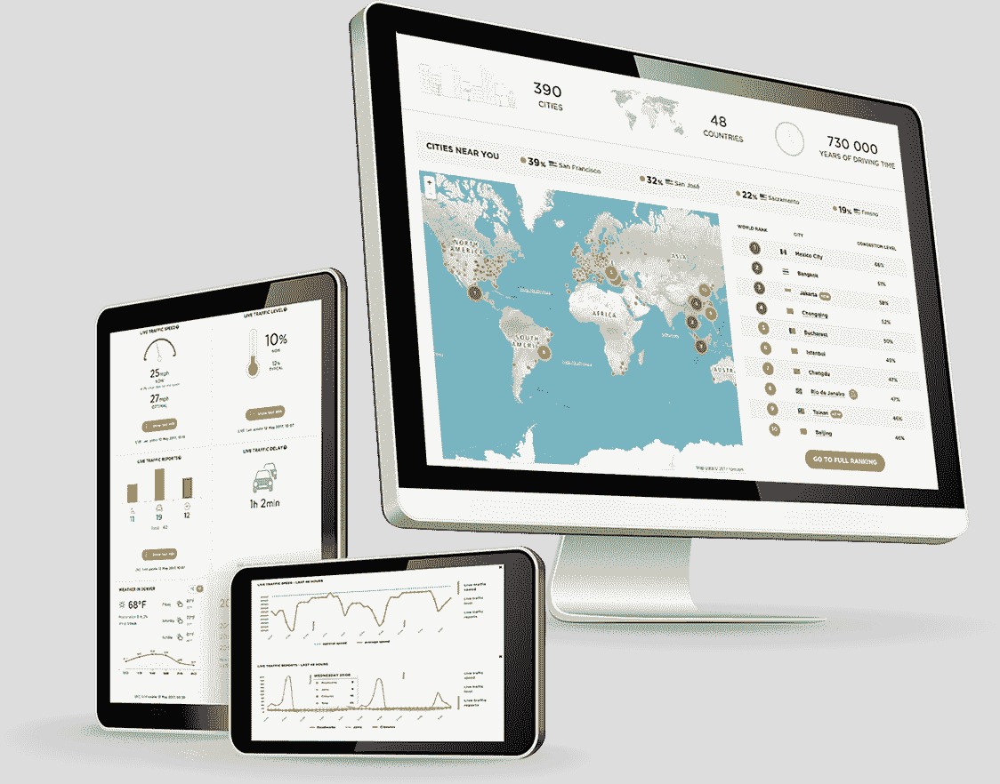

# TomTom 为开发者推出免费手机地图 SDK 

> 原文：<https://web.archive.org/web/https://techcrunch.com/2018/09/05/tomtom-launches-a-free-mobile-maps-sdk-for-developers/>

# TomTom 为开发者推出免费的手机地图 SDK

你可能还记得地图和导航公司 TomTom ，作为独立车载 GPS 领域的领导者，它在其全盛时期，今天在 TechCrunch Disrupt 上为开发者发布了免费的移动地图 SDK。这一举措是该公司从消费设备制造商向软件公司全面转型的一部分。

新的 SDK 将为所有 Android 和 iOS 用户提供免费地图和交通地图。正如 TomTom 的业务发展和产品营销副总裁[莱安德罗马古利斯](https://web.archive.org/web/20230215190835/https://www.linkedin.com/in/leandromargulis)告诉我的，免费在这种情况下真的意味着免费。虽然 SDK 不提供路线和其他一些高级功能，但对开发人员如何使用其地图和交通切片没有限制。

“这是关于把开发者放在我们所做的一切的中心，”Magulis 告诉我。“如果你看看你所做的任何类型的合作，无论是大的还是小的，在某个时候你会告诉工程师或开发人员去尝试这个 API。我们希望确保每个人都能看到我们所能做的事情的美妙之处。”他指出，这个领域的其他玩家也提供了许多不同的东西，但 TomTom 决定提供它最擅长的东西——而且在 API 调用方面没有任何限制。开发者甚至不需要给 TomTom 一个信用卡号码就能做到这一点。

正如 Magulis 所强调的，开发者可以在不违反任何 TomTom 规则的情况下混合和匹配来自多个供应商的地理定位服务。

除了新的 SDK 之外，TomTom 今天还发布了许多其他消息。例如，意法半导体将其开发工具直接连接到 TomTom 的地图 API，以帮助物联网公司定位他们的设备。自动驾驶初创公司 RideOS 将使用 TomTom 的实时和历史交通数据和地图作为其平台，而 Zenly 将使用该公司的路线和部分搜索 API 来支持其社交地图。

“人们可能会说，‘汤姆汤姆，你们还在吗？’“但是，是的，我们正在蓬勃发展，”马古利斯说我们不是你爸爸的汤姆，也不是你妈妈的汤姆。我们是你的汤姆汤姆。我们是一家技术公司，我们是定位专家，我们在这里支持下一代基于位置的使用案例。"