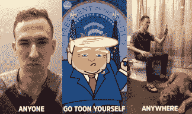

# 由于面部识别技术，卡通星让你把卡通人物变得栩栩如生

> 原文：<https://web.archive.org/web/https://techcrunch.com/2017/10/12/toonstar-launch/>

卡通之星的首席执行官约翰·阿塔那西奥说，他的目标是创建“一个新的卡通网络”。

阿塔那西奥和他的联合创始人路易莎·黄(Luisa Huang)都是华纳兄弟的高管，所以他们都在卡通网络的同一家公司旗下工作。阿塔那西奥说，Toonstar 方法的关键是创造“移动的、可抓取的、互动的”动画内容

具体来说，这家初创公司的 iOS 应用程序允许用户定制卡通人物，然后使用他们自己的面部表情制作动画。由此产生的卡通可以进行直播(在 Toonstar 本身和其他服务上，如脸书直播、YouTube 直播和 Musical.ly)，观众可以通过添加自己的动画进行互动，如将铁砧放入场景中。

这可能会让你想起 [animojis，苹果上个月发布的通过面部识别技术制作的表情符号](https://web.archive.org/web/20221007061441/https://beta.techcrunch.com/2017/09/12/iphone-x-animoji/)。然而，阿塔纳西奥表示，这两种服务试图做不同的事情——animo jis 是通信工具，而 Toonstar 则是娱乐。(另外，使用 Toonstar 的应用程序不需要等待 iPhone X。)

他还认为，做这种事情所需的面部识别技术已经存在了一段时间。他说，新的是“这种自拍文化的想法”，这种想法通过允许用户将自己变成其他角色，甚至整个角色来延伸。

Toonstar 应用程序今天结束了测试。该公司表示，在测试的三个月里，该应用吸引了 2 万名用户，创作的漫画被观看了 5000 万次。

该公司还与《行尸走肉》的幕后公司 Skybound Entertainment 合作，计划将几部 Skybound 漫画改编成卡通剧集。

Skybound North 首席执行官凯瑟琳·温德在声明中表示:“我们很高兴与 Toonstar 合作，因为我们相信从消费者和生产角度来看，卡通直播都有许多独特的优势。”“实时互动让粉丝可以以一种前所未有的方式直接与他们喜欢的角色联系。”

最终，阿塔纳西奥希望卡通星不仅仅是动画内容的另一个渠道，而是新知识产权的来源:“也许下一个瑞克和莫蒂来自卡通星，也许下一个杰克骑士来自卡通星。”

这家初创公司已经筹集了一轮种子资金，规模未披露，由科学公司(Science Inc .)牵头，Jon Goldman 的 GC VR 游戏跟踪基金、Manta Ray 和 Social Starts 也参与了进来。