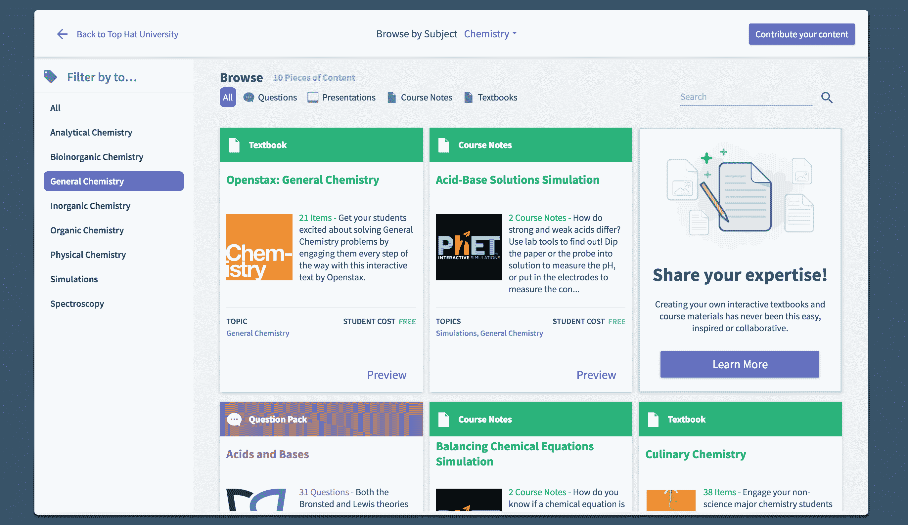
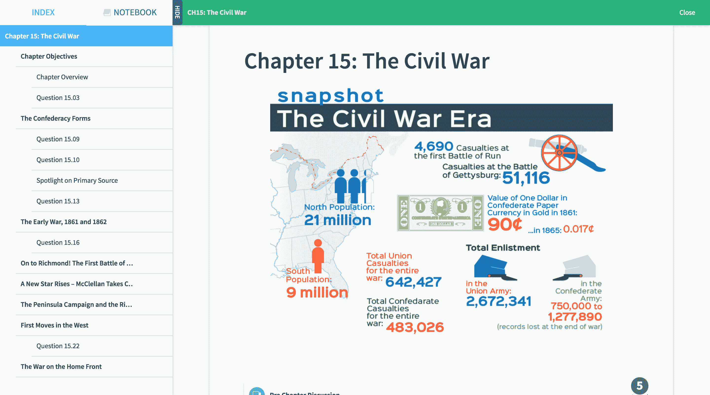

# 随着内容市场 TechCrunch 的推出，Top Hat 开始挑战教科书出版商

> 原文：<https://web.archive.org/web/https://techcrunch.com/2017/06/14/top-hat-takes-on-textbook-publishers-with-the-launch-of-its-content-marketplace/>

# 随着内容市场的推出，Top Hat 开始挑战教科书出版商

2012 年，总部位于多伦多的 Top Hat(当时仍被称为“大礼帽单片眼镜”)推出了一个基于电话的课堂反应系统，但在教师课堂上使用的内容方面几乎没有。不过，在某种程度上，这个响应系统是 Top Hat 的特洛伊木马。它让该公司在学术市场上站稳了脚跟，现在它拥有了这一点，1000 所顶级学院和大学中的 750 多所学院和大学的教师和学生都在使用它，它正在寻求扩大其产品组合。

为此，[公司在今年早些时候宣布了 2250 万美元的 C 轮融资](https://web.archive.org/web/20221024051557/https://www.pehub.com/canada/2017/2/3435988/)，正如礼帽公司首席执行官 Mike Silagadze 告诉我的，它现在已经从多伦多的[领袖基金](https://web.archive.org/web/20221024051557/http://leaders-fund.com/)获得了 750 万美元的后续资金。

随着这笔资金的到位，Top Hat 今天还宣布，它现在已经推出了它的内容市场(创造性地命名为 [Top Hat Marketplace](https://web.archive.org/web/20221024051557/https://tophat.com/marketplace/) )。这里的想法是挑战庞大的教科书行业，它不会因为一本书和几个(通常令人失望且难以使用的)在线工具和附录向学生收取数百美元而有任何疑虑。

Top Hat Marketplace 希望(因为找不到更好的词)通过让教师之间更容易合作并在 Top Hat 的网站上发布他们的书籍来破坏这一计划。为了做到这一点，Top Hat 为教师提供了他们需要的所有编辑工具，以构建现代化的交互式在线教材，并为教师发布额外的材料(如 PowerPoint 幻灯片、题库等)。).

老师们可以免费提供他们的课本，绝大多数老师在 beta 测试时都是这样做的，也可以向使用课本的学生收费。使用 Top Hat 的内置编辑功能，希望将这些课程和在线教材应用于课堂的教师也可以轻松地对材料进行自己的更改。学生必须支付每学期 26 美元的基本礼帽费(年度和终身订阅有很大折扣)才能获得免费和付费教科书。

Silagadze 告诉我，该公司与教科书出版商进行了一些早期讨论，这些出版商希望将他们的书籍带到平台上，但他们基本上想做的是将他们的 pdf 带到平台上(最好是在受 DRM 保护的 Flash 播放器的帮助下)。“这是一次可怕的经历，”Silagadze 说，并指出该公司很快中止了这些讨论。他认为，只要市场仍然很小，出版商就不太可能太在意它。但他显然认为这种情况很快就会改变。Silagadze 说:“我认为在这一点上他们很困惑，他们不知道该如何对待我们。”“很可能到明年，人们就会意识到，我们对他们的业务构成了生存威胁。”

