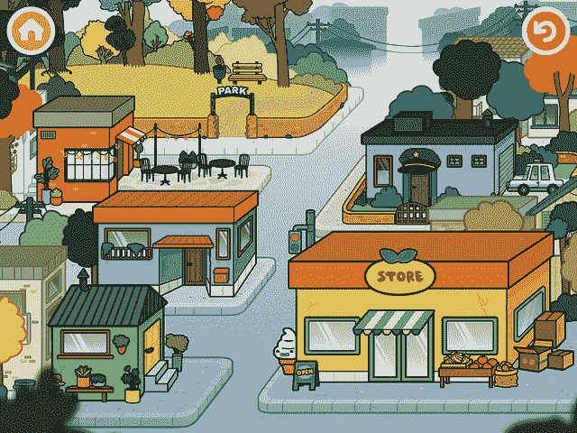

# 顶级儿童应用程序制造商 Toca Boca 向 Spin Master 出售，计划推出订阅视频服务和玩具 

> 原文：<https://web.archive.org/web/https://techcrunch.com/2016/04/25/top-kids-app-maker-toca-boca-sells-to-spin-master-plans-to-launch-subscription-video-service-and-toys/>

全球最大的儿童移动应用程序制造商之一 [Toca Boca](https://web.archive.org/web/20230113231138/http://tocaboca.com/) 被收购，其工作室制作的应用程序总下载量超过 1.4 亿次。这家公司最初在拥有 200 年历史的瑞典出版公司 Bonnier 内部像初创公司一样运营，但现在被一家名为 [Spin Master、](https://web.archive.org/web/20230113231138/http://www.spinmaster.com/)的儿童娱乐公司收购，该公司拥有 950 名员工，分别在加拿大、美国、法国、意大利、英国、斯洛伐克、德国、荷兰工作

Spin Master 生产了许多玩具和其他娱乐产品，包括五部电视节目，如 2007 年的热门剧集“爆丸”和目前的热门剧集“爪子巡逻”它也是流行玩具的故乡，如 Buchems、Zoomer Dino、Air Hogs、Maccanoid G15、Flutterbye fairies 和 Kinetic Sand 等。

交易条款没有披露，但此举将使 Toca Boca 的 100 多名员工全部加入 Spin Master，以及 Toca Boca 之前收购的另一家儿童应用程序制造商 Sago Mini 的员工。

对于 Toca Boca 来说，这是一个重要的举措，其应用程序在今天的应用程序商店的儿童部分占据主导地位，并在更年轻的孩子中吸引了相当多的追随者。如今，我很难见到一个孩子在自己的平板电脑或父母的设备上没有安装该公司的任何一款应用。

这些应用的吸引力显而易见——正如 Toca Boca 首席执行官 bjrn Jeffery 曾经向 TechCrunch 描述的那样，它们与其说是游戏，不如说是“数字玩具”。

Toca 的游戏不通过关卡，而是涉及一些更类似于富有想象力的开放式游戏。

例如，它在 2011 年 3 月推出的首款应用是 Toca Tea Party，用户可以在这里倒茶和提供美食，结合了现实世界和数字游戏。另一个流行的应用程序，Toca Hair Salon，让孩子们设计角色的发型；像 Toca Life: Town 这样的新应用程序具有类似模拟人生的吸引力，而 Toca Nature 则有一个世界建设工具包，允许孩子们在一个星球上种植树木、植物和动物。与此同时，西米迷你系列专注于学龄前儿童。

该公司的工作室如今在 App Store 排名前 20 位的儿童(付费)应用程序中占有 8 个，这让你对它们的广泛吸引力有所了解。

与当今许多风投支持的应用或初创公司不同，Toca 的应用往往是付费下载，没有订阅模式或应用内购买。取而代之的是，他们的想法是创建可以下载的应用程序，然后在设备上保存数年。我们的目标，而不是制作票房排行榜，是以一种非垃圾邮件的方式建立一个深受孩子们喜爱的品牌。

现在这个品牌正在转向视频。

你可能已经从字里行间猜到了，Toca Boca 准备将这个品牌转变为一台创收机器。

凭借 Spin Master 的经验，该公司正准备推出一款名为 Toca TV 的基于订阅的视频产品。电视频道将更像是 YouTube 的安全替代品，提供独家的托卡博卡内容以及互动功能。

围绕视频的计划之前已经宣布过，当时[公司引进了芝麻街工作室兽医 J·米利根来运营其位于纽约的制作单位](https://web.archive.org/web/20230113231138/http://deadline.com/2015/04/toca-boca-j-milligan-interactive-video-bjorn-jeffery-1201409843/)，专注于互动视频——这意味着孩子们可以用新的方式接触和联系视频。

Toca Boca 此前表示，将在 2015 年下半年推出这些产品。

至于收购将如何影响这些计划，杰弗瑞说，在短期内，“一切如常。随着时间的推移，我们将共同讨论如何最好地利用我们各自的优势和专长，”他补充道。

作为 Spin Master 交易的结果，Toca Boca 和 Sago Mini 的玩具生产线也在工作中。

“收购 Toca Boca 和 Sago Mini 将汇集瑞典、美国和加拿大的天才创意和开发资源，以及 Spin Master 工作室在洛杉矶的现有数字团队，”Spin Master 总裁兼首席运营官本·加布瓦(Ben Gadbois)在一份声明中说。

“对于我们来说，与一个真正了解创新对儿童产品开发的重要性以及如何进入北美家庭的合作伙伴一起扩张是合乎逻辑的一步，”杰弗里告诉 TechCrunch，为什么该公司决定退出邦尼耶。“我们认为，通过与 Spin Master 合作，我们可以更快更好地发展我们的愿景。”(他在发布到该公司网站的[帖子中表达了类似的观点。)](https://web.archive.org/web/20230113231138/http://tocaboca.com/toca-boca-and-sago-mini-join-spin-master/)

Toca Boca 可以吸引年轻粉丝到视频网站，但在一个充满网飞、Hulu 和亚马逊等大牌流媒体服务的世界里，这样的网站可能很难竞争。这些流媒体服务多年来一直在开发和完善适合儿童的内容库。

此外，其他有线电视网络也在向儿童圈扔帽子，比如 HBO、[与芝麻工作室](https://web.archive.org/web/20230113231138/http://www.sesameworkshop.org/press-releases/sesame-workshop-and-hbo-announce-partnership/)结成了五年的合作伙伴关系，以增加其儿童内容，以及 Nickelodeon 的流媒体服务 Noggin。当然，还有 YouTube 这个庞然大物。

换句话说，尽管 Toca Boca 在儿童应用领域建立了品牌，但在视频市场获得立足点可能更具挑战性——因此需要一个在推出成功的儿童电视方面有经验的合作伙伴。