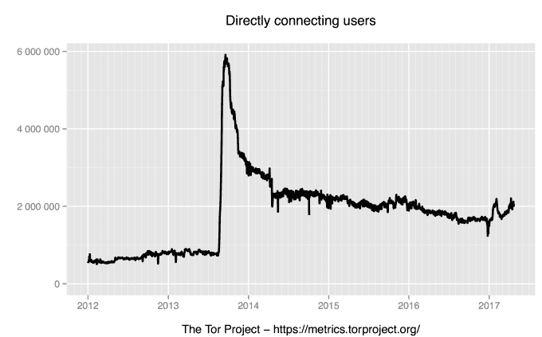

# Tor 项目的资金在 2015 年达到创纪录的 330 万美元

> 原文：<https://web.archive.org/web/https://techcrunch.com/2017/04/25/tor-project-funding-3-3-million-2015/>

对于匿名全球网络之外的非营利组织“Tor 项目”来说，去年是充满挑战的一年。[杰出的开发商 Jacob Applebaum 在性虐待的指控后辞职](https://web.archive.org/web/20230225042123/https://techcrunch.com/2016/06/04/tor-project-developer-steps-down-amid-sexual-mistreatment-allegations/)，这一丑陋的传奇导致新董事会的任命和[旨在防止未来类似事件的政策出台](https://web.archive.org/web/20230225042123/https://techcrunch.com/2016/07/27/tor-project-sexual-assault-policies/)。

尽管发生了这些事情，Tor 项目的业务比以往任何时候都得到更好的资助。该组织运营着一个匿名网络浏览器和即时通讯客户端[以及其他软件](https://web.archive.org/web/20230225042123/https://www.torproject.org/projects/projects.html.en)，刚刚公布了其最新的财务数据(2015 年)，显示其获利近 330 万美元。这高于 2014 年的 250 万美元，也是迄今为止最高的一年收入。

这些资本中的很大一部分与许多国家相关的拨款有关，根据备案文件，2015 年它们总共占所有收入的 86%。当然，这是一个巨大的数字，但这标志着 2014 年和 2013 年的改善，当时政府相关收入分别占 Tor 收入的 89%和 95%。

“与 2014 年相比，2015 年来自个人捐赠和其他非政府事物的收入更高，百分比也更高，但仍在 10-15%的范围内。我们有更多的工作要做，”Tor 研究部主任兼总裁罗杰·丁尔丁在一篇博客文章中写道。

“考虑到参与人数和我们的影响，Tor 的预算仍然有限。与我们的对手为使这个世界变得更加危险、更加不自由而花费的预算相比，这就相形见绌了。

认识到依赖政府计划的问题， [Tor 在 2015 年末/2016 年初为捐赠者开展了一场筹款活动](https://web.archive.org/web/20230225042123/https://techcrunch.com/2016/01/21/tor-project-crowdfunding-200000/),筹集了超过 200，000 美元。鉴于这些日期——这场运动于 2016 年 1 月结束——筹集的全部数字不会被包括在该组织 2015 年的纳税申报单中，如果有的话。丁尔丁警告说，年底的截止日期可能会使年度报告产生误导，他说该组织在资金方面“做得不错”。

Concern Tor 对政府拨款的依赖开启了众筹运动，一些具体事件引发了人们的担忧。2015 年，[该组织声称，美国联邦调查局向卡耐基梅隆大学支付了 100 万美元](https://web.archive.org/web/20230225042123/https://www.wired.com/2015/11/tor-says-feds-paid-carnegie-mellon-1m-to-help-unmask-users/)，以揭露 Tor 用户。该大学当时发表了微弱的否认，但攻击本身后来在与“黑暗网络”刑事案件相关的文件中得到证实。文件显示，CMU 的研究被执法当局使用，[如 Motherboard 报道](https://web.archive.org/web/20230225042123/https://motherboard.vice.com/en_us/article/carnegie-mellon-university-attacked-tor-was-subpoenaed-by-feds)，但联邦调查局和大学都不会证实任何财务安排。

今天，Tor 拥有大约 200 万用户，根据它自己的数据。2013 年，在爱德华·斯诺登的美国国家安全局泄密事件曝光后，使用量激增——[斯诺登本人使用 Tor 与记者劳拉·珀特阿斯联系](https://web.archive.org/web/20230225042123/https://blog.torproject.org/blog/what-tor-supporter-looks-edward-snowden)，最初分享他掌握的政府信息。有趣的是， [Tor 的使用量在 2017 年持续增长](https://web.archive.org/web/20230225042123/https://metrics.torproject.org/userstats-relay-country.html?start=2012-01-01&end=2017-04-25&country=all&events=off)。这可能符合美国新总统唐纳德·特朗普的到来，以及他的政府废除在线隐私规则的一些政策。Tor 的一位发言人拒绝对使用量增长背后的可能原因发表评论。

> 自 2012 年 1 月以来 Tor 的使用情况