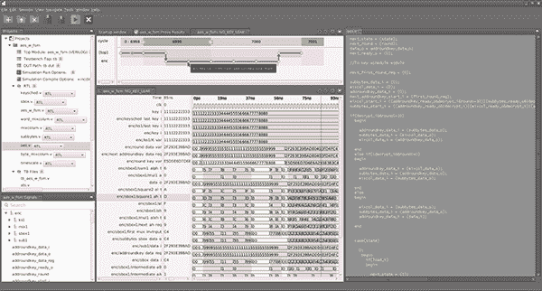

# Tortuga Logic 筹集 200 万美元建立芯片级安全系统 

> 原文：<https://web.archive.org/web/https://techcrunch.com/2017/11/16/tortuga-logic-raises-2-million-to-build-chip-level-security-systems/>

# Tortuga Logic 筹集 200 万美元建立芯片级安全系统

Tortuga Logic 已经从 Eclipse Ventures 筹集了 200 万美元的种子资金，帮助他们维护芯片级系统安全。总部设在帕洛阿尔托的该公司计划用这笔钱来开发能够发现计算机硬件“潜在漏洞”的产品。

创始人 Jason Oberg 博士、Jonathan Valamehr 博士、加州大学圣地亚哥分校的 Ryan Kastner 教授和加州大学圣巴巴拉分校的蒂姆·舍伍德教授在系统安全方面拥有数十年的经验，并获得了国家科学基金会的初步商业化拨款。

“世界上有大量基于软件的网络安全公司，但随着自动驾驶汽车的出现，移动设备越来越复杂，以及军事应用供应链中的信任问题，该行业在如何处理网络安全方面存在巨大差距——特别是硬件，”奥伯格说。

想象一下高端 DSLR 相机上的灰尘传感器这样的软件。该系统可以检测和管理硬件上的故障，并防止软件利用硬件漏洞。

“硬件漏洞已被成功利用，完全危及现代计算系统，”奥伯格说。“纠正一个已经发布或更糟的已被利用的安全漏洞，可能需要花费巨额资金来解决。与软件不同，硬件不能打补丁，在许多情况下需要更昂贵的解决方案，如召回。”

该团队认为安全性是一种“事后想法”，通过修补最危险的漏洞，他们能够大大提高系统安全性。

该公司制造和销售“一套硬件设计工具，用于识别半导体设计中的安全漏洞”，并且已经拥有航空航天和国防领域的客户。

“就网络安全公司而言，我们与其他公司的主要区别在于，我们专注于底层芯片，而不是软件，”奥伯格说。“当大公司的内部团队创建自己的团队来解决这个问题时，我们有特殊的技术，使我们能够自动找到安全漏洞的过程，而大多数内部团队没有任何自动化。”