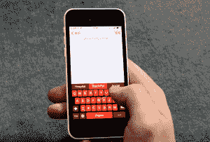

# 触宝推出 iOS 版第三方键盘 TechCrunch 引发新一轮重大争议

> 原文：<https://web.archive.org/web/https://techcrunch.com/2014/09/17/touchpal-raises-significant-new-round-as-it-launches-its-third-party-keyboard-for-ios/>

总部位于上海的键盘应用程序触宝(TouchPal)已经筹集了新一轮巨额资金，它希望扩大在美国的业务，并推出其 iOS 第三方键盘应用程序。

随着苹果第一次开放键盘，该公司的应用程序[是即将进入 iOS](https://web.archive.org/web/20221209121421/https://beta.techcrunch.com/2014/09/17/fleksys-ios-8-keyboard/)[的几个](https://web.archive.org/web/20221209121421/https://beta.techcrunch.com/2014/08/28/minuum-previews-its-size-shifting-virtual-keyboard-for-ios-8/)第三方[键盘](https://web.archive.org/web/20221209121421/https://beta.techcrunch.com/2014/09/10/swiftkey-ios-8-demo/)之一。

触宝在全球已经有 2 亿安卓操作系统用户，在 100 多个国家使用 85 种语言打字。消息人士称，新一轮融资远远超过 2000 万美元，来自红杉资本，以及之前的投资者祁鸣风险投资伙伴和战略投资者高通风险投资公司。

已经成为 HTC、索尼、阿尔卡特、华为和中兴等智能手机品牌的默认键盘，向 iOS 平台的扩展意味着该公司可以直接与美国和欧洲资金雄厚的竞争对手竞争，如 [SwiftKey](https://web.archive.org/web/20221209121421/http://swiftkey.com/en/) 和上市的 [Nuance Communications](https://web.archive.org/web/20221209121421/http://www.nuance.com/landing-pages/products/swype/) 。

触宝由三名前微软员工于 2008 年推出，采用“免费增值”模式，用户可以免费下载键盘，但需要为该公司的预测打字和自动填充功能等服务付费，这些功能可以分析语言和语音模式，为用户自动填充信息。

触宝首席执行官王敏德表示:“我们认为(移动计算)最大的瓶颈是触摸屏环境下的输入体验。”。“我们想首先为我们自己和我们的朋友制造键盘，后来我们发现它越来越受欢迎，我们决定推出它并将其推向市场。”

https://www.youtube.com/watch?v=AEFrE4gaoC8

根据 Wong 的说法，这一轮的结束给了触宝新的弹药来继续其研发工作，这是该公司的又一次胜利。自 Nuance 于 2012 年 12 月向美国国际贸易委员会(u . s . International Trade Commission)提起诉讼以来，触宝去年就卷入了与 Nuance 的专利纠纷。2013 年末，法院做出了有利于触宝的裁决，该公司与 Nuance 达成了和解。

“此案发生在收购触宝失败之后，”Wong 说。

有了这个案子和银行里的新资金，Wong 说他的公司正在进行新的研究和开发。该公司正在推出一项滑动功能，允许用户通过手指在键盘上滑动来打出完整的句子。触宝的服务自动确定与手指笔画最匹配的句子(看起来像是下一代的自动填充)。

Wong 还希望改善驱动公司上下文理解的人工智能。触宝的键盘从用户的书写和语音模式中学习，以更好地预测信息内容。

Wong 说，此外，触宝还将在美国插上自己的旗帜。该公司正在建立一个办事处，并已在旧金山提供了第一批雇员。

触宝首席执行官表示，竞争来得又快又激烈，现在是加大油门的时候了。“在美国，我们的渗透率相当低。我们的大多数客户都瞄准了欧洲和其他市场，由于诉讼，他们不想将我们的产品运往美国市场。”

现在，尽管触宝公司希望超越键盘应用程序，但预计它将在美国海岸大举营销。“我们考虑的不仅仅是键盘，还有用户界面，”Wong 说。“我们已经将语音识别集成到了键盘中。我们正在引入一些与设备交互的其他方式…如果你考虑用户交互，它不仅仅是键盘，而是语音和手势的结合。”

