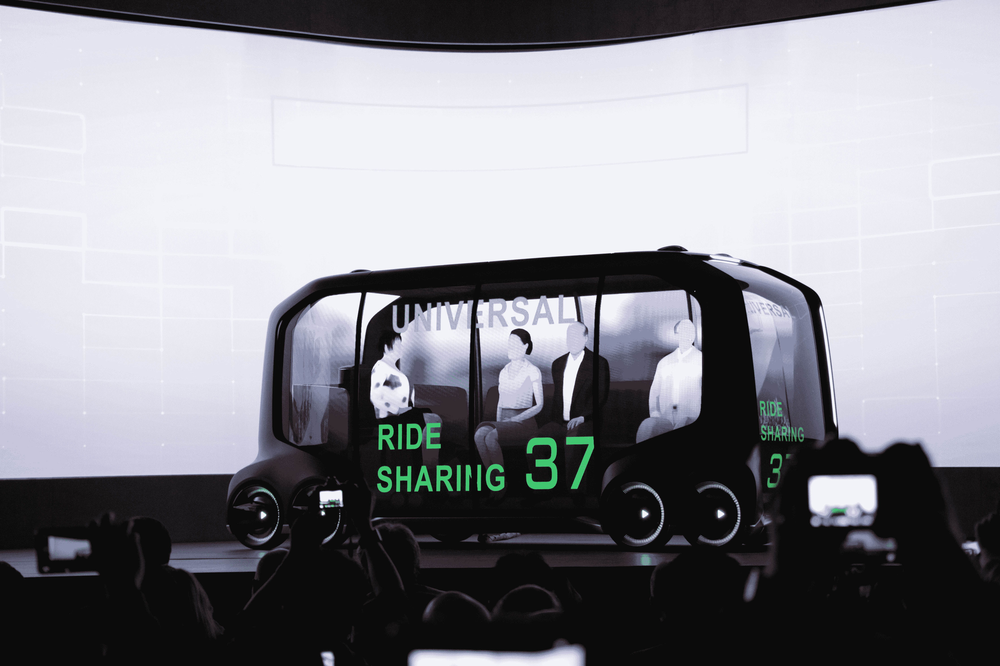

# 丰田移动业务在 CES TechCrunch 上进入高速发展阶段

> 原文：<https://web.archive.org/web/https://techcrunch.com/2018/01/08/toyotas-mobility-business-shifts-into-high-gear-at-ces/>

丰田利用 CES 2018 标志着其业务的重大转变，成为公司总裁丰田章男在其主题演讲中所说的“移动服务公司”。丰田似乎准备将移动服务作为其整体业务的核心部分，而不是一个分支或子公司，这是基于丰田的评论和该公司在详细说明其新的 [e-Palette 专用移动服务车辆](https://web.archive.org/web/20230118205550/https://techcrunch.com/2018/01/08/toyota-launches-dedicated-mobility-services-concept-vehicle/)和[产业联盟](https://web.archive.org/web/20230118205550/https://techcrunch.com/2018/01/08/toyota-teams-with-uber-amazon-pizza-hut-more-on-mobility-services/)将如何工作时透露的未来愿景。

丰田章男提出的愿景曾经引人注目，围绕着其新的 e-Palette 汽车，这基本上是一个灵活的空白车轮，带有一个电动马达和完全模块化的内部设计。大揭露包括以各种不同能力运行的汽车的模拟动画，包括在城市轻型运输卡车的车队中一起训练多名乘客，搭载四名乘客进行共享运输，或者只搭载一名乘客进行移动办公，充当酒店，甚至在无人乘坐的情况下运送食物、披萨和包裹。

概念车的视频在社区中滚动，速度快，效率高，能够在几乎一瞬间改变目的，满足不同类型客户的需求。这绝对是对未来的理想化预测，实践中事情会更加混乱，但这绝对是值得追求的事情——也是汽车制造商在弄清楚下一步会发生什么时采取的明智策略，一旦自动驾驶和电动汽车投资改变了交通运输的面貌。

我们从其他汽车制造商那里看到的很多东西或许可以更好地归类为旁注；一个典型的例子是，大众首席执行官昨天在与英伟达首席执行官黄仁勋的台上对移动服务的潜力表示怀疑，尽管大众有自己的移动子品牌 Moia。

分析师认为，丰田在电动汽车和移动业务等领域的一些落后行为过去也受到了批评。然而，该公司去年正式推出了移动服务平台，现在它明确表示，未来他们将投入大量投资和精力来支持该平台，并将其转化为具有真正商业适用性和可行性的东西。

丰田对这一愿景的介绍，从让丰田章男本人做出宣布这样的基本事情，到选择其首批行业合作伙伴，包括优步、滴滴、必胜客、亚马逊等，显示了一种严肃的态度，应该让行业的其他人站起来并注意到:丰田在这里的举动可能会在未来导致重要的市场领导地位，只要它继续在该领域投资，并愿意以其投资何时会产生重大回报的长远观点来这样做。