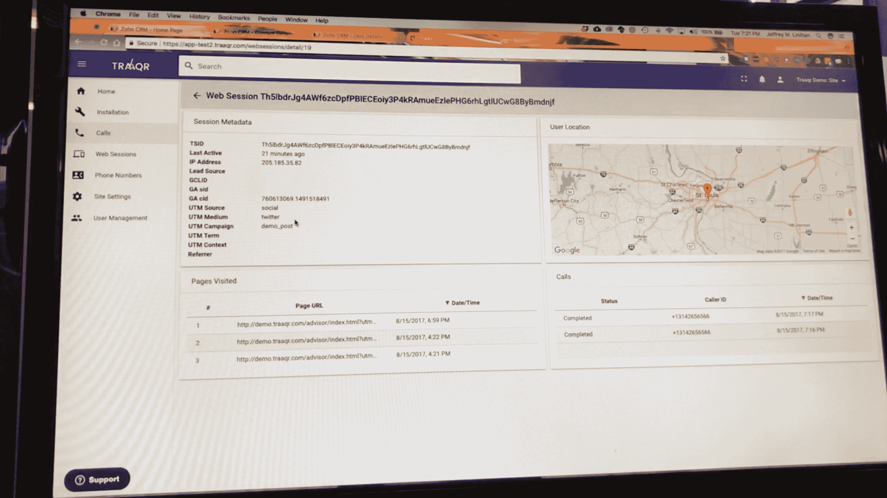

# Traaqr 将您的在线身份与真实身份联系起来 

> 原文：<https://web.archive.org/web/https://techcrunch.com/2017/10/05/traaqr-connects-your-online-identity-with-your-real-one/>

# Traaqr 将您的在线身份与真实身份联系起来

圣路易斯的 Traaqr 公司刚刚宣布推出他们有趣而聪明的新服务。本质上，该系统将在线互动与现实世界的客户服务代表联系起来，确保当有人从你的网站转到你的电话银行时，能够准确地找到对方。

该公司由企业家布莱恩·汉德里根、杰夫·利尼汉和 RJ·琼斯创建，已经筹集了 25 万美元来生产这款产品。他们已经接通了 9 万多个电话。该公司在旧金山的 TechCrunch Disrupt 上发布。

该系统的工作原理是将网站知道的关于你的数据与呼叫中心接听电话的人联系起来。例如，您可以在网站上提交您的姓名和请求，然后网站会询问您是否想与代表交谈。代表可以知道你是谁，你想要什么，而不是盲目的。

Traaqr 为离线转化归因提供了一个可与电子商务的精确度相媲美的粒度级别，”Handrigan 说。

创始人创建这个项目是因为他们知道管理网站到手机的转换有多难。他们最初有一家公司在网上产生线索，但通过后续电话赚钱。当买家接到电话时，打电话的人对他们一无所知。

“在与数字代理商所有者进行客户开发访谈后，我们确认有一个巨大的广告客户市场，他们已经接受了向他们提供的劣质选择。然后，我们决定开发出一种商业上可销售的产品，并推向市场，”他说。

虽然没有人认为接到销售人员的电话是一个好时机，但很明显，广告技术领域可能有很多问题需要解决。像 Traaqr 这样的工具使查看网站和询问更多信息的过程变得更简单、更有用，并且有望减少晚餐时间的推销电话。