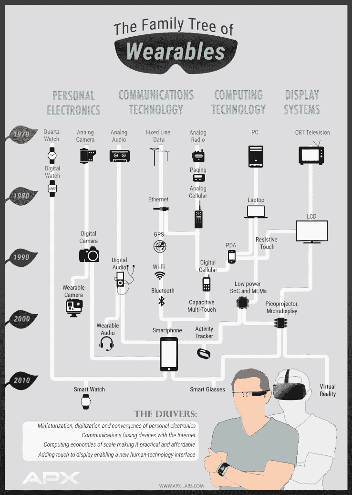

# 追溯可穿戴技术的根源 

> 原文：<https://web.archive.org/web/https://techcrunch.com/2015/11/24/tracing-the-roots-of-wearable-technology/>

布莱恩·巴拉德撰稿人

布莱恩·巴拉德是

[APX Labs](https://web.archive.org/web/20230128113440/http://www.apx-labs.com/)

.

More posts by this contributor

围绕小型化和便携性、无线通信、节能计算和高级显示技术的相互关联的趋势共同创造了今天的智能设备。智能手机是这些设备的鼻祖，已经有 15 年了，智能可穿戴设备现在已经准备好驱动下一波伟大的创新浪潮。这一浪潮是由之前的技术形成的。

值得回顾一下我们是如何走到这一步的，以了解我们接下来要去哪里。

## 1975 年，可穿戴设备挂在你的脖子上

*通往小型化、数字化和融合的道路*

在 20 世纪 70 年代中期，除了毫无疑问的时髦服装之外，你的便携式电子设备可能还有一条带子挂在你的脖子上。到 20 世纪 90 年代末，你的相机、调频收音机以及最终你的随身听变得更小、更便宜、更个性化——为消费电子行业奠定了基础。

数字革命的种子也是在这个时代播下的。尤其是手腕周围。1969 年，精工推出了第一款自动石英表，它使用表壳内的旋转钟摆来充电。1974 年，卡西欧的第一块电子手表诞生了。卡西欧特龙后来的迭代包括卡西欧数据库 CD-40，它允许数据存储，如电话号码，并提供了一个计算器。

数码相机也是在这段时间首次出现的。柯达在 1975 年开发了第一个数码相机技术，但放弃了这个概念——在接下来的 20 年里，它基本上处于休眠状态。

到 20 世纪 90 年代末，小型化和数字化已经全面展开。小型数码相机是主流。Garmin 便携式 GPS 设备于 1990 年推出。蓝牙耳机于 2000 年上市。2001 年，iPod 永远改变了音频和消费电子产品。最终，这些个人电子产品从独立的物品发展到外围附件，再发展到完全融入智能手机的组件——在一个真正的移动、融合智能设备中实现这一切更容易、更便宜。

## 你客厅里的野兽

*驱动人机界面*

在 20 世纪 70 年代，在你的客厅里安装一个大电视控制台并不罕见。很多木头，没有那么多屏幕。为了解决屏幕与体积的比例问题，当时的阴极射线管(CRT)技术正迅速向背投大屏幕发展。

平板液晶显示器(LCD)的出现是一个分水岭式的技术进步，它改变了电视的轨迹，也改变了计算和可穿戴设备的轨迹。卡西欧在 1983 年推出了第一台液晶电视机，夏普在 1988 年利用薄膜技术将其推向了先进。凭借其低功耗要求和越来越小的外形尺寸，LCD 为全彩色、高清显示器铺平了道路，可用于各种大小设备，从 100 英寸以上的电视到智能手机、智能眼镜和 VR 耳机。

显示技术的发展还带来了当今智能设备的另一个重要支柱——触摸。随着 LCD 在便携式计算机中变得流行，最初在计算机触摸板上发现的电容触摸技术也集成到智能手持设备的显示屏中，如 1993 年的 IBM Simon。

电容式触摸使用户能够在没有键盘或外围设备(如触笔)的情况下与设备进行交互。在 iPhone 的推动下，基于苹果收购的 FingerWorks 技术，电容式触摸发展成为今天常见的多点触摸功能。

> 可穿戴设备的故事是一个融合的故事。

这种显示加触摸的组合是我们今天使用的许多可穿戴设备中的基本用户界面。随着设备越来越接近用户，用户界面和交互就需要越来越自然——没有一种方法在所有情况下适用于所有人。如果没有源于不起眼的电视的用户体验技术的融合，现代可穿戴类别就不会出现。

## 计算引擎启动了

*使这一切成为可能的规模经济*

随着手表和你的便携设备的发展，现代电脑也在发展——它不断变得更小、更人性化。1986 年，随着世界上第一台大众市场笔记本电脑东芝 T1100 的诞生，移动计算从 DEC 微型计算机和第一台个人电脑的世界迅速转变为现实。

笔记本电脑继续变得越来越小，越来越便携，最早的个人数字助理(PDA)诞生了，随后的型号基于苹果在 20 世纪 80 年代末开发的牛顿平台。当 Palm Computing 在 1996 年推出第一款 PDA 时，PalmPilot 也从这个血统中脱颖而出。

黑莓从 PDA 发展出 Inter@active Pager 900，这是一种蛤壳式设备，允许双向寻呼。它最初的成功导致了许多代黑莓手机在整个 20 世纪 90 年代推出，并演变成我们今天知道的平板电脑和智能手机。

> 我们正在进入一个新创新、新选择和新设备从智能手机分支出来的时代。

通过这些发展阶段，子系统和芯片公司设计了新的制造技术，改进了他们的产品，但更重要的是，有能力淘汰数百万个单元。这降低了成本，创造了在几乎所有可以想象的设备中加入一点计算能力的能力。半导体生态系统、晶圆厂、工具以及所有这些投资都是整个智能可穿戴设备类别的组成部分，如果没有这些，这些设备仍将是昂贵的小批量利基设备。

## 无形的织物

*设备和互联网的联姻*

网络是将各种技术分支结合在一起的粘合剂。早期，挑剔和昂贵的模拟系统是标准。语音和数据的世界是完全分离的。

20 世纪 80 年代初，无线和分组交换数字网络的两股力量相结合，引发了一场变革浪潮。原始设备制造商和软件公司围绕一系列协议和标准——以太网、Wi-Fi 等——进行融合，使互操作性、集成和云架构成为可能。

随着移动计算的发展，无线网络也变得标准化和商品化，不仅将互联网的覆盖范围扩展到服务器和 PC，还扩展到便携式计算设备，最终随着 RFID、蓝牙 le 和 ZigBee 的出现，带来了物联网的概念。

今天的智能可穿戴设备依赖于无处不在的通信结构。由此产生和消耗的数据量将成为下一代网络的驱动力。我们已经开始看到由互联设备组成的个人网络，这将对网络拓扑和流量模式产生深远的影响。

智能手机首次汇集了计算、通信、显示和便携式电子产品的共同趋势。15 年后，它现在是通用系统——下一代可穿戴设备的基础。

> 可穿戴设备和物联网有着天然的结合和宝贵的自我强化技术。

在一个漫长的技术融合到单一消费设备的时代之后，我们正在进入一个新创新、新选择和新设备从智能手机分支的时代。一些产品，如手表和相机，正在将现有功能分解为优化的外形。其他人，尤其是智能眼镜，正在利用智能手机的优势，增加新的功能来处理更复杂和高级的场景。

## 下一个大分支

*可穿戴设备和物联网:人类和机器的联姻*

在我们的有生之年，我们看到了可穿戴设备家族的快速发展——它将四个核心技术分支整合到了一个新的设备类别中。当我们回顾几年后可穿戴设备的发展时，我预测我们将看到一个新的家庭——物联网。紧密相连的互联环境和互联人员。可穿戴设备和物联网有着天然的结合和宝贵的自我强化技术。

物联网应用到处都在激增:家庭自动化、安全系统和在家时的智能照明；外出时连接停车、交通仪表和零售/支付设备；设备跟踪、位置访问传感器以及在工作时使用智能工具。

像可穿戴设备一样，它们由小型、高能效的计算设备构成，集成了各种传感器和网络连接。但它们都需要与人有一些联系，这就是可穿戴设备发挥作用的地方。我们已经在企业中看到了这种爆炸式增长——例如，工业机器连接到戴着智能眼镜的工人。

总体而言，可穿戴设备的故事是一个融合的故事。电子、通信、计算和显示这四个行业的进步各自创造了今天智能可穿戴设备中出现的技术构件。我们正处于技术变革新篇章的开端，这一新篇章将影响几乎所有人。

