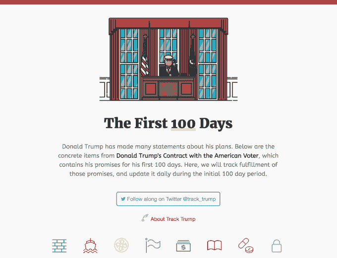
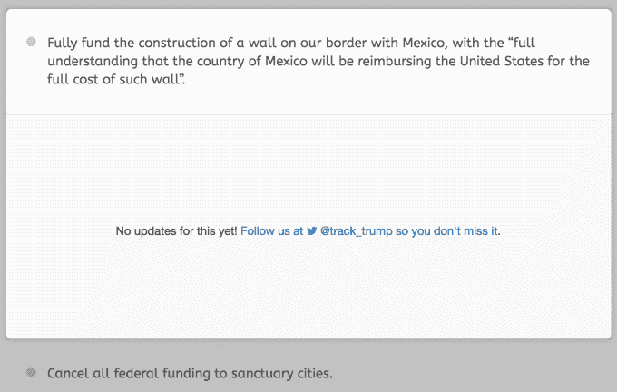

# “追踪特朗普”将比较特朗普的承诺与前 100 天的政策变化

> 原文：<https://web.archive.org/web/https://techcrunch.com/2017/01/20/track-trump-will-compare-trumps-promises-to-policy-changes-in-the-first-100-days/>

一个名为[追踪特朗普](https://web.archive.org/web/20230329142356/http://www.track-trump.com/)的新网站已经启动，以监测特朗普总统在履行其上任第一个 100 天的承诺方面的进展。10 月底，特朗普发布了一项名为“[唐纳德·特朗普与美国选民的契约](https://web.archive.org/web/20230329142356/https://assets.donaldjtrump.com/_landings/contract/O-TRU-102316-Contractv02.pdf)”的计划，[将](https://web.archive.org/web/20230329142356/http://www.npr.org/2016/11/09/501451368/here-is-what-donald-trump-wants-to-do-in-his-first-100-days)重点放在清理华盛顿、保护美国工人和恢复法治上。该计划的行动项目现在将在新网站上被追踪，以努力让即将上任的政府对其所做的承诺负责。

据 Y Combinator 总裁萨姆·奥特曼(Sam Altman)称，该网站是在过去几周内设计、开发和推出的，他是新的在线仪表板的创造者之一。

与奥特曼一起，Track Trump [是在 Alec Baum](https://web.archive.org/web/20230329142356/http://www.track-trump.com/about)的帮助下建立的，Alec Baum 此前曾为希拉里·克林顿 2016 年总统竞选工作；公共管理博士生彼得·费德曼；ReadMe 的创始人、前 Mozilla 公司雇员、开发者格雷戈里·科伯格(Gregory Koberger)。鲍姆和费德曼全职追踪川普，薪水由奥尔特曼个人出资，而不是 YC。

根据 Track Trump[主页 T11 的介绍，该网站的创建者认为，公民能够实时了解和跟踪将影响他们生活的政策变化很重要。](https://web.archive.org/web/20230329142356/http://www.track-trump.com/)

“部分动力是，我认为许多人一直在试图弄清楚面对政府，他们应该如何花费他们的时间和资源，因为他们实际上要做什么是如此不清楚，”奥尔特曼说。“我们只是想要一种监控方式。如果你每天都看仪表盘，你通常会开始注意到趋势，”他补充道。

除了简单地让新政府承担责任，追踪特朗普还旨在将实际政策变化与“言论和政治舞台”区分开来。

众所周知，特朗普在推特上发表了一些关于需要改变什么和他计划做什么的咆哮声明，但将这些话付诸政策的过程可能更具挑战性。

追踪特朗普将避免报道这些推文和其他公开声明，而是专注于与特朗普记录在案的承诺相比实际发生的政策变化。

然后可以通过一个简单的在线仪表板跟踪进度。

“我一直喜欢评估创业公司或其他东西的仪表板模型，”奥特曼解释说，并指出其他模型，如新闻提要，也曾被考虑过。

在该网站的主页上，有八个图标代表特朗普打算监控的政策类别，包括移民、贸易、能源和气候、联邦政府、经济政策、教育、医疗保健和安全。

在每个部分中，都有特朗普 100 天计划中引用的个人行动项目。这些声明也没有太多的措辞——它们实际上是从特朗普自己的话中复制和粘贴的，在某些情况下，是直接引用的。

随着每个领域的进展，具体承诺旁边的追踪器将从灰色(无行动)、黄色(已采取措施)、绿色(已实施政策)更新。)如果政策未能实施，或以官方身份更改，将更改为红色。

您还可以单击每个单独的项目，在弹出窗口中查看当前更新。

由于我们今天早上才刚刚见证了特朗普的就职典礼，所以所有的项目在开始时都设置为灰色。

今后，更新和其他一般政策新闻将在 Track-Trump.com 的每日博客中进行总结。

尽管该网站创始人的政治立场偏左，但该网站本身并没有在报道中留下太多偏见的空间，就像新闻媒体对特定政策变化的报道一样。相反，Track Trump 将简单地记录是否正在采取措施，是否制定了政策或是否取消了政策。也就是说，它会密切关注已经通过的行政命令和法律。

“我们希望建立一个对所有人都有用的资源，无论政治观点如何，他们都有兴趣以未经过滤的方式监督即将上任的政府的成就，”该网站指出。

已经有一些新闻机构询问他们是否可以在报道中引用仪表板，鉴于特朗普今天刚刚推出的 Track，这一点值得注意。如果这种兴趣持续下去，Altman 说这个网站可能会持续超过第一个 100 天。

奥尔特曼说，在这一点上，特朗普可能会考虑在演讲和书面文件中做出的其他承诺。

微博呢？

“我们会尽量避免推文。让我们不要谈论这些，”奥特曼笑着说。