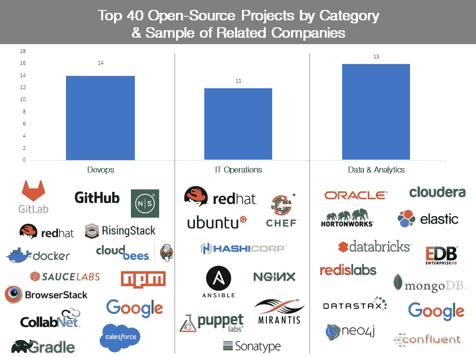

# 追踪开源软件的爆炸式增长

> 原文：<https://web.archive.org/web/https://techcrunch.com/2017/04/07/tracking-the-explosive-growth-of-open-source-software/>

达尔梅什·塔克撰稿人

Dharmesh Thakker 是

[Battery Ventures](https://web.archive.org/web/20230406232752/http://www.battery.com/)

也是英特尔投资公司的前董事总经理。

More posts by this contributor

麦克斯·希雷森撰稿人

[Max Schireson](https://web.archive.org/web/20230406232752/https://www.linkedin.com/in/maxschireson/)

是 Battery Ventures 投资公司的合伙人。他之前是数据库公司 MongoDB 的首席执行官。

More posts by this contributor

丹阮虎撰稿人

More posts by this contributor

当今许多最热门的新企业技术都围绕着免费的“开源”技术。因此，许多大公司——从金融巨头到零售商再到服务公司——都在围绕新的、基于社区的技术开展业务，这代表着过去 IT 实践的巨大变化。

但是企业客户和投资者如何评价所有这些新的开源产品呢？他们如何辨别哪些项目(通常奇怪地命名为:Ansible、Vagrant、Gradle)最能吸引客户？在软件开发人员中，哪些人拥有最大的追随者，最有可能占领市场份额？

这些问题特别难回答，因为大多数开源公司仍然是私有的，不需要公开关键的用户和财务指标。(尽管这种情况正在改变——开源巨头 [Cloudera](https://web.archive.org/web/20230406232752/https://techcrunch.com/2017/03/31/cloudera-posts-long-awaited-ipo-filing/) 最近宣布了上市计划，增加了市场对开源技术的关注。)

这就是为什么我们决定创建一个新的、详细的指数来跟踪流行的开源软件项目，并深入了解由这些技术驱动的新公司。这就是电池开源软件索引(BOSS Index ),我们花了几个月的时间把它和公开的信息放在一起，现在在这里介绍。我们希望每季度更新一次——随着更多使用这些项目的开源公司的成长和上市，该指数应该会变得更加相关。

该索引包含 40 个开源项目，是从 GitHub 源代码库网站上列出的项目以及企业 IT 出版物 Datamation 中收集的，data mation 也跟踪开源项目 。下面列出了前 25 名，完整的名单可以在我们的网站上找到。

我们专注于企业 IT 相关领域的项目，如 IT 运营，包括支持运营和供应系统的技术；数据和分析，包括人工智能和机器学习工具以及数据库；以及 DevOps，其中包括关注“容器”这一热门新趋势的项目，这有助于人们在一种自包含的环境中快速开发软件。

| **电池开源软件索引** |
| **排名** | **项目名称** | **项目总体评级** | **类别** | **关联公司样本** |
| 1 | Linux | 100.00 | IT 运营 | 红帽，Ubuntu |
| 2 | Git | 31.10 | DevOps | GitHub，GitLab |
| 3 | MySQL | 25.23 | 数据&分析 | 甲骨文 |
| 4 | Node.js | 22.75 | DevOps | 节点源，上升栈 |
| 5 | 码头工人 | 22.61 | DevOps | 码头工人 |
| 6 | Hadoop | 16.19 | 数据&分析 | Cloudera，Hortonworks |
| 7 | 弹性搜索 | 15.72 | 数据&分析 | 弹性 |
| 8 | 火花 | 14.99 | 数据&分析 | 数据块 |
| 9 | MongoDB | 14.68 | 数据&分析 | MongoDB |
| 10 | 硒 | 12.81 | DevOps | 酱实验室，BrowserStack |
| 11 | NPM | 12.31 | DevOps | NPM |
| 12 | Redis | 11.61 | 数据&分析 | Redis 实验室 |
| 13 | 雄猫 | 11.04 | IT 运营 | 那 |
| 14 | 詹金斯 | 10.47 | 开发人员 | CloudBees |
| 15 | 流浪汉 | 8.15 | IT 运营 | 哈希公司 |
| 16 | Postgres | 8.02 | 数据&分析 | 企业数据库 |
| 17 | 格拉德勒 | 7.68 | DevOps | 格雷尔 |
| 18 | Nginx | 7.57 | IT 运营 | Nginx |
| 19 | 可回答的 | 7.42 | IT 运营 | 可回答的 |
| 20 | 卡夫卡 | 7.22 | 数据&分析 | 汇合 |
| 21 | GitLab | 6.42 | 开发人员 | GitLab |
| 22 | Hbase | 6.41 | 数据&分析 | Cloudera，Hortonworks |
| 23 | 厨师 | 6.37 | IT 运营 | 厨师* |
| 24 | 张量流 | 5.97 | 数据&分析 | 谷歌 |
| 25 | 卡珊德拉 | 5.74 | 数据&分析 | 数据税 |

*公司根据四个因素进行排名。总体项目评分代表四个单项分数中两个分数的几何平均值，反映了在线讨论活动；搜索活动；就业影响；和 GitHub 活动。所有数据截至 2017 年 2 月 9 日。*

*榜单上有一些非常知名的名字，包括催生了大公司的项目。它们包括 Linux，它是 Red Hat 的基础；MySQL，为同名公司提供动力，2008 年被 Sun Microsystems(现为甲骨文的一部分)以 10 亿美元收购；还有 Hadoop，给我们带来了 Cloudera 和 Hortonworks。*

 *但是一些更不为人知的名字，如 Selenium，也排名很高，这表明开源领域正在发生大量的草根创新——以及正在产生有价值公司的许多新项目。尽管如此，我们的研究还发现，拥有大量开源项目用户并不能自动转化为创建一个商业上可行的公司。

我们根据四个因素对项目进行了排名，包括:

*   公众对项目的兴趣，通过谷歌搜索活动衡量；
*   用户活动，通过热门技术讨论版 [上的项目提及率来衡量；堆栈溢出](https://web.archive.org/web/20230406232752/http://stackoverflow.com/)；
*   岗位影响，以招聘板上列出的每一个开源项目的招聘数量来衡量[只是简单地雇佣了](https://web.archive.org/web/20230406232752/http://www.simplyhired.com/)；和
*   开源社区中的影响，通过测量项目对 GitHub 的影响来跟踪。具体来说，我们跟踪了在每个项目上构建的“分叉”或扩展的数量；某公司获得的 GitHub“星”数，说明其受欢迎程度；以及另一个流行指标“手表”的数量，都是截至 2017 年 2 月 9 日。

有些项目在某些条件下可能表现得非常好，也可能非常差，比如一个项目的谷歌搜索结果非常出色，但它的招聘得分却低于平均水平，因此我们将每个项目的最高和最低个人标准得分剔除在外。这种方法被称为“剔除均值”，类似于奥运会体操比赛，裁判会从每位评委手中剔除运动员的最高和最低分，然后对剩下的分数进行平均。(我们在竞争中没有 [东德裁判](https://web.archive.org/web/20230406232752/https://en.wiktionary.org/wiki/from_the_East_German_judge) ，但我们很小心。)

即便如此，公司仍然有改进的空间。一些采用和流行标准，比如下载衡量标准，显然有些难以衡量，而且我们肯定没有囊括所有最热门的新兴工具。尽管有了计划中的季度更新，我们应该能够跟踪新的领导者的出现。因此，我们非常乐意收到来自社区的反馈，以便随着时间的推移，改进我们的数据和指数。如果你对这些指标有进一步的见解，请在 [联系我们，opensource@battery.com](https://web.archive.org/web/20230406232752/mailto:opensource@battery.com)联系我们。

以下是本次研究的其他主要收获。

## Linux、Git 和 MySQL 在这一领域处于领先地位

领先我们指数的开源项目是 Linux，这也许并不令人意外，Linux 技术最早于 1991 年发布，是世界上应用最广泛的开源项目之一。它已经被很多公司商业化了，包括红帽(Red Hat，为数不多的公开交易的开源公司之一)，以及 Ubuntu 和 SUSE。

> 开源项目拥有大量用户并不会自动转化为创建一家商业上可行的公司。

Git 在榜单上名列第二，它的出现给了 GitHub 和 GitLab 很大的启发。这个广受欢迎的开源项目是一个“版本控制系统”，用于跟踪变化和协调软件开发人员之间的工作。

排名第三的 MySQL 也榜上有名，它是 1995 年首次开发的数据库技术。MySQL 目前帮助经营大型网络规模的公司，比如谷歌、脸书和 Twitter。但值得一提的是，有几种“NoSQL”数据库技术——它们是非关系数据库，不像 MySQL，通常更适合分析当今许多公司丢弃的非结构化数据——排名也很高。

这些 NoSQL 科技公司包括 MongoDB，它在我们的指数中排在第 9 位；Redis，这是由公司 Redis 实验室商业化，排名第 12 位；排名第 25 位的卡珊德拉落后于数据库公司 DataStax 排名第七的是弹性搜索，它正被弹性公司商业化。

2015 年末，MongoDB 进行了新一轮融资，该公司的估值约为 15 亿美元，目前正在与甲骨文、IBM 和微软等老牌数据库公司竞争。总的来说，这些 NoSQL 供应商中有几家是彼此独立发展的——在某些情况下相当快——而不是汇聚成一个庞大的系统。这意味着更广泛的数据基础设施领域将进一步细分，并可能导致几家强大的 NoSQL 公司的诞生，这些公司未来可能成为上市公司。

## 大数据推动开源

如今，许多组织都在努力管理海量的结构化和非结构化数据(从安全软件到推文，再到制造工厂的网络传感器)，因此他们越来越多地寻找新的数据管理和存储解决方案。这一趋势在我们的指数中得到了反映，因为在包含的 40 个项目中，有十几个(15 个)是支持数据库和数据处理的开源技术。

前面提到的 Hadoop 就是这样一种技术。但由 Databricks 等公司商业化的 Spark 是另一个例子，在我们的榜单上排名第八。

## 其他要知道的名字

Docker 是容器技术的宠儿，它帮助软件开发变得更快更有效，在我们的指数中排名第五。许多人将 Docker 视为公共巨头 VMware 技术的可能替代品，通过开源社区可以轻松、廉价地访问 Docker 的事实推动了它的采用。

Docker 还在与谷歌的 Kubernetes(排名第 33)和 Mesos 等开源平台技术竞争，以控制软件开发中的“编排”层，或跨不同软件环境管理容器的能力。

> 这些开源项目不是你父亲的 Sun 或 Oracle。

开源的另一个热门领域是“持续集成和持续交付”，或者用代码编写软件的能力，这些代码可以持续无缝地与其他平台集成。这方面的一些工具包括由 CloudBees 提供商业支持的 Jenkins(第 14 位)和 TravisCI。在相关的 DevOps 领域有 Maven(第 30 位)等技术，以及快速增长的 Artifactory 二进制库，这是一种旨在优化二进制文件下载和存储的软件工具，是 JFrog 商业化的平台。*

## 下雨了

但是正如我们之前提到的，拥有大量用户——虽然对最终获得商业吸引力至关重要——并不能保证一个开源项目会成为一笔好生意。这需要大量的辛勤工作和创造力，尤其是在构建新型商业模式方面；利用复杂的开源许可证；正如我们去年在 TechCrunch 上讨论的那样，调整传统的企业销售实践以适应开源产品。

更重要的是，我们发现，如果 IT 公司提供几种可以在某种“堆栈”中一起使用的开源技术，那么他们利用开源取得商业成功的机会有时会增加例如，Elastic 有一个“ELK”堆栈，由开源的 Elasticsearch(在我们的索引中排名第 7)、Kibana(排名第 36)和 Logstash(排名第 29)项目组成。

时间序列数据库公司 influx data *同样也销售“TICK”堆栈版本，代表 Telegraf、InfluxDB、Chronograf 和 Kapacitor。DevOps 公司 HashiCorp，在最后一个例子中，已经商业化了许多开源项目，包括两个进入我们名单的项目，流浪者(排名第 15)和 Vault(排名第 40)。软件开发人员喜欢能够从这些堆栈中挑选他们最喜欢的组件，这符合当今主导软件开发的“同类最佳”的产品理念。

这些开源项目不是你父亲的 Sun 或 Oracle。但是很明显，全球大公司的首席信息官们现在依靠开源技术——包括我们的指数中强调的许多技术——来运行他们基础设施的关键部分，其中许多项目将会持续很长时间。事实上，在我们去年主办的一次开源峰会上，从高盛到 Capital One 等大公司的 it 高管讨论了他们在部署新软件和基础设施时的“开源优先”态度。随着更多基于开源的公司在未来几年上市，我们将获得更多关于这些顶级项目表现的信息，并将继续跟踪它们的进展和对行业的影响。

****** 表示电池组合公司。*

*此处没有任何内容是或不应被视为投资建议或任何买卖任何证券的推荐或邀约。本文中的某些信息来自第三方来源，虽然被认为是可靠的，但其准确性未经独立验证，因此不能保证其完整性。**