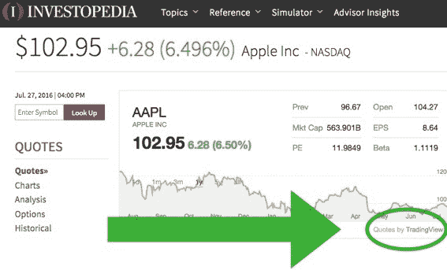

# 为痴迷于图表的投资者服务的社区 TradingView 进军新市场 

> 原文：<https://web.archive.org/web/https://techcrunch.com/2016/07/28/tradingview-a-community-for-chart-obsessed-investors-moves-into-new-markets/>

# 为痴迷于图表的投资者服务的社区 TradingView 进军新市场

数据驱动的投资者社区 TradingView 的月活跃用户已达 100 万，并正在向全球服务不足的市场扩张。TechCrunch [上一次报道 TradingView 是在 2012 年](https://web.archive.org/web/20230205231952/https://techcrunch.com/2012/02/24/tradingview-european-watch-list/)，当时该网站每天有 2000 名访客。

该网站不同于其他投资者社区，如 [Seeking Alpha](https://web.archive.org/web/20230205231952/http://seekingalpha.com/) ，因为它强调视觉效果。TradingView 采用基于图表的方法来支持投资。该社区分享、评论和构建以图表形式呈现的投资理念。

TradingView 很好地顺应了金融科技民主化的市场趋势。它的免费市场数据可以从俄罗斯、西班牙和巴西等国家的任何设备上获取。2013 年，同为民主党人的罗宾汉大张旗鼓地推出了其零手续费股票交易应用。这款应用向客户开放了股票交易，而之前这些客户被交易费拒之门外，交易费侵蚀了他们的利润。Robinhood 已经筹集了 6600 万美元的风险投资。

TradingView 的联合创始人兼首席运营官斯坦·博科夫认为，教育是该网站最强大的资产之一。

像 Twitter 一样，TradingView 允许用户发消息并关注其他有好主意的人。它还永久记录了平台上的每一项索赔。这样你就永远不会忘记，那次你完全没有买入脸书 IPO(或 Twitter)的股票是谁造成的。

继续 Twitter 的比较，大多数人是通过 TradingView 支持的其他网站上的小工具接触到该网站的。你可能在 [Investopedia](https://web.archive.org/web/20230205231952/http://www.investopedia.com/) 等网站上看到过 TradingView 内容。

这 1500 万非用户被集中到该网站，他们可以选择升级到高级订阅。博科夫指出，普通用户不需要升级，但那些寻求更高级功能的用户可以获得每月订阅计划，专业版 10 美元，专业版 20 美元，高级版 40 美元。

所有订阅计划都取消了广告，让用户订阅实时数据。pro-plus 计划提供了延长的交易时间、无限制的服务器端警报和其他图表类型。高级用户可以获得专门的电子邮件和电话支持。

NASDAQ、NYSE 和 NYMEX 等市场数据馈送的价格在每月 2 美元到每月 90 美元之间。免费层提供对 16 个基本数据包的访问，包括蝙蝠和 CBOE 期权数据。除了分级订阅，TradingView 还有一个网络商店，用户可以在那里购买第三方工具，如情绪分析。

这个专门的社区以每月 10%的速度增长，没有任何直接的广告。TradingView 同样值得注意的是，它如何能够在只有 375 万美元资金和 300 万美元收入的情况下扩展到 100 名员工。答案在于创造性外包。虽然 TradingView 在全球各地都有代表，但该公司的 70 人工程团队位于东欧。这降低了成本，同时使公司能够有效地进行全球扩展。

随着公司的成长和投资群体的培养，继续进军服务不足的市场是博科夫的首要目标