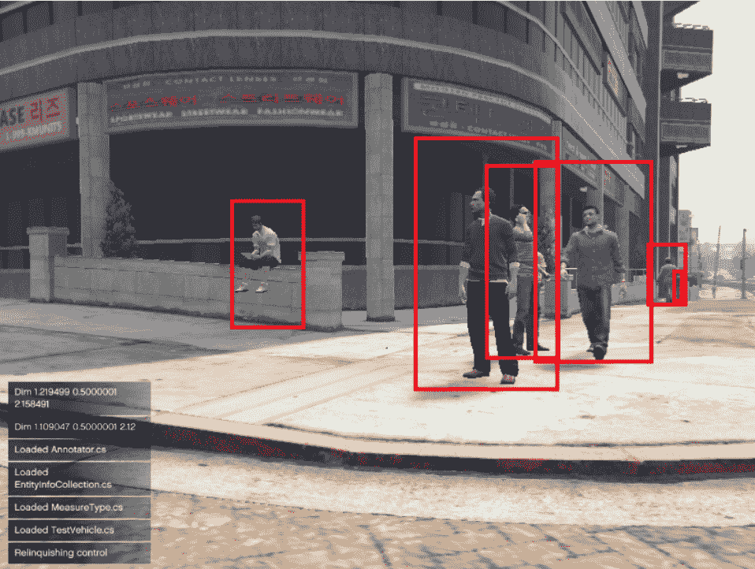

# 使用 GTA V 在洛斯桑托斯的街道上训练自动驾驶汽车变得更加容易 

> 原文：<https://web.archive.org/web/https://techcrunch.com/2017/01/11/training-self-driving-cars-on-the-streets-of-los-santos-with-gta-v-just-got-easier/>

# 使用 GTA V 在洛斯桑托斯的街道上训练自动驾驶汽车变得更加容易

[DeepDrive 项目](https://web.archive.org/web/20230212130013/http://deepdrive.io/)使得使用侠盗猎车手训练自动驾驶汽车已经有一段时间了。但是今天，[这项工作正在与 OpenAI 的 Universe](https://web.archive.org/web/20230212130013/https://openai.com/blog/GTA-V-plus-Universe/) 集成并开源。此次合作将把一度长达一天的设置时间缩短至 20 分钟。

最近，在合成数据上训练人工智能框架非常流行。大型科技公司和初创公司都在四处寻找漂亮的训练方法，以降低进入自动驾驶汽车游戏的障碍，并让注释变得不那么痛苦。像 Udacity 这样的公司一直在[稳步发布真实世界的驾驶数据](https://web.archive.org/web/20230212130013/https://techcrunch.com/2016/10/05/udacity-open-sources-an-additional-183gb-of-driving-data/)，但社区需要在数量和特异性上继续增长。

OpenAI 的 Universe [于去年年底推出](https://web.archive.org/web/20230212130013/https://techcrunch.com/2016/12/05/openais-universe-is-the-fun-parent-every-artificial-intelligence-deserves/)以满足部分市场需求，推出了 Atari 2600 款游戏、1000 款 flash 游戏和 80 种浏览器环境，以帮助实现培训资源的民主化访问。GTA V 的加入是对赛车 Flash 游戏的重大改进，为计算机视觉和自动驾驶汽车研究人员打开了大门。

“如果你真的想做一辆自动驾驶汽车，模拟是必不可少的，”谷歌自动驾驶技术负责人贾在今天的人工智能前沿大会上说。

虽然我不能说我会希望*任何*自动驾驶汽车基于*我的* GTA V 驾驶进行训练，但这款游戏对于稍微自律一点的人来说足够现实，可以完成这项工作。

脱离虚拟环境进行培训的最大优势之一是，它为收集标记数据做好了准备。GTA V 中的对象，无论是交通标志还是骑自行车的人，都可以很容易地进行定界和分析。

普林斯顿大学的一名学生 Artur Filipowicz 专门利用这个[收集了 140 万张各种条件下的停车标志图像，以预测给定十字路口出现标志的可能性，并估计到给定标志的距离。](https://web.archive.org/web/20230212130013/https://drive.google.com/file/d/0B0zrU_fRAzNcYkdhaHR6MDVFNUU/view)

摘自普林斯顿大学 Artur Filipowicz 完成的题为“驾驶学校 II，自动驾驶的视频游戏”的研究

从今天开始，那些喜欢 DIY 培训的人可以获得 GTA V 和 nab 的源代码和 AMI，以及 TensorFlow 和 Caffe 版本的预培训入门代理。该套件还包括避免碰撞、最小化目的地距离和最大化道路附着力的奖励功能。从效用的角度来看，计算机可以通过强化学习更好地模仿人类思维。

该团队在云中托管的 Windows 虚拟机上运行游戏，该虚拟机通过网络套接字和 VNC 与 Universe 通信。这为 Mac 和 Linux 上的工程师提供了可访问性。哦，别忘了，在你开始之前，你也需要给自己买一份游戏拷贝。