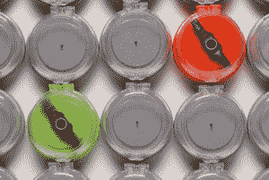

# Trak 就像精子的 Fitbit 

> 原文：<https://web.archive.org/web/https://techcrunch.com/2016/06/28/trak-semen-health/>

# Trak 就像精子的 Fitbit

如果你觉得世界面临人口不足的危险，但你的输卵管游泳队让你失望了，砂岩诊断公司会支持你。现在 FDA 批准，该公司的产品 Trak 将成为生活方式教练和家庭诊断工具，以帮助提供更快乐的精子和微小的 shouty 奇迹。

该公司本周宣布，其 Trak 产品已获得美国食品和药物管理局的批准，并表示将于今年夏末开始上市。

你让我旋转，宝贝，旋转。

“男性不育是一种被严重低估的疾病，每年影响着数百万对夫妇，”砂岩公司首席执行官格雷格·萨默说。

“Trak 是一个完整的系统，不仅使夫妇能够在家里方便地测量精液质量，还提供数字健康工具和基于人口的数据，以帮助男性以一种全新的方式负责他们的生殖健康。”

该公司表示，其服务是有益的，特别是因为在诊所提供精液样本被视为尴尬和尴尬，可能会阻碍获得帮助，而帮助男性生育能力回归正轨是必要的。我明白为什么会这样，值得指出的是，在家里做同样的事情通常是男人最喜欢的消遣之一。

Sandstone 的 Trak 使用离心力来分离和量化精子细胞，使用特别设计的(幸运的是一次性使用的)盒子。该系统包括 Trak 引擎和几个用于重复测试的一次性测试套件，以随着时间的推移收集数据。

除了获得 FDA 批准提供关于测量精子数量的半定量指导(如“低”、“中等”或“最佳”)外，配套应用程序还提供关于改善和跟踪精子数量的反馈和健康建议。