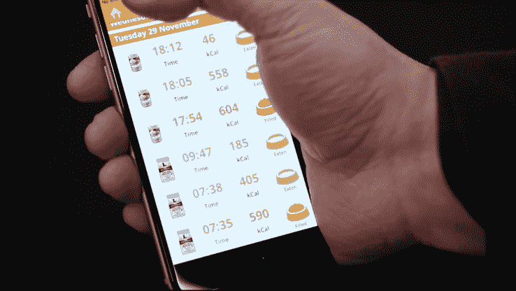

# Trakz 是一款带有 GPS 跟踪技术的 Fitbit，适用于您的狗或猫 

> 原文：<https://web.archive.org/web/https://techcrunch.com/2016/12/07/trakz-is-a-fitbit-with-gps-tracking-technology-for-your-dog-or-cat/>

# Trakz 是一款为你的狗或猫配备 GPS 追踪技术的 Fitbit

[https://web.archive.org/web/20221209004555if_/https://www.youtube.com/embed/mXzU28tE3ao?feature=oembed](https://web.archive.org/web/20221209004555if_/https://www.youtube.com/embed/mXzU28tE3ao?feature=oembed)

视频

我们爱我们的宠物，希望跟踪它们，确保它们吃得好，得到它们需要的锻炼，总部位于英国的 Trakz 希望通过跟踪你的狗和猫的技术产品来帮助我们做到这一点。

这家初创公司有一个 GPS 和健身跟踪设备，可以插在你的狗狗或猫咪的项圈上，还有一个喂食碗跟踪器，可以跟踪它们每天吃了多少。

还有一些其他公司也有类似的健身产品，如 [Whistle](https://web.archive.org/web/20221209004555/http://www.whistle.com/) ，它也集成了 GPS 和健身追踪器；以及 [Fitbark](https://web.archive.org/web/20221209004555/https://www.fitbark.com/) ，它包括一个睡眠监视器。

每个 Trakz 设备都将数据上传到一个应用程序，以帮助您找到您的宠物，并确保它们在您家或附近的“安全地带”。如果你的宠物离开这个区域，这个应用程序会通知你，如果朋友或家人失踪，它也会提醒他们。

该应用程序还会跟踪你的猫花了很多时间在哪里，所以如果你找不到它们，你可以很好地知道它们可能藏在哪里。

这个项圈可以告诉你你的宠物一天走了多少路，以及它们的实时位置。这道菜会立即更新你的宠物刚刚从碗里咬下了多少食物，以及这些咬下的食物中有多少卡路里，这样你就可以监控你的宠物是否吃得过多。

Trakz GPS 追踪项圈装置目前可以预定，价格为 79.00 英镑，约合 100 美元

本周，在 TechCrunch Disrupt London 期间，我们在我们的初创公司巷子里采访了初创公司 CEO 汤姆·布彻(Tom Butcher)。点击上面的视频，观看采访，了解更多信息。