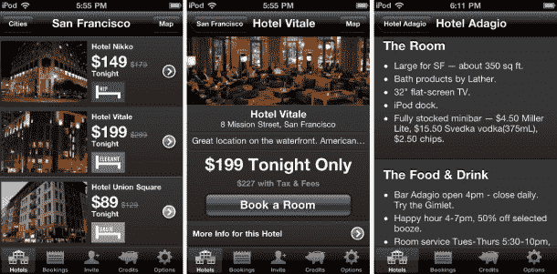
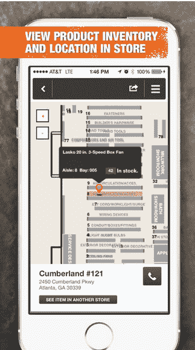
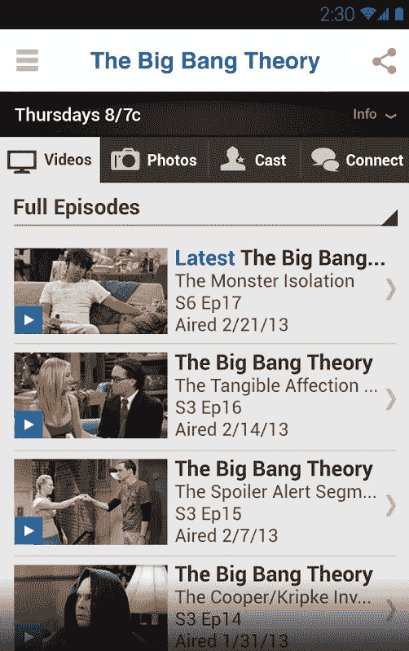

# 旅游、零售和媒体是接管 App Store 的 3 个行业 

> 原文：<https://web.archive.org/web/https://techcrunch.com/2014/10/18/travel-retail-and-media-are-3-industries-taking-over-the-app-store/>

贝特朗·施密特撰稿人

**编者按:** *Bertrand Schmitt 是 [App Annie](https://web.archive.org/web/20230202063923/http://www.appannie.com/) 的联合创始人兼 CEO。*

自从苹果公司在 2008 年推出应用商店以来，移动应用已经走过了漫长的道路，领先的应用商店中有超过 500 万个应用可供使用。虽然有许多因素促成了这一增长，但以相对较小的前期投资接触全球受众的能力无疑是一个重要因素。如果一个应用成功了，潜在的投资回报率是巨大的——问问 Flappy Bird 或 Kim Kardashian 应用的开发者就知道了。

这种增长的惊人之处不仅仅在于数量，还在于应用程序的多样性，一个应用程序可以完成几乎所有可以想象的任务。iOS 应用商店拥有 23 个应用类别，而 Google Play 有 20 个，这还不包括游戏和报刊亭应用的子类别。

即便如此，并不是所有的应用类别都以同样的速度发展，游戏和社交应用处于领先地位。事实上，就收入和下载量而言，Google Play 和 App Store 排名前 10 的应用中的大多数都属于游戏或社交媒体类别。毫不奇怪，社交和游戏应用在下载量和参与度方面也处于领先地位。这些应用开创了货币化战略，迅速将应用商店转变为今天的十亿美元发电站。

这并不是说其他应用类别没有发展势头，当然这些应用背后的开发者、品牌和行业都有自己衡量成功的标准。虽然游戏曾经独占应用商店排行榜，但旅游、零售和娱乐行业现在正在争夺这些位置，并迅速成为新的应用商店巨头。

## **行程**

鉴于预计到 2015 年移动业务将占美国在线旅游销售额的四分之一，收入接近 400 亿美元，旅游品牌正在大力投资移动业务。移动应用天生适合旅行，在旅途中将旅行者与酒店、航空公司和地面交通联系起来，满足了一个关键需求。

随着这个行业变得越来越拥挤，旅游聚合商——在[十大旅游和交通应用](https://web.archive.org/web/20230202063923/http://www.appannie.com/indexes/all-stores/rank/travel-transportation/?month=2014-06-01&country=US)中占了五个——正在为更小的屏幕优化他们的在线产品，并促进有管理的搜索、高效的支付流程和最后一分钟的基于位置的交易。这些聚合应用程序还通过添加新的应用程序功能来扩展其预订以外的服务，从而保持其优势。

**旅游 App 负责人:** [**酒店之夜**](https://web.archive.org/web/20230202063923/http://www.appannie.com/apps/ios/app/hotel-tonight/)

作为一个例子，HotelTonight 作为行业中的开拓者脱颖而出。这家纯移动公司简化了最后一分钟酒店的预订，只需八秒钟，只需轻点三次，轻轻一扫。简洁的用户界面吸引了当今精通技术、自给自足的旅行者，虽然精选的酒店和航空公司也提供类似的自助服务工具，但 HotelTonight 让客户能够在数千种品牌中获得这些便利。该公司旨在通过投资手机入住和无钥匙进入等功能，创造最顺畅的酒店体验。

## **零售**

零售应用如果得到有效利用，可以对购物体验的各个方面产生影响。Forrester Research 预测，从 2013 年到 2018 年，美国智能手机商务的收入将从 160 亿美元增加到 460 亿美元。随着“展厅”的兴起——在店内浏览产品，然后以更低的价格在线购买——成功的实体零售商正通过使用应用程序来推动消费者回到实体店。

研究表明，使用移动应用程序创建交互式店内体验可以将客户参与度提高多达 5 倍，从而提高忠诚度和销售额。

**零售 App 负责人:** [**家得宝**](https://web.archive.org/web/20230202063923/http://www.appannie.com/apps/ios/app/the-home-depot/)

顾客用来浏览和购买超过 60 万种产品的家得宝应用程序，通过将购物者与实体店面联系起来，在 iOS 生活应用程序中稳步攀升。内置扫描仪可实现轻松的产品搜索，GPS 功能可提示基于位置的优惠券和产品建议，链接到商店地图的购物清单可实现高效购物。

“店内提货”和“送货到店”为客户节省了运输费用，加快了时间敏感项目的进度。总体而言，该应用程序通过将电子商务的便利性与亲自购物的触觉体验相结合，成功地指导了消费者的店内购物。

## **媒体和娱乐**

随着数字电视观众的数量将在 2017 年底达到 1 . 45 亿，娱乐行业也开始转向移动应用程序，以联系其粉丝群并扩展观看体验。网飞和其他流媒体提供商正在通过跟踪多种设备上的活动，让你更容易沉迷于你最喜欢的节目。

粉丝们可以通过工作室开发的移动应用访问从电影预告片到游戏和互动实时聊天的一切内容。电视和电影工作室通过与内容提供商和开发商合作，提供独家的应用内促销和内容。

**媒体&娱乐 App 负责人:** [**CBS**](https://web.archive.org/web/20230202063923/http://www.appannie.com/apps/ios/app/530168168/)

哥伦比亚广播公司推出了广受欢迎的 My CBS 应用程序，通过独家互动的应用程序内容来提高观众的参与度。这包括一系列现场视频聊天，观众可以在推特上向 CBS 节目的明星提问，女演员/男演员将在摄像头上实时回应。当添加了喜爱的剧集时，该应用程序会发送推送通知。哥伦比亚广播公司还与亚马逊合作，在前两季的原始播出日期后四天，提供斯蒂芬·金的《穹顶之下》独家剧集的黄金即时视频。

随着越来越多的人在移动设备上与品牌互动，问题不是移动应用是否会成为接触你所在市场消费者的重要渠道，而是什么时候。最成功的公司将模仿和创新由 HotelTonight、Home Depot 和 CBS 等市场领导者推出的智能、位置感知、互动和无摩擦的应用程序。