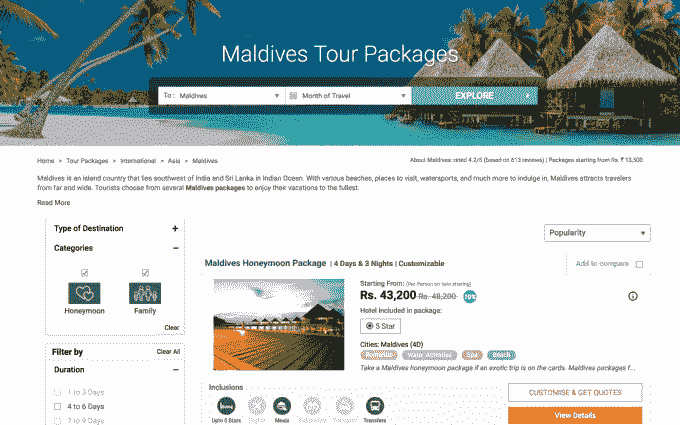

# TravelTriangle 筹集 1000 万美元让印度旅行社上线 

> 原文：<https://web.archive.org/web/https://techcrunch.com/2017/02/07/traveltriangle-closes-10-million-series-b/>

印度的 TravelTriangle 已经完成了一轮 1000 万美元的 B 轮融资。

这家成立四年的公司专注于将印度主要由中小型公司主导的线下旅行社业务带到线上。这不仅有助于旅游经纪人接触到更多的受众，也为印度超过 12 亿的人口提供了更多的旅游选择。

它的在线市场为旅行社带来商机，但除了像在 Expedia 上那样简单地预订套餐，旅行社还会与客户联系，帮助他们根据自己的特定需求定制旅行。如果你亲自走进他们办公室的大门，他们也会这么做。现在，它声称有超过 650 个代理和超过 65 个目的地。

这轮 B 轮融资由总部位于新加坡的 [RB Investments](https://web.archive.org/web/20221007100122/http://rbworld.com/) 牵头，现有投资者 [SAIF 合伙人](https://web.archive.org/web/20221007100122/http://www.saifpartners.com/)和[贝塞麦风险投资合伙人](https://web.archive.org/web/20221007100122/https://www.bvp.com/)参与。SAIF 在 2014 年 7 月领投了 travel triangle 170 万美元的 A 轮融资，而贝塞麦领投了 800 万美元的 A 轮融资，该融资于 2015 年 4 月结束。该公司最初是靠自己起家的，但到今天为止，TravelTriangle 已经从投资者那里筹集了大约 2000 万美元。

联合创始人兼首席执行官 Sankalp Agarwal 告诉 TechCrunch，该网站通常每月有 200 万访客，其中 50%是有机流量。他补充说，预订旅行的人通常花费 1200 美元，而三分之二的旅行是去海外目的地。

Agarwal 对新兴市场如何使用互联网进行了有趣的观察，他说 60%的流量来自移动设备，但 70%的支付是通过桌面设备完成的。因此，手机和平板电脑是浏览的理想选择，但人们希望在支付辛苦赚来的钱之前做充分的研究。

除了从交易中赚取佣金，TravelTriangle 还努力让自己扎根于旅行社。它提供一套服务来帮助管理这些业务，从处理业务到分析和财务。这是一种成为代理商不可或缺的资源的聪明方法，从而确保他们在其网站上的交易——the dynamic 回忆说，Practo，[是一家资金雄厚的印度健康初创公司](https://web.archive.org/web/20221007100122/https://beta.techcrunch.com/2017/01/16/practo-raises-55-million-series-d-led-by-tencent/)，除了面向消费者的医患连接器之外，它也提供医疗保健实践的 Saas 产品。

Agarwal 表示，TravelTriangle 计划在 B 轮融资中扩大其网站上的交易数量，与更多的代理商合作，并为他们的业务引入更多的服务。他看好印度在线旅游的未来，这要归功于智能手机销量的增长和印度中产阶级的壮大。

“在 10 亿人口中，印度有 6500 万护照持有者是潜在的旅行者。2016 年，只有 1800 万人出国旅游，这表明出境休闲度假市场在印度处于起步阶段，”Bessemer 的 Raghav Bahl 在一份声明中说。

“出境休闲市场估计约为 100 亿美元，保守估计到 2020 年将翻一番，并将在未来一段时间内继续保持长期增长，”Bahl 补充道。