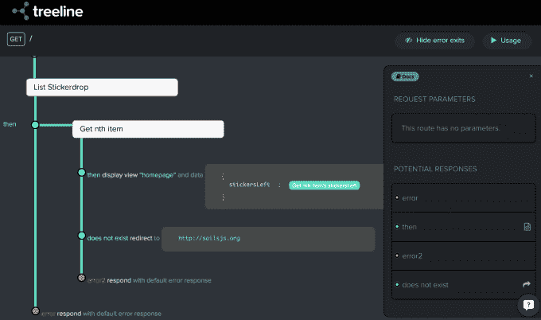

# Treeline 想去掉构建后端的代码

> 原文：<https://web.archive.org/web/https://techcrunch.com/2015/03/11/treeline-wants-to-take-the-coding-out-of-building-a-backend/>

构建后端来支持你梦想中的应用是阻止前端开发人员尝试构建自己的应用设计原型的障碍之一。

它必须在您决定使用的任何基础设施上快速高效地运行。它必须能与你可能为之构建客户端的任何平台兼容。如果出了问题，它会破坏你为让客户满意而做的所有其他工作。

Y Combinator 支持的[Treeline](https://web.archive.org/web/20230320102954/https://treeline.io/)正试图通过将构建后端的工作剥离到本质上来打破这种威胁:在应用程序或服务中构建数据流的管道。

“构建一个应用程序的前端就像是搭建一个纸牌屋，”Treeline 联合创始人兼首席执行官 [Mike McNeil](https://web.archive.org/web/20230320102954/https://github.com/mikermcneil) 在今天的一次采访中告诉我。“你必须跟踪一系列部件，做出一系列精确的动作，才能建造出看起来像结构的东西。这很难建立，但如果你搞砸了，后果也没那么糟糕。然而，构建后端就像堆叠酒杯:这并不难，但如果你犯了一个错误，那就更难处理了。”

Treeline 的后端开发方法对于那些玩过可视化脚本工具的人来说可能很熟悉。Treeline 让你通过插入预先制作的逻辑位并填入需要的数据和应该如何处理这些数据来创建“机器”，而不是自己编码所有的东西(或者，更有可能的是，把你必须编码的东西编码出来，把来自 Google 的位和 Stack Overflow 的位拼凑在一起，然后把剩下的东西打包)。

这家初创公司建立在 McNeil 也创立的两个开源项目之上。 [Sails.js](https://web.archive.org/web/20230320102954/http://sailsjs.org/#!/) 是一个框架，它使使用 JavaScript 和 Node.js 创建应用程序变得更容易，而[节点-机器项目](https://web.archive.org/web/20230320102954/http://node-machine.org/)是 JavaScript 函数的开放标准，它让开发人员“确切地知道哪些操作可用，提供什么作为输入值，以及当他们在代码中包含一台机器时，你将得到什么”。目前在节点机器公共存储库上有 46 个“机器包”，提供对 Windows Azure、脸书和 Stripe 等的 API 的访问。

Treeline 编辑器只是为您提供了一个可视化界面，用于将这些标准化的机器连接在一起。这意味着在幕后，它实际上只是制作出 JavaScript 代码，这些代码将做您所期望的事情。如果您想要实现的东西无法通过 Treeline 或 Node Machine 存储库获得，您可以简单地自己编写一个机器代码，并将其放到 Treeline 中的工作中。

麦克尼尔表示，目前，Treeline 主要面向那些愿意自己构建面向用户的应用程序，但需要帮助来构建可扩展后端的独立开发者。为了进一步简化这类用户，该团队刚刚推出了免费的应用程序托管，因此您不必担心将早期版本部署到托管平台上。麦克尼尔本人承认，新功能推出时有点慢，但从长远来看，他说计划是向甚至最大的用户提供应用托管(当然是以合理的费用)。

鉴于该公司的开源根源，该产品对那些不介意将他们制造的机器也开源的人是免费的。那些想要保护自己作品隐私的人必须为这一特权付费，尽管理论上你可以通过从 Treeline 获得 JavaScript 代码，然后托管在 Heroku 或任何其他支持 Node 的服务器上来跳过这一费用。

NcNeil 表示，Treeline 的下一个重大步骤是建立协作功能，以便团队可以开始利用该平台——毕竟，该公司赚钱的唯一方式是引入最终开发成功应用的初创公司。与此同时，Treeline 正在与 Sails.js 社区合作，引入 JavaScript 开发人员，他们可以使用该编辑器来提高工作效率。