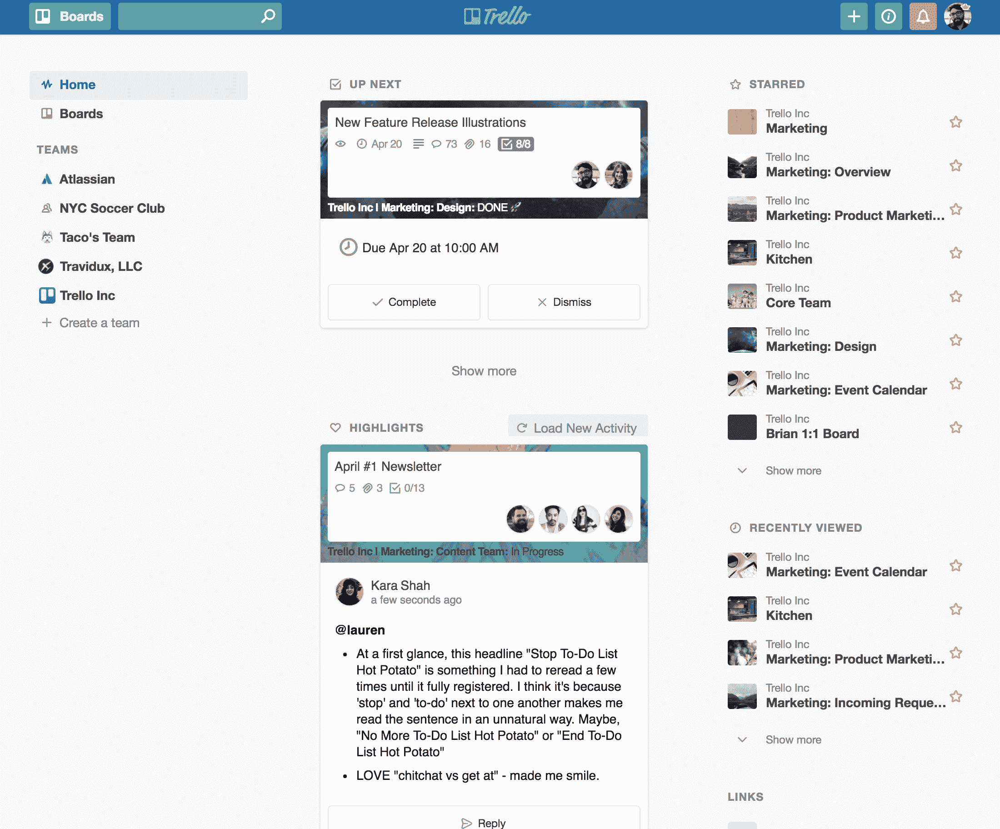
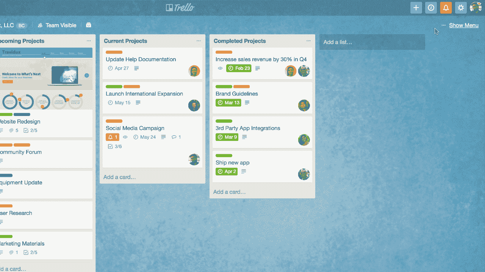

# Trello 获得新闻源和改进的通知 

> 原文：<https://web.archive.org/web/https://techcrunch.com/2018/04/24/trello-gets-a-newsfeed-and-improved-notifications/>

# Trello 获得了新闻提要和改进的通知

Atlassian 旗下广受欢迎的基于卡的项目管理服务 Trello ，今天对[进行了一点改造](https://web.archive.org/web/20221206050732/https://blog.trello.com/2-billion-cards-with-trello-home)。

传统上，Trello 总是关于它的卡片和棋盘，而不是别的。但这也意味着高级用户经常不得不费力地通过一系列的讨论来决定他们下一步应该关注什么。现在，特雷罗得到了一个[个性化新闻源](https://web.archive.org/web/20221206050732/https://blog.trello.com/trello-home-view)，它将突出显示您的特雷罗团队的活动。

“通过展示来自你的 Trello 团队的活动新闻，home 在你需要的时候提供你需要的信息，”Trello 团队今天写道。“让信息来到你面前，按你自己的步调浏览。查看团队中的每个人都在做什么，而不必查看每个单独的板块。”

新闻提要将包括“下一步”和“亮点”等部分，让您更好地了解项目内部发生的事情。该公司告诉我，主页订阅是按截止日期、可能需要你立即关注的卡片活动以及“你不在的时候你所关注的所有板块发生的事情”来组织的。您还可以按团队过滤此订阅源。

Trello 中的新功能还有[改进的通知](https://web.archive.org/web/20221206050732/https://blog.trello.com/trello-notifications-mark-as-read)。现在，您可以从通知中更改任何给定卡的到期日期和停止通知。此外，您还可以将提醒标记为“已读”或“未读”

