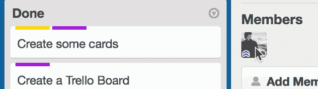

# 数字白板 Trello 拥有 700 万用户 

> 原文：<https://web.archive.org/web/https://techcrunch.com/2015/02/18/trello-the-digital-whiteboard-tops-7m-users/>

协作任务管理软件 Trello 已经突破 700 万用户，每周有 12 万新用户加入该平台。Trello 联合创始人迈克尔·普莱尔(Michael Pryor)向 TechCrunch 证实，该服务拥有 170 万月活跃用户，Trello 用户遍布全球每个国家(除了缅甸、瑙鲁和图瓦卢)。

“百分之八十的注册来自口口相传，”普莱尔说。“我们一直在更新产品——我们昨天对 iOS 应用程序进行了重大更新，最近我们让 LifeHacker 写了关于我们的文章——但这只占我们新用户的一小部分。我们越成长，越多的人从他们的朋友那里了解我们。”

[Trello](https://web.archive.org/web/20221207081023/https://trello.com/) 于 2011 年在[扰乱战场舞台](https://web.archive.org/web/20221207081023/https://beta.techcrunch.com/video/trello-finalist-startup-battlefield-presentation/517173973/)上推出，目前已经筹集了总计 1000 万美元。

Trello 与其他任务管理软件的不同之处在于它专注于一种新的媒体类型。Trello 的平台旨在成为数字世界的白板，专注于某个项目的生命周期，从开始到结束，为用户提供一个团队从无到有构建东西的鸟瞰图。

“这种新的、通用的、一刀切的媒体类型没有名字，但我们希望它是特雷罗，”普莱尔说。“最大的挑战是帮助人们了解他们可以使用它的所有方式。”

普赖尔说他在特雷罗看到了各种各样的项目。虽然有些人使用它进行公司项目管理，但其他 Trello 项目包括婚礼规划、儿童圣诞礼物清单或家庭度假。

“这很像电子表格，在我们知道它之前，”普赖尔说。“一旦你意识到它是如何工作的，你会发现你可以用一百万种不同的方式来使用它。”

当然，在协作任务管理领域，Trello 并不孤单。Asana，BaseCamp 和新人 Slack 正在争夺宝贵的空间。

特别是 Slack T1，也就是 T2 的日活跃用户数达到了 365，000，已经筹集了 1.8 亿美元。但普赖尔将特雷罗视为 Slack 的好伙伴，并承认特雷罗团队将其作为一种整合。事实上，特雷罗是谷歌产品背后与 Slack 的[二号整合。](https://web.archive.org/web/20221207081023/http://slackhq.com/post/110820064015/our-year-in-numbers)

Trello 是一个全面免费的产品，但消费者和企业客户都可以升级到高级包，提供额外的功能。

“我们的目标一直是建立一个横向业务，我们可以有很多人使用该产品，一小部分人支付少量费用来获得额外的好处，这就是我们现在的道路，”普赖尔说。

你可以点击查看 [Trello。](https://web.archive.org/web/20221207081023/https://trello.com/)

[gallery ids="1121090，1121091，1121092，1121093，1121094，1121095"]