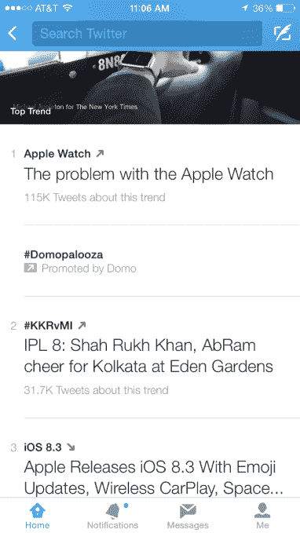
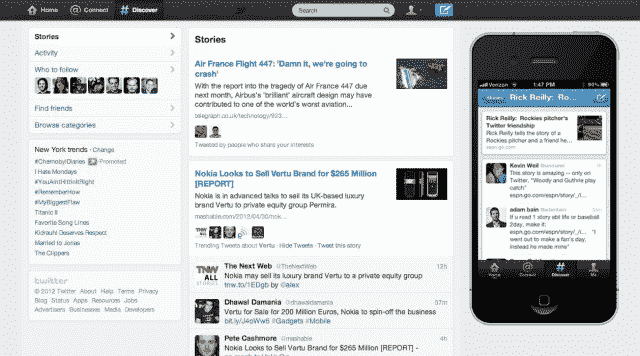

# Twitter 沟渠发现对热门话题的描述

> 原文：<https://web.archive.org/web/https://techcrunch.com/2015/04/08/trend-descriptions/>

# Twitter 沟渠发现描述什么趋势话题的意思

Twitter 的热门话题可能会令人困惑。你可能不知道#NYFW 指的是纽约时装周。所以今天的[是用一个增强的趋势部分](https://web.archive.org/web/20230224043727/https://blog.twitter.com/2015/updating-trends-on-mobile)取代发现标签，包括每个趋势主题的简要描述。目前，美国用户可以用英语使用它，他们已经打开了定制趋势功能，但 Twitter 正在网络上进行试验，并计划将其推广到更多国家。

这些解释类似于脸书在 2014 年 1 月[推出其版本的推特热门话题](https://web.archive.org/web/20230224043727/https://techcrunch.com/2014/01/16/facebook-trending/)时包含的描述。通过给人们提供背景，Twitter 可以让大众更容易接触到它的产品，帮助增长，并让更多的人参与到潮流中来。

例如，你可能看了《幻影 3》却不知道主题是什么。但是现在推特会告诉你“世界上最大的无人机公司发布了最新产品 DJI 幻影 3”。

以前，Discover 是 Twitter 底部导航栏中自己的标签。现在那个标签已经被取消了，当你点击屏幕上方的搜索图标时，带有描述的新趋势就会出现。点击其中一个趋势，你会看到关于该主题的热门推文、媒体、你关注的人的推文，然后是更广泛的提到该主题的帖子。

Twitter 在 2011 年推出了 Discover，但它一直是一个尴尬的功能，试图拼凑这些年来的热门新闻、来自你的网络的推文、趋势、事件等。随着对 Summify 的收购，它试图使该部分更加个性化。尽管如此，它始终是 Twitter 的一个偏僻小巷，与实时流相比，它的内容令人感到过时。

用增强的趋势取代 Discover 将让用户更好地了解 Twitter 上发生的最重要的事情，这可能是 Discover 的初衷。