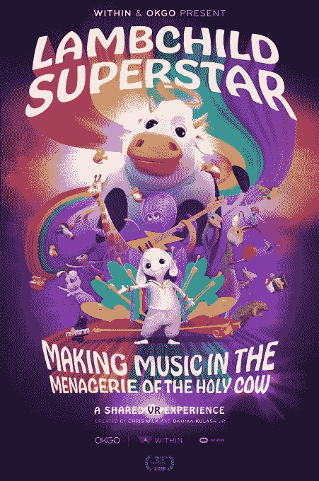

# 今年的翠贝卡电影节使用 ar 和 VR 来探索音乐制作和移情 

> 原文：<https://web.archive.org/web/https://techcrunch.com/2018/04/28/tribeca-terminal-3-ok-go/>

在翠贝卡电影节参观[身临其境的](https://web.archive.org/web/20221025222820/https://techcrunch.com/2018/03/08/tribeca-immersive/) 拱廊总是充满挑战。每年，都有更多的虚拟现实和增强现实体验要尝试(更不用说采访创作者了)，我无法在短短几个小时内完成。

和往常一样，今年我只能检查少数几个项目。它们的范围从严肃的政治到有趣的多彩——尽管即使是有趣的项目也仍然在探索关于创造力和人类联系的想法。

[例如，3 号航站楼](https://web.archive.org/web/20221025222820/https://www.tribecafilm.com/filmguide/terminal-3-2018)利用增强现实将观众置于机场安检人员的审问者的位置:你会见并采访一名穆斯林旅客，在最终决定是否允许他们入境之前，你可以从不同的问题中进行选择。

艺术家 Asad J. Malik 告诉我，作为一个在巴基斯坦长大的人，“我是机场安检的专家，因为我经常被安检。”在《3 号航站楼》中，马利克采访了真实的人(其中一个选项是采访马利克本人)，尽管你眼前的这个人看起来并不像照片一样真实。相反，它们几乎就像一个数码幽灵，可能会逐渐变得更加逼真，这取决于你提出的问题。

[https://web.archive.org/web/20221025222820if_/https://www.youtube.com/embed/8B70uYZFO3Y](https://web.archive.org/web/20221025222820if_/https://www.youtube.com/embed/8B70uYZFO3Y)

视频

马利克说，他并不是在试图宣传一种关于穆斯林的特定政治信息，只是想说明那些可能认为自己是穆斯林，也可能不认为自己是穆斯林，但“世界会认为谁是穆斯林”的人们之间的巨大差异，以及他们的性格、背景和观点。

《3 号航站楼》是在 [Unity for Humanity](https://web.archive.org/web/20221025222820/https://unity3d.com/humanity) 和 [RYOT](https://web.archive.org/web/20221025222820/https://www.ryot.org/) 的支持下创建的(这是一家专注于虚拟现实的工作室，像 TechCrunch 一样，是威瑞森子公司 Oath 的一部分)。它是为微软 Hololens 打造的——这并不是翠贝卡最受欢迎的平台，但马利克说，这对他的方法至关重要，因为它允许采访在真实房间的背景下进行:“突然之间，这个故事，这个人，就在你的真实空间里。”

与此同时， *[《羔羊巨星:在圣牛](https://web.archive.org/web/20221025222820/https://www.tribecafilm.com/filmguide/untitled-ok-go-within-project-2018)* 的动物园里制作音乐》并没有试图复制一个真实的环境。相反，它发生在一个色彩耀眼的虚拟世界中，充满了可以被操纵来制作音乐的动物——例如，你可以抓住一只奶牛的尾巴并重新定位来改变它放屁的声音。

*小羊羔巨星*是电影制作人[克里斯·米尔克](https://web.archive.org/web/20221025222820/https://www.with.in/)和 OK Go 乐队的合作。OK Go 的达米安·库拉什说，他们最初是从这个问题开始的，“什么是虚拟现实中的 OK Go 视频？”在决定这是错误的方法之前。

像[“颠倒的&从里到外”视频](https://web.archive.org/web/20221025222820/https://techcrunch.com/2016/02/11/watch-ok-go-fly-weightless-in-their-new-music-video/)(显示乐队失重飞行)可能看起来像是 360 度视频的一个很好的候选，但库拉什说它实际上证明是“与环境无关”相反，它呈现给你的是一种“非常可控的矩形”的体验

因此，Kulash 和 Milk 决定探索一个不同的方向，即允许用户创建自己的音乐。

“我开始对音乐的魔力发出荒谬的咆哮，”库拉什回忆道。“你把一个声音加到另一个声音上。你带着喜悦和情感从另一边走出来。简直是疯了:那东西哪来的？”

但米尔克指出，如果你给大多数人一把吉他或一架钢琴，他们可能会感到害怕，因为他们不知道如何演奏:“这是一个障碍。”因此，有趣的环境和动物；这感觉更像是在玩游戏，而不是在表演音乐，但你最终会以一首独特的歌曲出现。

这是一首你和另一个用户一起创作的歌曲，Kulash 说这也是体验的一个关键部分。

“克里斯对此很狂热，而且理由很充分，”他说。“虚拟现实可能是一种非常孤立的技术……但我们有没有办法利用它，而不是孤立，让你有一种更接近人类的体验？这是一件奇怪的事情，我们不得不移除所有的人类肖像来做到这一点。”

今年的 Tribeca Immersive 也不同寻常，因为它是第一个包括几款游戏的游戏，如 *[【星子】](https://web.archive.org/web/20221025222820/https://www.tribecafilm.com/filmguide/star-child-2018)* ，这是一款来自 [Playful Corp](https://web.archive.org/web/20221025222820/http://www.playfulcorp.com/) 的平台冒险游戏。Playful 的 Paul Bettner 说，就像该公司以前的游戏*Lucky ' s Tale*,*Star Child*使用 3D 和虚拟现实，试图为经典游戏类型注入新的生命，即像 *Abe 的 Oddysee* 这样的平台游戏。

[https://web.archive.org/web/20221025222820if_/https://www.youtube.com/embed/2NuUF4-zEQ4](https://web.archive.org/web/20221025222820if_/https://www.youtube.com/embed/2NuUF4-zEQ4)

视频

今天是翠贝卡沉浸式的最后一天，所以纽约人有最后一次机会体验所有这些项目。虽然你可能很难在节日环境之外找到这些项目，但 Bettner 打算将 *Star Child* 作为~~移动~~ PC 和主机游戏发布。将虚拟现实体验压缩到一个更小的屏幕上听起来可能很难，但显然对 Bettner 的团队来说，这并不困难。

“我在虚拟现实中发现，如果我们以某种方式构建内容，专注于做第三人称虚拟现实，我们将整个项目专注于让它脱颖而出，并利用虚拟现实可以做的事情，然后将它带到我们所谓的平板屏幕平台，这比反过来要容易得多，”他说。