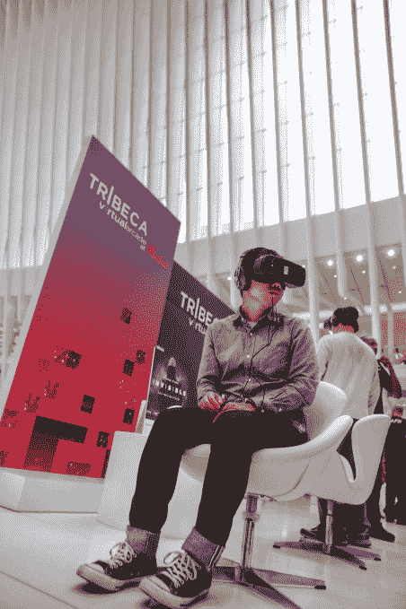

# Tribeca Enterprises 将虚拟现实带到了 Westfield 世界贸易中心 

> 原文：<https://web.archive.org/web/https://techcrunch.com/2016/11/04/tribeca-virtual-arcade-westfield/>

# 翠贝卡企业将虚拟现实带到了韦斯特菲尔德世贸中心

韦斯特菲尔德世界贸易中心(最近在世界贸易中心下面开放的购物中心)的游客将能够在本月获得一次实际操作的虚拟现实体验——这是由翠贝卡电影节背后的组织翠贝卡企业策划的体验。

翠贝卡在 T1 之前已经举办了许多虚拟现实活动，但程序员 Loren Hammonds 指出，这些活动是电影节的一部分，它们通常吸引了“早期采用者”或至少“非常好奇”的人。通过在 Westfield 安装[虚拟街机，翠贝卡有可能接触到更多的主流观众。](https://web.archive.org/web/20221202141902/https://www.westfield.com/westfieldworldtradecenter/events/tribeca-virtual-arcade-at-westfield)

“他们可能是第一次体验虚拟现实，”Hammonds 说。

虚拟街机将以四款作品为特色——*入侵！*(动画电影)*(由*伯恩身份*和*明日边缘*导演道格·里曼打造的超自然系列)*Kids*(one Republic 的音乐视频)；以及*kà内斗*(与太阳马戏团有关联的武侠故事)。*

 *

翠贝卡昨天举行了一场新闻发布会，记者们体验了这部电影，并听取了一些电影制作人的意见。李曼说，他的制作公司在决定采用虚拟现实之前，曾讨论过将《隐形的 T4》作为可能的电影或电视节目，虚拟现实吸引了他，因为它的沉浸感——他说这是他所有电影的目标。李曼回忆起第一次尝试虚拟现实时的想法，“这比我所能完成的任何事情都更加身临其境。”

李曼和他的制片人朱利安·塔特洛克承认，他们已经重新思考了一些拍摄方法，以适应这种技术。例如，李曼说，拍摄 360 度镜头更像是一项“团队运动”，因为你不能只编辑弱的表演。

“它必须在每个方向都很棒，”他说。观众可以朝各个方向看，所以“他们可能会看到你的缺点和不足。”

塔特洛克补充说，他们被告知，“也许你[不想]把摄像机移动得太多、太快或切得太快”——这使得创造“令人兴奋的追逐场景”更具挑战性所以他们的方法是“拍摄静态镜头，安全镜头——然后我们会挑战极限。”

翠贝卡虚拟商场将于周五至周日开放，从今天开始到 11 月 20 日结束。*